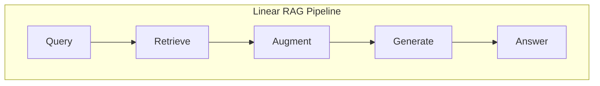
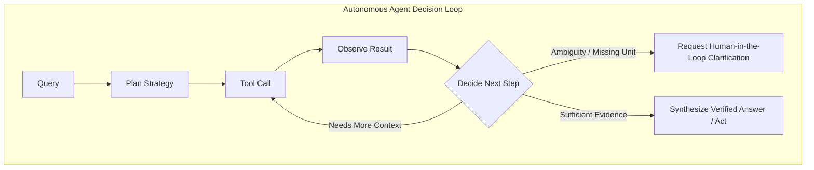
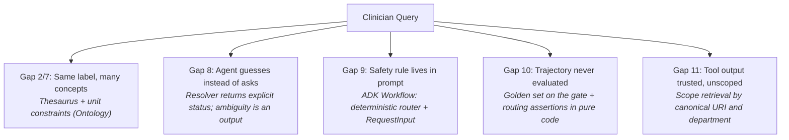
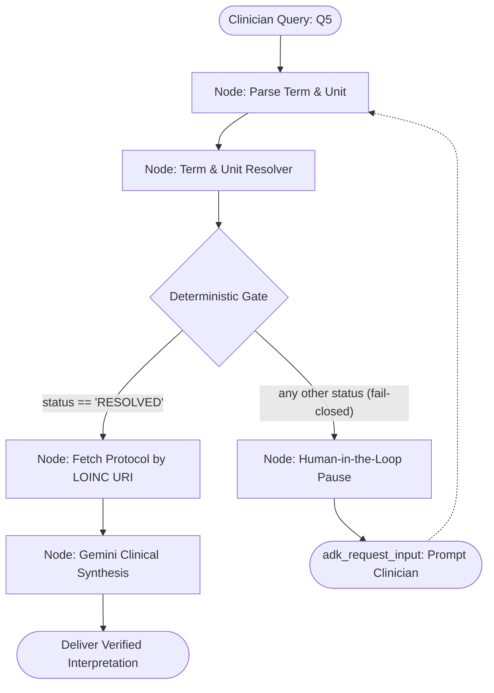
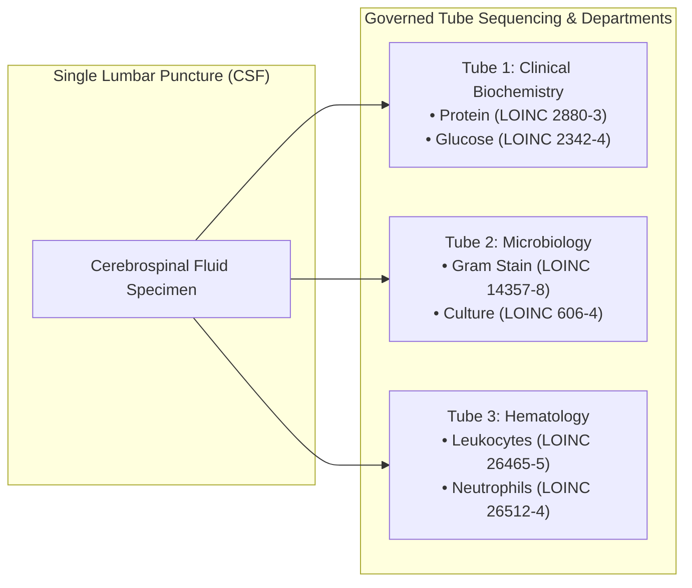

# Laboratory Medicine Decision Support with Google ADK 2.0 & Clinical Ontologies

*When the Retriever Has to Decide: From the 7 Retrieval Gaps to the Agent Loop*

By Dr. Amit Puri · October 2026

> **In continuation to:** *Information Retrieval Part I*, *Part II: When Similarity Isn't Enough!*, and *Recap & Closing*.

---

## Executive Summary & TL;DR

- **An agent is a retriever that has to decide.** Every one of the 7 classical/RAG retrieval gaps still applies. Agents introduce four new failure modes: guessing instead of asking (Gap 8), safety rules relegated to probabilistic prompts (Gap 9), un-evaluated execution trajectories (Gap 10), and tool output treated as unscoped, trusted context (Gap 11).
- **An ontology's job in an agent is to define what a term means, and when to stop.** In laboratory medicine, terms like `"Hb"`, `"Calcium"`, and `"CSF panel"` each conceal multiple distinct assays with different clinical units, reference ranges, or owning laboratory departments.
- **Google's Agent Development Kit (ADK) 2.0 enables a rigorous division of labor:**
  - **Models:** Interpret nuanced, natural clinician language and articulate reasoning.
  - **Code:** Enforces deterministic policies, ontological validation, and entity resolution.
  - **Humans:** Intervene on exceptions when the system cannot safely fail forward.
  - A deterministic router plus a human-in-the-loop pause (`RequestInput`) turns *"the model usually asks"* into *"the system must ask."*
- **The resolution layer is pure, deterministic code.** This enables zero-cost trajectory evaluation in CI without invoking LLMs.
- **Diagnose first, then apply the smallest effective fix.** Not every agent requires a full workflow graph, and not every token needs an ontology.

> [!TIP]
> The objective is not to find a universally "perfect" agent architecture, but to pinpoint **what failed**, **why it failed**, and **the smallest intervention that fixes it**.

---

## Architecture & Gaps Addressed

| Gap | Level | Addressed In | Implementation & Clinical Significance |
| :--- | :--- | :--- | :--- |
| **Gap 2 & 8: Ambiguity & Guessing** | Agent Loop | [`src/tools.py`](file:///c:/repositories/repos/agentic-ai-retrieval-gaps/src/tools.py) | `resolve_lab_term()` maps lab terms to LOINC concepts and returns explicit `AMBIGUOUS`, `UNIT_MISMATCH`, or `NOT_FOUND` statuses instead of silent guesses. |
| **Gap 9: Safety Rule in Prompt** | Agent Loop | [`src/workflow.py`](file:///c:/repositories/repos/agentic-ai-retrieval-gaps/src/workflow.py) | ADK 2.0 `Workflow` graph with a deterministic routing `gate()` and human-in-the-loop pause (`RequestInput`). Fails closed on uncertainty. |
| **Gap 10: Trajectory Never Evaluated** | Agent Loop | [`tests/test_gate.py`](file:///c:/repositories/repos/agentic-ai-retrieval-gaps/tests/test_gate.py) | Pure-code test suite verifying ontology resolution, collision detection, and gate fail-closed behavior in milliseconds without LLM calls. |
| **Gap 11: Tool Output Trusted, Unscoped** | Agent Loop | [`src/tools.py`](file:///c:/repositories/repos/agentic-ai-retrieval-gaps/src/tools.py) | `csf_workup()` scopes CSF panel tests by owning department and enforces governed tube sequencing (Tube 1, 2, 3) to prevent specimen contamination. |
| **Range Collisions** | Clinical Safety | [`src/tools.py`](file:///c:/repositories/repos/agentic-ai-retrieval-gaps/src/tools.py) | `check_calcium()` detects when look-alike tests inside one department diverge (e.g., Total vs Ionized Calcium at 4.8 mg/dL: Critical Low vs Normal). |

---

## Repository File Layout

```text
agentic-ai-retrieval-gaps/
├── src/
│   ├── ontology.py      # LOINC concepts, thesaurus alt-labels, reference ranges, & CSF/Calcium mappings
│   ├── tools.py         # resolve_lab_term, fetch_grounded_protocol, csf_workup, check_calcium
│   ├── agents.py        # naive_agent, grounded_agent_v1, and synthesize agent definition
│   ├── workflow.py      # ADK 2.0 Workflow graph (parse -> resolve -> gate -> fetch/clarify -> synthesize)
│   ├── runner.py        # Async runner orchestrating multi-turn clinician interactions via ADK Runner
│   ├── main.py          # Entrypoint CLI script executing all demonstration scenarios
│   └── env.example      # Example template for GEMINI_API_KEY
├── tests/
│   └── test_gate.py     # Pure Python pytest suite covering 12 deterministic safety invariants
├── pytest.ini           # Pytest configuration
├── requirements.txt     # Python dependencies (google-adk, google-genai, pytest, python-dotenv)
└── README.md            # Comprehensive project documentation & architecture guide
```

---

## 1. Problem Setup: The Visit Gets a Lab Result

We build upon the outpatient cardiology visit from earlier parts in the Information Retrieval series: the 10 FHIR clinical resources, `D1` to `D10` (patient Ravi Kumar, male, 58, type 2 diabetes, stable angina, HbA1c ordered in `D10`). One new resource arrives:

```text
D10 ServiceRequest  HbA1c blood test                                     (existing)
D11 Observation     Lab note (free text): "Hb 13.5, flagged for review"    <- new, unit not captured
```

Three clinical queries require an agent capable of decision-making rather than a static ranked list of chunks:

- **Q5 (Ambiguous term across departments):** *"Patient's Hb came back at 13.5 with a risk flag. How should we interpret this?"*
- **Q6 (One specimen, multiple owning departments):** *"What tests and tube order do we need for our CSF emergency panel?"*
- **Q7 (Look-alike tests within one department):** *"The report says Calcium 4.8 mg/dL. Do we act?"*

Q5 directly mirrors Gap 7: while HbA1c maps canonically to LOINC 4548-4 across clinical laboratories, note `D11` omitted `"A1c"` and recorded only `"Hb"`.

---

## 2. From RAG to Agents: What Actually Changes

In linear RAG, retrieval is a static first step. In agentic RAG, an LLM agent decides *when* to retrieve, *what* to query, and *which source* to inspect.





Four fundamental characteristics change:

1. **The retriever becomes a tool:** The model chooses whether to invoke it and generates arguments dynamically.
2. **Outputs trigger actions:** An erroneous interpretation results in real-world actions (e.g., incorrect medication administration) rather than merely a wrong paragraph.
3. **Errors compound across steps:** An unhandled ambiguity at step 1 poisons subsequent steps 2 through 5, even while each individual step appears internally consistent.
4. **The failure surface shifts:** In RAG, the failure is *"the right chunk was never retrieved."* In agents, it is *"the right decision was never made."*

### Division of Labor in Google ADK 2.0

Google ADK 2.0 models applications as explicit execution graphs where nodes can be LLM agents, deterministic tools, pure Python code functions, or human interaction barriers:

```text
┌────────────────────────────────────────────────────────┐
│ Model: Interprets unstructured language & synthesizes  │
├────────────────────────────────────────────────────────┤
│ Code: Enforces deterministic policy, ontology, & gates │
├────────────────────────────────────────────────────────┤
│ Human: Resolves genuine ambiguities & clinical edge-cases│
└────────────────────────────────────────────────────────┘
```

---

## 3. The 4 New Agentic Retrieval Gaps



---

## 4. Scenario A: "Hb" (Same Label, Different Departments)

The abbreviation **"Hb"** can denote either:
1. **Total Hemoglobin** (Hematology, `g/dL`, LOINC `718-7`): At `13.5 g/dL`, this sits just below the adult male reference range (mild anemia / borderline normal).
2. **Glycated Hemoglobin / HbA1c** (Clinical Biochemistry, `%`, LOINC `4548-4`): At `13.5%`, this indicates dangerously uncontrolled diabetes requiring immediate endocrinology escalation.

### Step 1 & 2: The Naive Keyword Agent & Its Failure (Gaps 2 & 8)

When a naive agent queries a flat knowledge base using keyword search, it retrieves conflicting notes:

```python
LAB_KB = [
    {"id": "KB-1", "text": "Hb above 10% means poorly controlled diabetes. Hb above 13% is critical: escalate to endocrinology."},
    {"id": "KB-2", "text": "Adult male Hb reference range is 13.8 to 17.2 g/dL. Below 12.0 g/dL suggests anemia."},
]
```

- **Semantic Blurring (Gap 2):** Two distinct clinical concepts collapse because they share the token `"hb"`.
- **Unit Indifference:** The value `13.5` was never validated against compatible units.
- **Silent Confidence (Gap 8):** Lacking explicit uncertainty tracking, the model guesses—confusing CBC hemoglobin with HbA1c and creating a false-positive clinical panic.

> [!CAUTION]
> A retrieved fact that is true for one concept is dangerous when applied to its look-alike. Similarity is not equivalence.

### Step 3 & 4: The Ontological Resolver (Closing Gap 8)

Applying Jessica Talisman's Ontology Pipeline, we establish a controlled vocabulary, metadata (owning departments, valid units), and a thesaurus of alternate labels where `"hb"` intentionally maps to both candidate concepts:

```python
# From src/ontology.py
CONCEPTS = {
    "loinc:718-7": {
        "label": "Hemoglobin [Mass/volume] in Blood",
        "alt_labels": ["hb", "hgb", "hemoglobin", "total hemoglobin", "cbc hemoglobin"],
        "department": "Hematology",
        "units": ["g/dL", "g/L"],
    },
    "loinc:4548-4": {
        "label": "Hemoglobin A1c/Hemoglobin.total in Blood",
        "alt_labels": ["hb", "hemoglobin", "hba1c", "hb a1c", "a1c", "glycated hemoglobin"],
        "department": "Clinical Biochemistry",
        "units": ["%"],
    },
}
```

The resolver tool ([`src/tools.py:resolve_lab_term`](file:///c:/repositories/repos/agentic-ai-retrieval-gaps/src/tools.py)) returns an explicit status:

```python
resolve_lab_term("Hb")           # -> {"status": "AMBIGUOUS", "candidates": [...both...]}
resolve_lab_term("Hb", "g/dL")    # -> {"status": "RESOLVED", "candidates": [loinc:718-7]}
resolve_lab_term("Hb", "mg/dL")   # -> {"status": "UNIT_MISMATCH", "reported_unit": "mg/dL"}
resolve_lab_term("troponin")      # -> {"status": "NOT_FOUND", "candidates": []}
```

> [!IMPORTANT]
> **Cheapest Fix for Gap 8:** Make `AMBIGUOUS` a first-class return status that routes to a clarifying question. You do not need a larger model; you need a structured destination for uncertainty.

### Step 5 & 6: Moving Safety from Prompts to ADK 2.0 Workflows (Closing Gap 9)

In standard prompt engineering, instructions like *"If ambiguous, do not guess"* are probabilistic and fail under complex conversational pressure.

In ADK 2.0, we construct an explicit orchestration graph ([`src/workflow.py`](file:///c:/repositories/repos/agentic-ai-retrieval-gaps/src/workflow.py)):



The deterministic routing gate inspects the payload:

```python
def route_for(status: str) -> str:
    """Pure function. Fails closed on any unexpected or ambiguous status."""
    return "PROCEED" if status == "RESOLVED" else "CLARIFY"
```

When status is `AMBIGUOUS` or `UNIT_MISMATCH`, the `clarify` node yields `RequestInput`:
- Execution pauses deterministically without calling the LLM.
- The clinician is prompted with the exact candidate concepts and expected units.
- Once clarified (e.g., `Hb 13.5 | g/dL`), execution resumes at `START`, the gate evaluates to `PROCEED`, the canonical protocol is fetched, and Gemini synthesizes the interpretation.

---

## 5. Scenario B: Q6, CSF Emergency Panel (One Specimen, Many Owners; Closing Gap 11)

**Question:** *"What tests and tube order do we need for our CSF emergency panel?"*

A single cerebrospinal fluid (CSF) lumbar puncture specimen is split across three distinct laboratory departments:



### The Failure of Unscoped Tool Output (Gap 11)
A flat search over procedure manuals leaks cross-department notes. A model might assign protein testing to Tube 3 or mix cell counts into Tube 1. In traumatic lumbar punctures, peripheral blood clears across successive tubes; placing cell counts in Tube 1 causes severe diagnostic misinterpretation.

### The Ontological Fix: Hierarchical Taxonomy & Department Scoping
[`src/tools.py:csf_workup`](file:///c:/repositories/repos/agentic-ai-retrieval-gaps/src/tools.py) returns tests pre-grouped by owning department and tube number, with optional department filtering:

```python
>>> csf_workup("hemat")
{
  "Hematology": [
    {"uri": "loinc:26465-5", "test": "Leukocytes [#/volume] in CSF", "tube": 3},
    {"uri": "loinc:26512-4", "test": "Neutrophils/Leukocytes in CSF", "tube": 3}
  ]
}
```

The model never invents tube assignments because tube policy is enforced by the semantic data model.

---

## 6. Scenario C: Q7, Calcium 4.8 mg/dL (Look-Alike Tests; Range Collisions)

**Question:** *"The report says Calcium 4.8 mg/dL. Do we act?"*

Both tests belong to Clinical Biochemistry and report in `mg/dL`:
- **Total Calcium** (LOINC `17861-6`): Reference range `8.5 - 10.5 mg/dL`. A reading of `4.8 mg/dL` is a **critical, life-threatening low**.
- **Ionized Calcium** (LOINC `17864-0`): Reference range `4.5 - 5.6 mg/dL`. A reading of `4.8 mg/dL` is **completely normal**.

> [!CAUTION]
> **Clinical Risk:** Treating an unqualified `4.8 mg/dL` as total calcium prompts immediate intravenous calcium administration. If the patient had normal ionized calcium, unnecessary IV calcium can trigger hypercalcemic crisis and cardiac arrhythmias.

### Deterministic Range-Collision Detection
[`src/tools.py:check_calcium`](file:///c:/repositories/repos/agentic-ai-retrieval-gaps/src/tools.py) evaluates the numerical reading against all plausible assay interpretations:

```python
>>> check_calcium(4.8)
{
  "status": "RANGE_COLLISION",
  "value_mg_dl": 4.8,
  "readings": {
    "Total calcium": "CRITICAL_LOW",
    "Ionized calcium": "NORMAL"
  }
}
```

Because `RANGE_COLLISION != "RESOLVED"`, it automatically routes to the `CLARIFY` human-in-the-loop branch. Unqualified values cannot trigger erroneous clinical orders.

---

## 7. Evaluating Agent Trajectories in Pure Code (Closing Gap 10)

Traditional evaluations (Ragas, TruLens, LLM-as-a-judge) evaluate only final generated text. In an agent loop, an agent that guessed correctly by luck produces identical text to an agent that verified the ontology.

Gap 10 is **un-evaluated agent trajectories**. Because our resolution logic, collision detection, and routing gates are deterministic Python functions, we evaluate safety invariants directly using `pytest` without invoking an LLM:

```python
# From tests/test_gate.py
def test_hb_without_unit_is_ambiguous():
    res = resolve_lab_term("Hb")
    assert res["status"] == "AMBIGUOUS"
    assert len(res["candidates"]) == 2

def test_calcium_collision():
    res = check_calcium(4.8)
    assert res["status"] == "RANGE_COLLISION"
    assert res["readings"]["Total calcium"] == "CRITICAL_LOW"
    assert res["readings"]["Ionized calcium"] == "NORMAL"

def test_gate_fails_closed():
    assert route_for("RESOLVED") == "PROCEED"
    for s in ("AMBIGUOUS", "UNIT_MISMATCH", "NOT_FOUND", "RANGE_COLLISION", "UNKNOWN"):
        assert route_for(s) == "CLARIFY"
```

Running `python -m pytest tests/ -v` executes 12 safety assertions in **~2.8 seconds** with 0 API tokens spent:

```text
============================= test session starts =============================
tests/test_gate.py::test_hb_without_unit_is_ambiguous PASSED             [  8%]
tests/test_gate.py::test_hb_with_correct_unit_resolves PASSED            [ 16%]
tests/test_gate.py::test_hb_with_invalid_unit_triggers_mismatch PASSED   [ 25%]
tests/test_gate.py::test_unknown_term_returns_not_found PASSED           [ 33%]
tests/test_gate.py::test_calcium_collision PASSED                        [ 41%]
tests/test_gate.py::test_calcium_with_qualifiers_resolves PASSED         [ 50%]
tests/test_gate.py::test_gate_fails_closed PASSED                        [ 58%]
tests/test_gate.py::test_csf_workup_grouping_and_tube_order PASSED       [ 66%]
tests/test_gate.py::test_csf_workup_scoped_by_department PASSED          [ 75%]
tests/test_gate.py::test_csf_workup_unknown_department PASSED            [ 83%]
tests/test_gate.py::test_fetch_grounded_protocol PASSED                  [ 91%]
tests/test_gate.py::test_parse_input_variations PASSED                   [100%]
============================= 12 passed in 2.80s ==============================
```

---

## 8. The Unified 11-Gap Diagnostic Matrix

| Gap | Level | Nature of Failure | Characteristic Symptom | The Smallest Effective Fix |
| :--- | :--- | :--- | :--- | :--- |
| **Gap 1** | Classical IR | Lexical Mismatch | `"sugar tablets"` misses `"metformin"` | Dense embeddings / synonym expansion |
| **Gap 2** | Classical IR | Semantic Blurring | `"chest pain"` ranks below unrelated cardiac notes | Hybrid search (BM25 + Dense) + metadata filters |
| **Gap 3** | Classical IR | Candidate Recall | Relevant chunk missing from top-20 pool | Query-adaptive RRF + cross-encoder rerank |
| **Gap 4** | RAG | Chunk Context Loss | Chunk splits sentence; referent lost | Recursive structure-aware chunking / Parent-Child |
| **Gap 5** | RAG | Undiagnosed Errors | Blaming LLM hallucination for retrieval miss | Isolated IR benchmark (Precision@K) vs Generation eval |
| **Gap 6** | RAG | Multi-Hop Disconnection | Cannot connect medication to test order | Knowledge Graph traversal over relational entities |
| **Gap 7** | Graph RAG | Graph Drift / Polysemy | Synonyms create duplicate disconnected nodes | Controlled ontology (LOINC, SNOMED, RxNorm) |
| **Gap 8** | Agent Loop | Guesses Instead of Asks | Conflates HbA1c with CBC hemoglobin | Resolver tool with explicit `AMBIGUOUS` status |
| **Gap 9** | Agent Loop | Safety Rule Lives in Prompt | Model ignores instructions under pressure | ADK deterministic workflow router + `RequestInput` |
| **Gap 10** | Agent Loop | Trajectory Never Evaluated | System evaluated only on final text, not steps | Pure-code assertion suite on routing states |
| **Gap 11** | Agent Loop | Tool Output Trusted, Unscoped | Cross-department note leakage / wrong tube | Scope retrieval by canonical URI / department |

---

## 9. Getting Started & Execution

### Prerequisites & Installation

- Python 3.11+
- Virtual environment recommended

```bash
# Install dependencies
pip install -r requirements.txt
```

### Running Unit Tests (Pure Code Verification)

```bash
python -m pytest tests/ -v
```

### Running Scenarios (Live Gemini or Offline Mode)

Configure your Gemini API key in `src/.env` (optional; falls back to offline stub if omitted):

```bash
cp src/env.example src/.env
# Edit src/.env and set: GEMINI_API_KEY=your_key_here
```

Execute the full demonstration:

```bash
python -m src.main
```

### Sample Live Output Trace

```text
================================================================================
   Information Retrieval, Part III: When the Retriever Has to Decide
   Google ADK 2.0 & Clinical Ontology Decision Support
================================================================================

================================================================================
SCENARIO A: Q5 ('Hb 13.5') - ADK DETERMINISTIC WORKFLOW GRAPH
================================================================================
[*] Synthesis Mode: Live Gemini (gemini-3.5-flash)

--- Turn 1: Ambiguous test name without unit ---
Clinician message: 'Hb 13.5'
  [lab_demo@1/resolve_node@1] status=AMBIGUOUS
  [lab_demo@1/gate@1] route=CLARIFY
  [lab_demo@1/gate@1] status=AMBIGUOUS

  [PAUSED: adk_request_input]
  --> Gate Route: CLARIFY
  --> Prompt to Clinician: "Status AMBIGUOUS. Candidates: Hemoglobin [Mass/volume] in Blood, Hemoglobin A1c/Hemoglobin.total in Blood. Which test and unit?"

--- Turn 2: Follow-up providing unit 'g/dL' ---
Clinician message: 'Hb 13.5 | g/dL'
  [lab_demo@1/resolve_node@1] status=RESOLVED
  [lab_demo@1/gate@1] route=PROCEED
  [lab_demo@1/gate@1] status=RESOLVED
  [lab_demo@1/fetch_node@1] Protocol fetched for loinc:718-7

  [lab_demo@1/synthesize@1] Live Gemini Clinical Synthesis:
    Resolved LOINC Concept: Hemoglobin [Mass/volume] in Blood (LOINC: 718-7)
    Protocol Data: Adult male: 13.8–17.2 g/dL; Adult female: 12.1–15.1 g/dL
    Patient Value: 13.5 g/dL
    Interpretation: Value is slightly below normal adult male baseline; panic limits not breached.

--- Turn 3: Invalid unit 'mg/dL' submitted ---
Clinician message: 'Hb 13.5 | mg/dL'
  [lab_demo@1/resolve_node@1] status=UNIT_MISMATCH
  [lab_demo@1/gate@1] route=CLARIFY

  [PAUSED: adk_request_input]
  --> Gate Route: CLARIFY
  --> Prompt to Clinician: "Status UNIT_MISMATCH. Candidates: Hemoglobin [Mass/volume] in Blood, Hemoglobin A1c/Hemoglobin.total in Blood. Which test and unit?"

================================================================================
SCENARIO B: Q6 (CSF Emergency Panel - Governed Tube Ordering, Closing Gap 11)
================================================================================
  Department: Clinical Biochemistry
    - Tube 1: Protein [Mass/volume] in CSF [loinc:2880-3]
    - Tube 1: Glucose [Mass/volume] in CSF [loinc:2342-4]
  Department: Microbiology
    - Tube 2: Microscopic observation [Identifier] in CSF by Gram stain [loinc:14357-8]
    - Tube 2: Bacteria identified in CSF by culture [loinc:606-4]
  Department: Hematology
    - Tube 3: Leukocytes [#/volume] in CSF [loinc:26465-5]
    - Tube 3: Neutrophils/Leukocytes in CSF [loinc:26512-4]

================================================================================
SCENARIO C: Q7 (Calcium 4.8 mg/dL - Look-Alike Tests & Deterministic Collision)
================================================================================
Unqualified result for Calcium 4.8 mg/dL:
  Status: RANGE_COLLISION
    - Total calcium: CRITICAL_LOW
    - Ionized calcium: NORMAL
  Outcome: Critical low vs Normal collision -> Routed to CLARIFY, prevents lethal IV calcium error.
```

---

## 10. Conclusion & Ontological Principles

Giving an LLM agent more tools without a semantic layer simply multiplies its opportunities to make confident errors. An ontology does not make an agent "smarter"—it establishes boundaries:

1. **Identity:** A governed definition of what terms mean (LOINC, UCUM, SNOMED).
2. **Epistemic Discipline:** A formal representation of ambiguity that turns confusion into a first-class output.
3. **Deterministic Safety:** Clinical guardrails extracted from probabilistic prompts and enforced in deterministic code.

When the retriever has to decide, the safest action it can take is knowing when to stop and ask.

---

### Acknowledgements & References

- **Ontology Pipeline:** Jessica Talisman (*Intentional Arrangement*).
- **Standards:** LOINC (Regenstrief Institute), UCUM, SNOMED CT.
- **Frameworks:** Google Agent Development Kit (ADK) 2.0 (`google-adk`), Google GenAI SDK (`google-genai`).
- *Educational and research demonstration only; not clinical decision software or medical advice.*
