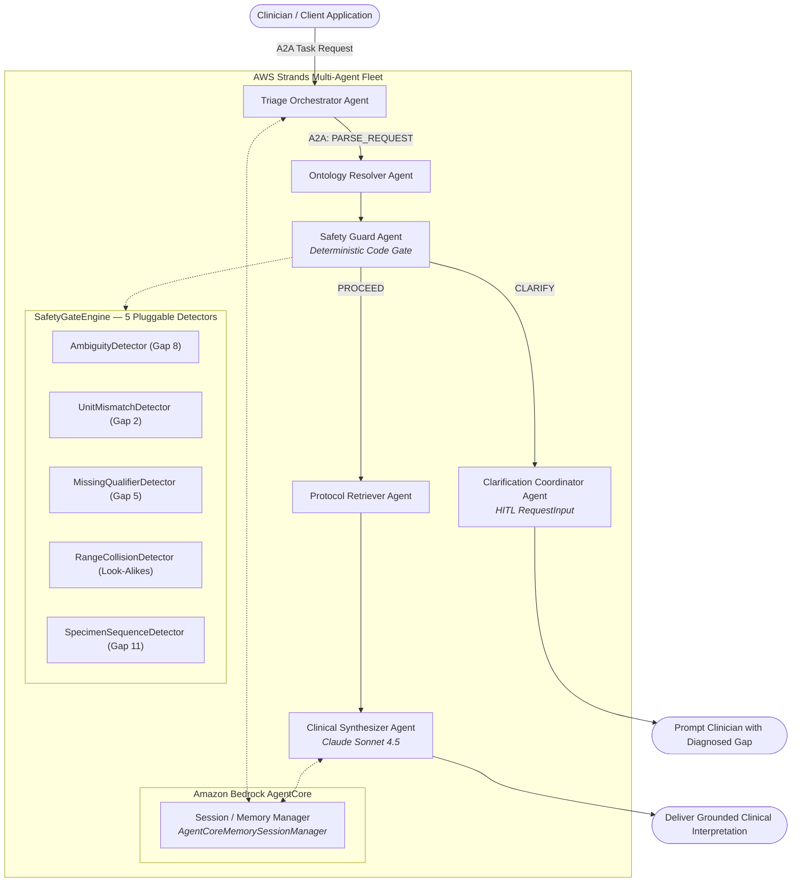
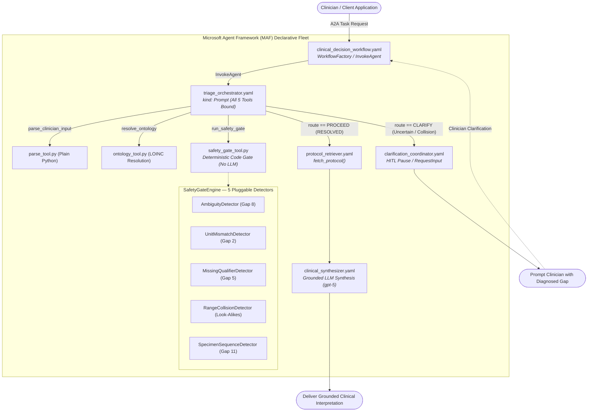
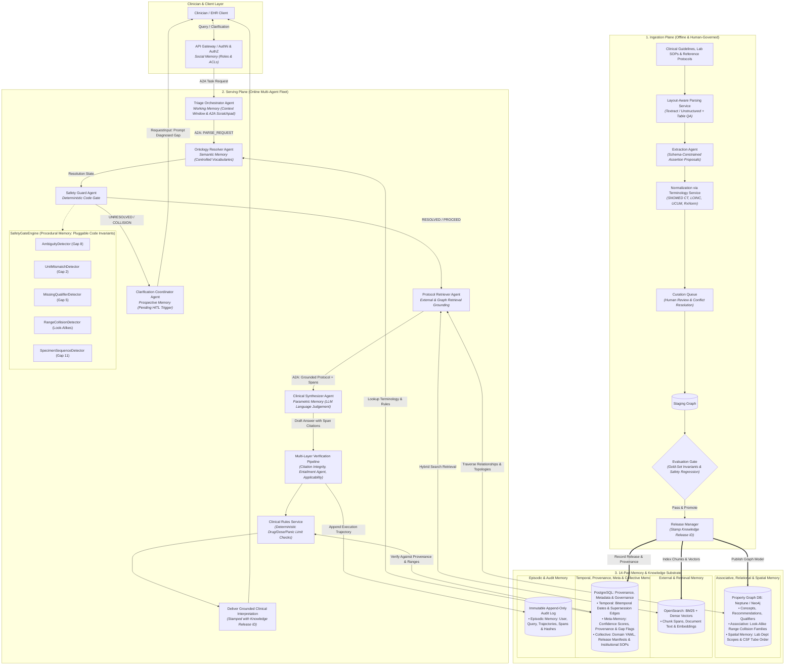

# Laboratory Medicine Decision Support — Multi-Agent Retrieval-Gap System

*When the Retriever Has to Decide: Reusable Multi-Agent Architecture, Configurable Gaps, and Deterministic Gating*

By Dr. Amit Puri · October 2026

> **In continuation to:** *[Information Retrieval Part I](https://www.linkedin.com/pulse/information-retrieval-dr-amit-puri-ahcec/)*, *[Part II: When Similarity Isn't Enough!](https://www.linkedin.com/pulse/information-retrieval-when-similarity-isnt-enough-dr-amit-puri-2rnzc/)*, and *[Recap & Closing](https://www.linkedin.com/pulse/recap-where-retrieval-gaps-diagnose-fix-dr-amit-puri-fhlwf)*.

---

## Executive Summary & TL;DR

- **An agent is a retriever that has to decide.** Every one of the 7 classical/RAG retrieval gaps still applies. Agents introduce four new failure modes: guessing instead of asking (Gap 8), safety rules relegated to probabilistic prompts (Gap 9), un-evaluated execution trajectories (Gap 10), and tool output treated as unscoped, trusted context (Gap 11).
- **An ontology's job in an agent is to define what a term means, and when to stop.** In laboratory medicine, terms like `"Hb"`, `"Calcium"`, `"CSF panel"`, and `"Troponin"` each conceal multiple distinct assays with different clinical units, reference ranges, or owning laboratory departments.
- **Same clinical logic, three agent frameworks.** The deterministic `SafetyGateEngine`, Pydantic models, YAML config, and A2A contracts are framework-independent. Three complete implementations demonstrate portability:

| Framework | Folder | Model | Status |
| :--- | :--- | :--- | :--- |
| **Google ADK 2.0** | `google-adk-agents/` | Gemini 3.5 Flash | ✅ Complete |
| **AWS Strands Agents SDK + Bedrock AgentCore** | `strands-agents/` | Anthropic Claude Sonnet 4.5 | ✅ Complete |
| **Microsoft Agent Framework (MAF) / Azure AI Foundry** | `agent-framework/` | GPT-5 via Azure AI Foundry / OpenAI | ✅ Complete |

> [!TIP]
> The objective is not to find a universally "perfect" agent architecture, but to pinpoint **what failed**, **why it failed**, and **the smallest intervention that fixes it**.

---

## Repository Layout

```text
multiagent-retrieval-gaps/
│
├── config/                              # Shared declarative YAML — all frameworks consume this
│   ├── domains/
│   │   └── laboratory_medicine/
│   │       ├── concepts.yaml            # Controlled vocabulary, LOINC mappings, synonyms, units
│   │       ├── protocols.yaml           # Clinical reference protocols & panic limits keyed by URI
│   │       ├── ranges.yaml              # Reference/critical limits & look-alike collision families
│   │       └── specimen_rules.yaml      # Specimen handling, aliquot rules & CSF tube sequencing
│   └── scenarios/
│       ├── scenario_a_hemoglobin.yaml       # Hb ambiguity & unit mismatch (Gap 2 & 8)
│       ├── scenario_b_csf_panel.yaml        # CSF emergency panel tube ordering (Gap 11)
│       ├── scenario_c_calcium_collision.yaml # Calcium look-alike range collision
│       └── scenario_d_troponin.yaml          # Dynamic extension: Troponin I vs T (zero-code)
│
├── google-adk-agents/                   # ── Framework 1: Google ADK 2.0 ──────────────────────
│   ├── README.md                        # Framework 1 documentation, OKF v0.2 & Harness details
│   ├── Dockerfile                       # Cloud Run / GKE production container
│   ├── pytest.ini
│   ├── src/
│   │   ├── .env                         # GEMINI_API_KEY (gitignored)
│   │   ├── env.example                  # Template
│   │   ├── a2a/contracts.py             # A2AMessage, AgentRole, A2AAction, A2ATaskState
│   │   ├── core/
│   │   │   ├── models.py                # Pydantic schemas (TrustTier, ConceptDefinition...)
│   │   │   ├── config.py                # YAML loader & OntologyRegistry
│   │   │   ├── okf_index.py             # Progressive disclosure catalog index (OKF §7.1)
│   │   │   ├── concept_graph.py         # Typed concept graph walk & look-alikes (OKF §4, §8.2)
│   │   │   ├── okf_writer.py            # Knowledge writeback & log.md maintenance (OKF §5.2, §7.5)
│   │   │   ├── attestation.py           # Deterministic numeric range attestation (OKF §5.4, §9)
│   │   │   └── detectors/               # 5 pluggable gap detectors + SafetyGateEngine
│   │   ├── agents/                      # 6 specialized ADK agent roles (OKF trust-aware synthesis)
│   │   ├── harness/                     # Agent Harness — 4-step MCP continuous loop
│   │   │   ├── agent.py                 # Step 1: ClinicalADKHarness continuous reasoning loop
│   │   │   ├── mcp_server.py            # Step 2: FastMCP server (6 clinical tools)
│   │   │   ├── mcp_client.py            # Step 2: Gemini function_call ↔ MCP bridge
│   │   │   ├── context.py               # Step 3: Token budgeting & OKF progressive disclosure
│   │   │   ├── session.py               # Step 3: Turn-by-turn conversation session state
│   │   │   ├── server.py                # Step 4: FastAPI ASGI server (REST + healthz + MCP tools)
│   │   │   └── console.py               # Step 4: Interactive CLI debugging console
│   │   ├── orchestration/a2a_orchestrator.py # ADK Workflow with OKF pre-scoping
│   │   ├── runner.py                    # Scenarios A–D runner (supports --harness flag)
│   │   └── main.py                      # CLI entrypoint
│   ├── requirements.txt                 # google-adk, google-genai, mcp, fastapi, uvicorn
│   ├── load_env.sh
│   └── tests/
│       ├── test_gate.py                 # 21 deterministic safety invariant tests
│       ├── test_multiagent_extensible.py# 16 multi-agent, A2A & YAML-extension tests
│       ├── test_okf_refinement.py       # 46 OKF Phase 1–4 tests (trust tiers, loader, resolver, synthesis)
│       ├── test_okf_phases_5_8.py       # 24 OKF Phase 5–8 tests (index, graph, writeback, attestation)
│       └── test_harness.py             # 35 harness tests: session, MCP dispatch, context, scenarios
│
├── strands-agents/                      # ── Framework 2: AWS Strands Agents SDK ──────────────
│   ├── README.md                        # Framework 2 documentation & AgentCore memory details
│   ├── pytest.ini
│   ├── requirements.txt
│   ├── .env.example                     # Bedrock / AgentCore template
│   ├── src/
│   │   ├── .env                         # ANTHROPIC_API_KEY + ANTHROPIC_MODEL_ID (gitignored)
│   │   ├── env.example
│   │   ├── models/provider.py           # AnthropicModel (claude-sonnet-4-5) or BedrockModel
│   │   ├── a2a/contracts.py             # Shared A2A contracts (same schema as ADK)
│   │   ├── core/                        # Shared detectors & Pydantic models
│   │   ├── agents/                      # 6 Strands agent roles
│   │   ├── memory/session.py            # Bedrock AgentCore managed session / local fallback
│   │   ├── orchestration/               # Strands workflow coordinator
│   │   ├── runner.py                    # Scenarios A–D runner
│   │   └── main.py                      # CLI entrypoint
│   └── tests/
│       └── test_strands_agents.py       # 50 deterministic offline tests
│
├── agent-framework/                     # ── Framework 3: Microsoft Agent Framework (MAF) ────
│   ├── pytest.ini
│   ├── requirements.txt
│   ├── load_env.sh
│   ├── declarative-agents/              # 6 × kind: Prompt YAML agent definitions
│   │   ├── triage_orchestrator.yaml     # Primary entrypoint — all 5 tools bound
│   │   ├── ontology_resolver.yaml       # LOINC concept resolution
│   │   ├── safety_guard.yaml            # Deterministic code gate (Gap 9)
│   │   ├── protocol_retriever.yaml      # Reference range + panic limits
│   │   ├── clinical_synthesizer.yaml    # Grounded LLM synthesis (only after PROCEED)
│   │   └── clarification_coordinator.yaml # HITL pause — returns gap to clinician
│   ├── declarative-workflows/
│   │   └── clinical_decision_workflow.yaml # WorkflowFactory + InvokeAgent conditional routing
│   ├── src/
│   │   ├── .env                         # Azure / OpenAI credentials (gitignored)
│   │   ├── env.example
│   │   ├── a2a/contracts.py             # Shared A2A contracts (parity with ADK & Strands)
│   │   ├── core/                        # Namespace shim importing shared Pydantic models
│   │   ├── harness/                     # MAF Agent Harness
│   │   │   ├── agent.py                 # ClinicalHarnessAgent + create_clinical_harness_agent()
│   │   │   ├── session.py               # HarnessSession — per-turn history & state
│   │   │   ├── providers.py             # ClinicalTodoProvider, ClinicalModeProvider,
│   │   │   │                            #   SafetyGateApprovalPolicy
│   │   │   └── console.py               # Terminal UX — /todos /mode /scenario /status
│   │   ├── tools/                       # 6 plain Python tools bound via YAML bindings
│   │   ├── models/provider.py           # Credential auto-detection (Foundry, Azure OpenAI, OpenAI)
│   │   ├── orchestration/workflow_runner.py # Live MAF workflow + offline fast path
│   │   ├── runner.py                    # Scenarios A–D runner
│   │   └── main.py                      # CLI entrypoint (--harness, --harness-scenario)
│   └── tests/
│       ├── test_gate.py                 # 23 deterministic safety invariant tests
│       ├── test_offline_pipeline.py     # 10 offline pipeline & fail-closed tests
│       └── test_harness.py              # 11 harness: session, todos, modes, approval, pipeline
│
├── docs/
│   ├── ai-agent-memory-architecture.md
│   ├── healthcare_multi_agent_architecture.md
│   └── ontology-kg-okf-for-ai-agents.md # Open Knowledge Format (OKF v0.2) reference
│
└── .gitignore
```

> [!IMPORTANT]
> **`config/`** is the single source of truth for all clinical knowledge. All three framework
> implementations read from the same `config/domains/` and `config/scenarios/` YAML files —
> no Python code changes are needed to add a new gap scenario.

---

## Gaps Addressed

| Gap | Level | Addressed In | Implementation |
| :--- | :--- | :--- | :--- |
| **Gap 2: Unit Mismatch** | Agent Loop | `core/detectors/unit_mismatch.py` | Standalone detector that explicitly rejects units not valid for any matched concept (e.g. `mg/dL` for Hemoglobin). |
| **Gap 5: Missing Qualifier** | Agent Loop | `core/detectors/missing_qualifier.py` | Flags numeric results in look-alike assay families (Calcium, Troponin) when no qualifier is supplied. |
| **Gap 8: Ambiguity & Silent Guessing** | Agent Loop | `core/detectors/ambiguity.py` | Returns explicit `AMBIGUOUS`, `UNIT_MISMATCH`, or `NOT_FOUND` statuses instead of silent guesses. |
| **Gap 9: Safety Rule in Prompt** | Agent Loop | `orchestration/` | Deterministic routing `safety_guard_node`; fails closed on uncertainty. Human-in-the-loop pause. |
| **Gap 10: Trajectory Never Evaluated** | Agent Loop | `tests/` | Pure-code `pytest` suite verifying invariants in milliseconds without LLM calls. |
| **Gap 11: Tool Output Trusted, Unscoped** | Agent Loop | `core/detectors/specimen_sequence.py` | Enforces CSF panel tube sequencing and department scope boundaries. |
| **Range Collisions (Look-Alikes)** | Clinical Safety | `core/detectors/range_collision.py` | Evaluates numeric values against look-alike assay families to prevent lethal classification errors. |
| **Dynamic Gap Extensibility** | Framework | `config/scenarios/` | New gaps declared entirely in YAML — zero changes to Python code. |

---

## Framework 1 — Google ADK 2.0 (`google-adk-agents/`)

### Multi-Agent Architecture


### Getting Started — Google ADK

```bash
# 1. Install dependencies
cd google-adk-agents
pip install -r requirements.txt

# 2. Configure API key
cp src/env.example src/.env
# Edit src/.env: set GEMINI_API_KEY="..."

# 3. Run all scenarios (live Gemini, ADK workflow)
python src/main.py

# 4. Offline / stub mode (no API key needed)
python src/main.py --offline

# 5. Run all scenarios via Agent Harness (FastMCP + continuous loop)
python src/runner.py --harness
python src/runner.py --harness --offline

# 6. Interactive Agent Harness CLI console
python -m src.harness.console --offline
# clinician> Hb 13.5 | g/dL    → [PROCEED] loinc:718-7 | Ref: 13.8–17.2 g/dL [Attested ✓]
# clinician> Calcium 4.8 mg/dL → [CLARIFY] RANGE_COLLISION: Total vs. Ionized

# 7. Start production REST server (FastAPI / ASGI)
uvicorn src.harness.server:app --host 0.0.0.0 --port 8000
# POST /api/v1/query  GET /api/v1/mcp/tools  GET /healthz  GET /readyz

# 8. Run tests (142 deterministic safety invariants, OKF & harness tests)
python -m pytest tests/ -v
```

> [!TIP]
> See [`google-adk-agents/README.md`](google-adk-agents/README.md) for detailed documentation of the Google ADK 2.0 multi-agent implementation and Open Knowledge Format (OKF v0.2) enhancements.


---

## Framework 2 — AWS Strands Agents SDK + Bedrock AgentCore (`strands-agents/`)

### Multi-Agent Architecture



### Model Selection

| Mode | Model ID | Trigger |
| :--- | :--- | :--- |
| **Local / Direct Anthropic** | `claude-sonnet-4-5` | `ANTHROPIC_API_KEY` set in `src/.env` |
| **AWS Bedrock** | `us.anthropic.claude-sonnet-4-5:0` | `AWS_REGION` + credentials, `ANTHROPIC_API_KEY` unset |
| **Offline / Mock** | `MockBedrockModel` | `STRANDS_OFFLINE_MODE=true` or no credentials |

### Getting Started — Strands Agents

#### Option A: Local run with Anthropic API key (simplest)

```bash
cd strands-agents

# 1. Install dependencies
pip install -r requirements.txt

# 2. Verify src/.env (key is shared from google-adk-agents):
#    ANTHROPIC_API_KEY="sk-ant-..."
#    ANTHROPIC_MODEL_ID="claude-sonnet-4-5"
cat src/.env

# 3. Run all scenarios (live Claude Sonnet 4.5 via direct Anthropic API)
python src/main.py

# 4. Offline mode (no API key needed, deterministic mock)
python src/main.py --offline

# 5. Run tests (50 deterministic offline invariants, ~1.7 s)
python -m pytest tests/ -v
```

> [!TIP]
> See [`strands-agents/README.md`](strands-agents/README.md) for detailed documentation of the AWS Strands Agents SDK implementation, supervisor orchestration, and Amazon Bedrock AgentCore memory management.


#### Option B: AWS Bedrock (cross-region inference profile)

```bash
export AWS_REGION=us-east-1
export AWS_PROFILE=your-profile
export BEDROCK_MODEL_ID=us.anthropic.claude-sonnet-4-5:0
unset ANTHROPIC_API_KEY   # let Bedrock auto-discovery take over
python src/main.py
```

#### Option C: Bedrock AgentCore managed memory (production)

```bash
# Add to strands-agents/src/.env:
# AGENTCORE_MEMORY_ID=mem-clinical-decision-support
# AGENTCORE_SESSION_ID=session-default
# AGENTCORE_ACTOR_ID=clinician-001
# STRANDS_OFFLINE_MODE=false
python src/main.py
```

> [!NOTE]
> `ANTHROPIC_API_KEY` in `src/.env` takes precedence over AWS auto-discovery.
> Unset it to switch to Bedrock. The Strands SDK logs a reminder when both are present.

---

## Framework 3 — Microsoft Agent Framework (MAF) / Azure AI Foundry (`agent-framework/`)

### Multi-Agent Architecture (Declarative YAML + WorkflowFactory)



### Key Design Highlights — Microsoft Agent Framework

- **Declarative Agents (`kind: Prompt` YAML)**: 6 declarative agents defined entirely in `declarative-agents/*.yaml`, separating prompt instructions and tool declarations from execution logic.
- **Declarative Workflows (`WorkflowFactory`)**: Structured in `declarative-workflows/clinical_decision_workflow.yaml` using MAF conditional routing (`InvokeAgent` + `If/Then/Else`).
- **Plain Python Tools (Zero Decorator Overhead)**: Plain Python functions bound via YAML `bindings:` without mandatory `@tool` or `@kernel_function` decorators.
- **Fail-Closed Code Safety Gate**: `SafetyGateEngine` runs pure deterministic Python before any synthesis model invocation (closing Gap 9).
- **Namespace-Safe Core Shim**: Pre-registers shared ADK core modules via `importlib.util` in `sys.modules`, achieving zero-duplication code reuse across frameworks without namespace collisions.

### Credential Modes & Priority

| Priority | Mode | Environment Variable | Target Environment |
| :--- | :--- | :--- | :--- |
| **1** | **Azure AI Foundry** | `AZURE_AI_FOUNDRY_PROJECT_ENDPOINT` | Production cloud deployment (`gpt-5`) |
| **2** | **Azure OpenAI Direct** | `AZURE_OPENAI_ENDPOINT` + `AZURE_OPENAI_DEPLOYMENT` | Direct Azure tenant resource |
| **3** | **OpenAI Agents SDK** | `OPENAI_API_KEY` | Local development & rapid prototyping |
| **4** | **Deterministic Offline** | `MAF_OFFLINE_MODE=true` | Fast invariant CI/CD (0 API calls, ~1 s) |

### Getting Started — Microsoft Agent Framework

```bash
# 1. Install dependencies
cd agent-framework
pip install -r requirements.txt

# 2. Configure credentials (or use included local key in src/.env)
cp src/env.example src/.env

# 3. Run all scenarios (live gpt-5)
python src/main.py

# 4. Offline mode (no API key needed, deterministic mock)
python src/main.py --offline

# 5. Run a single scenario via WorkflowFactory runner
python src/main.py --scenario A   # Hb 13.5 — ambiguity, unit mismatch, resolution
python src/main.py --scenario B   # CSF emergency panel — tube ordering (Gap 11)
python src/main.py --scenario C   # Calcium 4.8 — look-alike collision
python src/main.py --scenario D   # Troponin I vs T — dynamic extension

# 6. Launch the interactive MAF Agent Harness console
python src/main.py --harness
# clinician> Hb 13.5 | g/dL    → [PROCEED] loinc:718-7 | Ref: 13.8–17.2 g/dL
# clinician> /todos             → 4-step diagnostic workflow checklist
# clinician> /mode plan         → switch to PLAN mode (analysis only, no protocol fetch)
# clinician> /scenario A        → run Scenario A through the harness
# clinician> /status            → session ID, mode, registered tools

# 7. Run a scenario non-interactively through the Harness
python src/main.py --harness-scenario A
python src/main.py --harness-scenario all

# 8. Run test suite (44 deterministic safety invariants, ~1.2 s)
python -m pytest tests/ -v
```

---

## The Demonstration Scenarios

All four scenarios are declared as **declarative YAML** under `config/scenarios/` — shared across all frameworks.

### Scenario A: "Hb 13.5" — Same Label, Different Departments
- **Problem:** `"Hb 13.5"` without unit → CBC Hemoglobin (`13.5 g/dL` = borderline normal) or Glycated Hemoglobin (`13.5%` = severe diabetic emergency).
- **Resolution:** `AmbiguityDetector` → `RequestInput` asking for unit. `g/dL` → LOINC `718-7`; `mg/dL` → `UNIT_MISMATCH`.

### Scenario B: CSF Emergency Panel — One Specimen, Many Owners
- **Problem:** Single Lumbar Puncture must be partitioned across 3 departments without cross-contamination.
- **Resolution:** `SpecimenSequenceDetector` pre-scopes by tube: Tube 1 (Biochem), Tube 2 (Micro), Tube 3 (Haematology).

### Scenario C: Calcium 4.8 mg/dL — Look-Alike Range Collision
- **Problem:** Total Calcium at 4.8 = `CRITICAL_LOW` (emergency IV calcium); Ionized Calcium at 4.8 = `NORMAL`.
- **Resolution:** `RangeCollisionDetector` → `RANGE_COLLISION` → forced clarification before medication.

### Scenario D: Troponin I vs T — Zero-Code Extension
- **Problem:** `"Troponin 15"` — cTnI in `ng/mL` (critical > 0.40) vs hs-cTnT in `ng/L` (critical > 52). Wrong unit = false alarm catheterization or missed MI.
- **Resolution:** Declared entirely in `scenario_d_troponin.yaml` — zero Python code. Full multi-agent A2A fleet.

---

## Trajectory Evaluation — Closing Gap 10

Pure-code deterministic `pytest` suites verify safety invariants **without LLM calls**:

```bash
# Google ADK 2.0 — 142 tests (~5.4 s)
cd google-adk-agents && python -m pytest tests/ -v

# AWS Strands SDK — 50 tests (~1.7 s)
cd strands-agents && python -m pytest tests/ -v

# Microsoft Agent Framework (MAF) — 44 tests (~1.2 s)
cd agent-framework && python -m pytest tests/ -v

# Total: 236 deterministic safety invariants verified across all 3 frameworks!
```

---

## A2A Message Contracts

All three implementations (ADK, Strands, and MAF) exchange the same structured `A2AMessage` envelopes:

```python
class A2AMessage(BaseModel):
    message_id: str
    trace_id: str
    sender: AgentRole       # triage_orchestrator, ontology_resolver_agent, …
    recipient: AgentRole
    action: A2AAction       # PARSE_REQUEST, RESOLVE_CONCEPT, VALIDATE_SAFETY, …
    timestamp: float
    payload: Dict[str, Any]
    status: Optional[ResolutionStatus] = None
```

---

## Production Architecture

### Proposed End-to-End System Architecture

The proposed production architecture integrates the **Offline Clinical Knowledge Ingestion & Governance Plane** ([`docs/healthcare_multi_agent_architecture.md`](./docs/healthcare_multi_agent_architecture.md)), the **Online Serving Plane with Deterministic Safety Gating**, and the **14-Part Memory Substrate** ([`docs/ai-agent-memory-architecture.md`](./docs/ai-agent-memory-architecture.md)).



---

### 14-Part Memory Architecture in Healthcare Multi-Agent Systems

Grounding the fourteen memory types from [`docs/ai-agent-memory-architecture.md`](./docs/ai-agent-memory-architecture.md) in this decision-support system:

| # | Memory Type | Implementation in Decision Support System | Failure Mode Mitigated |
|---|---|---|---|
| **1** | **Working (Context)** | Single-turn context window + typed `A2AMessage` payload scratchpads across the fleet. | Context rot; loss of active lab session constraints. |
| **2** | **Semantic** | Controlled clinical vocabularies, LOINC mappings, UCUM units, and approved concept definitions (`concepts.yaml`). | Semantic drift; inventing non-existent clinical codes. |
| **3** | **Episodic** | Session event logs, execution trajectories, and historical query resolutions. | Repeating past diagnostic failures or re-asking answered questions. |
| **4** | **Procedural** | Pluggable `SafetyGateEngine` detectors, A2A action contracts, skill recipes, and protocol resolution algorithms. | Blind replay of outdated runbooks or inconsistent gate execution. |
| **5** | **External (Retrieval)** | OpenSearch hybrid search (BM25 + dense vectors) over document chunks and evidence spans. | Hallucinating clinical literature not present in guidelines. |
| **6** | **Parametric** | Frozen weights of base foundation models (Gemini 3.5 Flash, Claude Sonnet 4.5, Azure OpenAI). | Answering changing clinical thresholds from stale training data. |
| **7** | **Prospective** | Pending clarification triggers in `ClarificationCoordinatorAgent` awaiting clinician input (`RequestInput`), async lab result hooks. | Unresolved clinical ambiguities left hanging or forgotten. |
| **8** | **Spatial** | Physical CSF lumbar puncture tube sequencing (Tubes 1–3) and owning laboratory department boundaries (Biochemistry, Microbiology, Haematology). | Specimen cross-contamination; dispatching tests to the wrong lab department. |
| **9** | **Temporal** | Bitemporal records (`valid_from`/`valid_to` vs. `recorded_at`), explicit `[:SUPERSEDES]` graph edges, and guideline expiration dates. | Recommending obsolete or superseded clinical guidelines. |
| **10** | **Associative / Relational** | Property graph (Neptune/Neo4j) linking Concepts, Recommendations, Qualifiers, Evidence Chunks, and Look-Alike Collision Families (Calcium, Troponin). | Treating numeric values in isolation without cross-assay collision awareness. |
| **11** | **Social** | Clinician role, department credentials, patient-caregiver relationship, and granular Document ACLs. | Leaking restricted clinical trial data or bypassing role authorization. |
| **12** | **Meta-Memory** | Confidence scores, span citation verification, gap detection status (`AMBIGUOUS`, `RANGE_COLLISION`), and retrievability gating. | Unearned certainty; guessing when information is incomplete (Gap 8). |
| **13** | **Collective / Organizational** | Governed `config/domains/` YAML knowledge base, institutional SOPs, panic limit definitions, and immutable `KnowledgeReleaseID`. | Inconsistent recommendations across clinical teams or facilities. |
| **14** | **Sensory (Perceptual)** | Short-lived raw multimodal buffers for lab instrument outputs, scanned PDF requisitions, and table OCR. | Prematurely discarding subtle assay flags or raw instrument metadata. |

---

### Architectural Planes & Interaction Flow

1. **Ingestion Plane (Offline & Human-Governed):**
   - Guidelines, SOPs, and manufacturer assay package inserts are processed through a layout-aware parsing pipeline.
   - An isolated, schema-constrained **Extraction Agent** proposes candidate assertions linked to exact text spans.
   - Assertions are normalized via the **Terminology Service** (SNOMED CT, LOINC, UCUM, RxNorm).
   - Clinical governance reviews high-risk claims and conflicts in the **Curation Queue**.
   - An **Evaluation Gate** runs gold-set regression invariants; on pass, a **`KnowledgeReleaseID`** is stamped and published across the graph, search index, and relational store.

2. **Serving Plane (Online Multi-Agent Fleet):**
   - Queries enter through the **API Gateway** where identity, role, and ACLs are established (Social Memory).
   - The **Triage Orchestrator** parses the clinical request and coordinates the fleet via typed `A2AMessage` contracts.
   - The **Ontology Resolver Agent** expands synonyms and maps clinical terms to canonical concepts.
   - The **Safety Guard Agent** runs the deterministic `SafetyGateEngine` in code (closing Gap 9). If any gap is detected (e.g. unit mismatch, look-alike collision, tube order violation), the flow halts immediately and routes to the **Clarification Coordinator Agent** (closing Gap 8).
   - Once validated, the **Protocol Retriever Agent** pulls grounded recommendations and evidence chunks from the knowledge substrate.
   - The **Clinical Synthesizer Agent** drafts the clinical interpretation with span-level citations.
   - The **Verification Pipeline & Clinical Rules Service** deterministically verifies citation integrity, entailment against source spans, population applicability, currency, and dose/panic thresholds.
   - The verified output is stamped with the `KnowledgeReleaseID` and delivered to the clinician, with a complete trajectory recorded in the immutable **Audit Log**.

---

### Technology Stack

| Layer | Google ADK | AWS Strands | Microsoft MAF / Azure AI Foundry |
| :--- | :--- | :--- | :--- |
| **Agent framework** | Google ADK 2.2 | AWS Strands SDK + Bedrock AgentCore | Microsoft Agent Framework (MAF) Python SDK |
| **Model** | Gemini 3.5 Flash | Claude Sonnet 4.5 | `gpt-5` via Azure AI Foundry / OpenAI |
| **Session memory** | ADK `InMemorySessionService` + `HarnessSession` | Bedrock AgentCore managed sessions | MAF `HarnessSession` / Local session manager |
| **Agent Harness** | `ClinicalADKHarness` (FastMCP, ASGI server, REST API) | — | `ClinicalHarnessAgent` (todos, modes, approval) |
| **MCP Integration** | FastMCP server — 6 clinical tools via MCP protocol | — | — |
| **Safety gate** | `SafetyGateEngine` (shared) | `SafetyGateEngine` (shared) | `SafetyGateEngine` (shared) |
| **Tests** | **142 offline `pytest` tests** (OKF v0.2 + Safety Gate + Harness) | 50 offline `pytest` tests | 44 offline `pytest` tests (✅ Complete) |

| Shared Infrastructure | Production Choice |
| :--- | :--- |
| **Graph DB** | Neptune (openCypher) or Neo4j (Cypher) |
| **Search** | OpenSearch (BM25 + dense vectors) |
| **Relational** | PostgreSQL — provenance, ACLs, releases |
| **Terminology** | Terminology server over LOINC, SNOMED CT, RxNorm, UCUM |
| **Clinical rules** | Licensed drug knowledge base behind a service |
| **Guardrails** | Bedrock Guardrails / Azure Content Safety / equivalent |
| **Observability** | Langfuse or similar, PHI-redacted |

> [!WARNING]
> **Safety rules must live in deterministic code, not in prompts.** This is Gap 9.
> The `SafetyGateEngine` runs before any LLM synthesis — regardless of which agent framework is used.

---

## Ontological Principles for Multi-Agent Systems

1. **Identity:** A governed definition of what terms mean (LOINC, UCUM, SNOMED).
2. **Epistemic Discipline:** Ambiguity as a first-class output, not a silent guess.
3. **Deterministic Safety:** Clinical guardrails extracted from probabilistic prompts and enforced in code.
4. **Agent-to-Agent Division of Labor:** Specialized agent roles via typed A2A contracts.

> When the retriever has to decide, the safest action it can take is knowing when to stop and ask.

---

## Evaluation & Quality Gates

| Gate | Check | Blocks Release If |
| :--- | :--- | :--- |
| **Trajectory (Gap 10)** | Deterministic `pytest` — no LLM calls | Any safety invariant regression |
| **Retrieval** | Gold queries with known correct spans | Recall regression |
| **Verification** | Seeded false claims, wrong-population cases | Any unblocked unsafe claim |
| **Safety** | Red-team: prompt injection, ACL bypass, PHI leakage | Any critical failure |
| **Regression** | Model, prompt, or ontology change | Any metric drop vs. last release |

---

## Security, Privacy & Regulatory

- **PHI:** One BAA-covered inference path; PHI-safe telemetry (redact/hash prompts; enforce retention limits).
- **Authorisation:** ACLs on `DocumentVersion` enforced in graph queries and citations. UI RBAC is insufficient.
- **Audit:** Append-only log: `user`, `query`, `knowledge_release_id`, `retrieved_spans`, `output_hash`.
- **Regulatory:** Write an intended-use statement before build. FDA CDS criteria (January 2026 guidance). Consult regional equivalents (EU MDR etc.) with counsel.

---

## Design Principles

1. Evidence is the source of truth; the graph is a derived index.
2. Recommendations are first-class, qualified nodes — not bare triples.
3. Agents only where judgement is needed. Parsing, lookup, ACL checks, and index writes are services.
4. Humans gate the knowledge base. Staging → evaluated release → promote.
5. Verify against source, not against the LLM's own output.
6. Never store a fact without its provenance.
7. Prefer supersession over overwriting. Supersession is an explicit graph edge.
8. Scope everything. Enforce with ACLs, not UI conventions.
9. Make forgetting explicit. Define retention and deletion rules up front.
10. Evaluate memory directly — test recall, staleness, conflict resolution, cross-session continuity.
