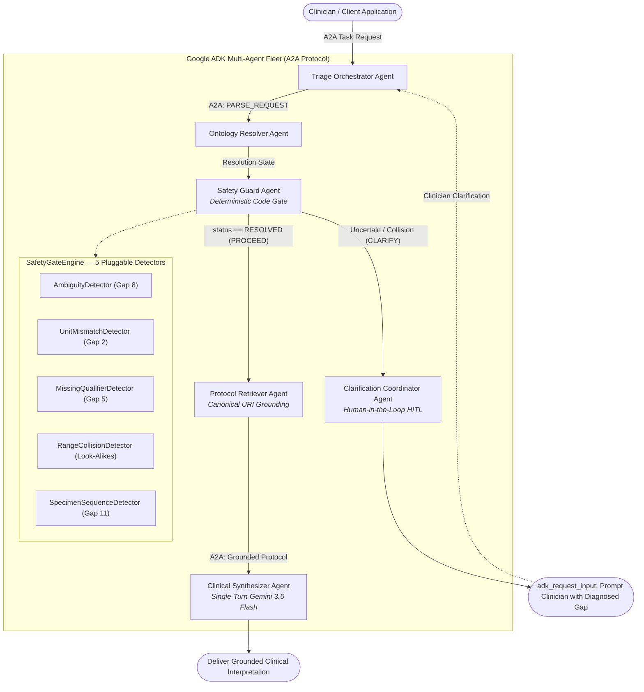

# Laboratory Medicine Decision Support — Multi-Agent Retrieval-Gap System

*When the Retriever Has to Decide: Reusable Multi-Agent Architecture, Configurable Gaps, and Deterministic Gating*

By Dr. Amit Puri · October 2026

> **In continuation to:** *[Information Retrieval Part I](https://www.linkedin.com/pulse/information-retrieval-dr-amit-puri-ahcec/)*, *[Part II: When Similarity Isn't Enough!](https://www.linkedin.com/pulse/information-retrieval-when-similarity-isnt-enough-dr-amit-puri-2rnzc/)*, and *[Recap & Closing](https://www.linkedin.com/pulse/recap-where-retrieval-gaps-diagnose-fix-dr-amit-puri-fhlwf)*.

---

## Executive Summary & TL;DR

- **An agent is a retriever that has to decide.** Every one of the 7 classical/RAG retrieval gaps still applies. Agents introduce four new failure modes: guessing instead of asking (Gap 8), safety rules relegated to probabilistic prompts (Gap 9), un-evaluated execution trajectories (Gap 10), and tool output treated as unscoped, trusted context (Gap 11).
- **An ontology's job in an agent is to define what a term means, and when to stop.** In laboratory medicine, terms like `"Hb"`, `"Calcium"`, `"CSF panel"`, and `"Troponin"` each conceal multiple distinct assays with different clinical units, reference ranges, or owning laboratory departments.
- **Same clinical logic, three agent frameworks.** The deterministic `SafetyGateEngine`, Pydantic models, YAML config, and A2A contracts are framework-independent. Three complete implementations demonstrate portability:

| Framework | Folder | Model | Status |
| :--- | :--- | :--- | :--- |
| **Google ADK 2.0** | `google-adk-agents/` | Gemini 3.5 Flash | ✅ Complete |
| **AWS Strands Agents SDK + Bedrock AgentCore** | `strands-agents/` | Anthropic Claude Sonnet 4.5 | ✅ Complete |
| **Azure AI Foundry + Semantic Kernel** | `agent-framework/` | Azure OpenAI | 🔜 Coming soon |

> [!TIP]
> The objective is not to find a universally "perfect" agent architecture, but to pinpoint **what failed**, **why it failed**, and **the smallest intervention that fixes it**.

---

## Repository Layout

```text
multiagent-retrieval-gaps/
│
├── config/                              # Shared declarative YAML — all frameworks consume this
│   ├── domains/
│   │   └── laboratory_medicine/
│   │       ├── concepts.yaml            # Controlled vocabulary, LOINC mappings, synonyms, units
│   │       ├── protocols.yaml           # Clinical reference protocols & panic limits keyed by URI
│   │       ├── ranges.yaml              # Reference/critical limits & look-alike collision families
│   │       └── specimen_rules.yaml      # Specimen handling, aliquot rules & CSF tube sequencing
│   └── scenarios/
│       ├── scenario_a_hemoglobin.yaml       # Hb ambiguity & unit mismatch (Gap 2 & 8)
│       ├── scenario_b_csf_panel.yaml        # CSF emergency panel tube ordering (Gap 11)
│       ├── scenario_c_calcium_collision.yaml # Calcium look-alike range collision
│       └── scenario_d_troponin.yaml          # Dynamic extension: Troponin I vs T (zero-code)
│
├── google-adk-agents/                   # ── Framework 1: Google ADK 2.0 ──────────────────────
│   ├── pytest.ini
│   ├── src/
│   │   ├── .env                         # GEMINI_API_KEY (gitignored)
│   │   ├── env.example                  # Template
│   │   ├── a2a/contracts.py             # A2AMessage, AgentRole, A2AAction, A2ATaskState
│   │   ├── core/
│   │   │   ├── models.py                # Pydantic schemas (ConceptDefinition, NumericAssay…)
│   │   │   ├── config.py                # YAML loader & OntologyRegistry
│   │   │   └── detectors/               # 5 pluggable gap detectors + SafetyGateEngine
│   │   ├── agents/                      # 6 specialized ADK agent roles
│   │   ├── orchestration/a2a_orchestrator.py
│   │   ├── runner.py                    # Scenarios A–D runner
│   │   └── main.py                      # CLI entrypoint
│   ├── requirements.txt
│   ├── load_env.sh
│   └── tests/
│       ├── test_gate.py                 # 12 deterministic safety invariant tests
│       └── test_multiagent_extensible.py# 16 multi-agent, A2A & YAML-extension tests
│
├── strands-agents/                      # ── Framework 2: AWS Strands Agents SDK ──────────────
│   ├── pytest.ini
│   ├── requirements.txt
│   ├── .env.example                     # Bedrock / AgentCore template
│   ├── src/
│   │   ├── .env                         # ANTHROPIC_API_KEY + ANTHROPIC_MODEL_ID (gitignored)
│   │   ├── env.example
│   │   ├── models/provider.py           # AnthropicModel (claude-sonnet-4-5) or BedrockModel
│   │   ├── a2a/contracts.py             # Shared A2A contracts (same schema as ADK)
│   │   ├── core/                        # Shared detectors & Pydantic models
│   │   ├── agents/                      # 6 Strands agent roles
│   │   ├── memory/session.py            # Bedrock AgentCore managed session / local fallback
│   │   ├── orchestration/               # Strands workflow coordinator
│   │   ├── runner.py                    # Scenarios A–D runner
│   │   └── main.py                      # CLI entrypoint
│   └── tests/
│       └── test_strands_agents.py       # 50 deterministic offline tests
│
├── agent-framework/                     # ── Framework 3: Azure AI Foundry (coming soon) ──────
│   ├── README.md                        # Planned stack & structure
│   ├── src/
│   │   ├── .env                         # Azure OpenAI key + endpoint (gitignored)
│   │   └── env.example
│   └── tests/
│       └── pytest.ini
│
├── docs/
│   ├── ai-agent-memory-architecture.md
│   └── healthcare_multi_agent_architecture.md
│
└── .gitignore
```

> [!IMPORTANT]
> **`config/`** is the single source of truth for all clinical knowledge. All three framework
> implementations read from the same `config/domains/` and `config/scenarios/` YAML files —
> no Python code changes are needed to add a new gap scenario.

---

## Gaps Addressed

| Gap | Level | Addressed In | Implementation |
| :--- | :--- | :--- | :--- |
| **Gap 2: Unit Mismatch** | Agent Loop | `core/detectors/unit_mismatch.py` | Standalone detector that explicitly rejects units not valid for any matched concept (e.g. `mg/dL` for Hemoglobin). |
| **Gap 5: Missing Qualifier** | Agent Loop | `core/detectors/missing_qualifier.py` | Flags numeric results in look-alike assay families (Calcium, Troponin) when no qualifier is supplied. |
| **Gap 8: Ambiguity & Silent Guessing** | Agent Loop | `core/detectors/ambiguity.py` | Returns explicit `AMBIGUOUS`, `UNIT_MISMATCH`, or `NOT_FOUND` statuses instead of silent guesses. |
| **Gap 9: Safety Rule in Prompt** | Agent Loop | `orchestration/` | Deterministic routing `safety_guard_node`; fails closed on uncertainty. Human-in-the-loop pause. |
| **Gap 10: Trajectory Never Evaluated** | Agent Loop | `tests/` | Pure-code `pytest` suite verifying invariants in milliseconds without LLM calls. |
| **Gap 11: Tool Output Trusted, Unscoped** | Agent Loop | `core/detectors/specimen_sequence.py` | Enforces CSF panel tube sequencing and department scope boundaries. |
| **Range Collisions (Look-Alikes)** | Clinical Safety | `core/detectors/range_collision.py` | Evaluates numeric values against look-alike assay families to prevent lethal classification errors. |
| **Dynamic Gap Extensibility** | Framework | `config/scenarios/` | New gaps declared entirely in YAML — zero changes to Python code. |

---

## Framework 1 — Google ADK 2.0 (`google-adk-agents/`)

### Multi-Agent Architecture



### Getting Started — Google ADK

```bash
# 1. Install dependencies
cd google-adk-agents
pip install -r ../requirements.txt

# 2. Configure API key
cp src/env.example src/.env
# Edit src/.env: set GEMINI_API_KEY="..."

# 3. Run all scenarios (live Gemini)
python src/main.py

# 4. Offline / stub mode (no API key needed)
python src/main.py --offline

# 5. Run tests (28 deterministic safety invariants, ~2.5 s)
python -m pytest tests/ -v
```

---

## Framework 2 — AWS Strands Agents SDK + Bedrock AgentCore (`strands-agents/`)

### Multi-Agent Architecture


### Model Selection

| Mode | Model ID | Trigger |
| :--- | :--- | :--- |
| **Local / Direct Anthropic** | `claude-sonnet-4-5` | `ANTHROPIC_API_KEY` set in `src/.env` |
| **AWS Bedrock** | `us.anthropic.claude-sonnet-4-5:0` | `AWS_REGION` + credentials, `ANTHROPIC_API_KEY` unset |
| **Offline / Mock** | `MockBedrockModel` | `STRANDS_OFFLINE_MODE=true` or no credentials |

### Getting Started — Strands Agents

#### Option A: Local run with Anthropic API key (simplest)

```bash
cd strands-agents

# 1. Install dependencies
pip install -r requirements.txt

# 2. Verify src/.env (key is shared from google-adk-agents):
#    ANTHROPIC_API_KEY="sk-ant-..."
#    ANTHROPIC_MODEL_ID="claude-sonnet-4-5"
cat src/.env

# 3. Run all scenarios (live Claude Sonnet 4.5 via direct Anthropic API)
python src/main.py

# 4. Offline mode (no API key needed, deterministic mock)
python src/main.py --offline

# 5. Run tests (50 deterministic offline invariants, ~1.7 s)
python -m pytest tests/ -v
```

#### Option B: AWS Bedrock (cross-region inference profile)

```bash
export AWS_REGION=us-east-1
export AWS_PROFILE=your-profile
export BEDROCK_MODEL_ID=us.anthropic.claude-sonnet-4-5:0
unset ANTHROPIC_API_KEY   # let Bedrock auto-discovery take over
python src/main.py
```

#### Option C: Bedrock AgentCore managed memory (production)

```bash
# Add to strands-agents/src/.env:
# AGENTCORE_MEMORY_ID=mem-clinical-decision-support
# AGENTCORE_SESSION_ID=session-default
# AGENTCORE_ACTOR_ID=clinician-001
# STRANDS_OFFLINE_MODE=false
python src/main.py
```

> [!NOTE]
> `ANTHROPIC_API_KEY` in `src/.env` takes precedence over AWS auto-discovery.
> Unset it to switch to Bedrock. The Strands SDK logs a reminder when both are present.

---

## Framework 3 — Azure AI Foundry + Semantic Kernel (`agent-framework/`)

> [!NOTE]
> **🔜 Coming soon.** Planned as the third framework port using Azure AI Foundry Agents API
> and Semantic Kernel. Will share the same `config/` YAML knowledge base and `SafetyGateEngine`.
> See [`agent-framework/README.md`](./agent-framework/README.md) for the planned stack and structure.

---

## The Demonstration Scenarios

All four scenarios are declared as **declarative YAML** under `config/scenarios/` — shared across all frameworks.

### Scenario A: "Hb 13.5" — Same Label, Different Departments
- **Problem:** `"Hb 13.5"` without unit → CBC Hemoglobin (`13.5 g/dL` = borderline normal) or Glycated Hemoglobin (`13.5%` = severe diabetic emergency).
- **Resolution:** `AmbiguityDetector` → `RequestInput` asking for unit. `g/dL` → LOINC `718-7`; `mg/dL` → `UNIT_MISMATCH`.

### Scenario B: CSF Emergency Panel — One Specimen, Many Owners
- **Problem:** Single Lumbar Puncture must be partitioned across 3 departments without cross-contamination.
- **Resolution:** `SpecimenSequenceDetector` pre-scopes by tube: Tube 1 (Biochem), Tube 2 (Micro), Tube 3 (Haematology).

### Scenario C: Calcium 4.8 mg/dL — Look-Alike Range Collision
- **Problem:** Total Calcium at 4.8 = `CRITICAL_LOW` (emergency IV calcium); Ionized Calcium at 4.8 = `NORMAL`.
- **Resolution:** `RangeCollisionDetector` → `RANGE_COLLISION` → forced clarification before medication.

### Scenario D: Troponin I vs T — Zero-Code Extension
- **Problem:** `"Troponin 15"` — cTnI in `ng/mL` (critical > 0.40) vs hs-cTnT in `ng/L` (critical > 52). Wrong unit = false alarm catheterization or missed MI.
- **Resolution:** Declared entirely in `scenario_d_troponin.yaml` — zero Python code. Full multi-agent A2A fleet.

---

## Trajectory Evaluation — Closing Gap 10

Pure-code deterministic `pytest` suites verify safety invariants **without LLM calls**:

```bash
# Google ADK 2.0 — 28 tests (~2.5 s)
cd google-adk-agents && python -m pytest tests/ -v

# AWS Strands SDK — 50 tests (~1.7 s)
cd strands-agents && python -m pytest tests/ -v
```

---

## A2A Message Contracts

Both ADK and Strands implementations exchange the same structured `A2AMessage` envelopes:

```python
class A2AMessage(BaseModel):
    message_id: str
    trace_id: str
    sender: AgentRole       # triage_orchestrator, ontology_resolver_agent, …
    recipient: AgentRole
    action: A2AAction       # PARSE_REQUEST, RESOLVE_CONCEPT, VALIDATE_SAFETY, …
    timestamp: float
    payload: Dict[str, Any]
    status: Optional[ResolutionStatus] = None
```

---

## Production Architecture

### Technology Stack

| Layer | Google ADK | AWS Strands | Azure (Planned) |
| :--- | :--- | :--- | :--- |
| **Agent framework** | Google ADK 2.2 | AWS Strands SDK + Bedrock AgentCore | Azure AI Foundry + Semantic Kernel |
| **Model** | Gemini 3.5 Flash | Claude Sonnet 4.5 | Azure OpenAI (GPT-4o / o3) |
| **Session memory** | ADK `InMemorySessionService` | Bedrock AgentCore managed sessions | Azure AI Foundry sessions |
| **Safety gate** | `SafetyGateEngine` (shared) | `SafetyGateEngine` (shared) | `SafetyGateEngine` (shared) |
| **Knowledge config** | `config/` YAML (shared) | `config/` YAML (shared) | `config/` YAML (shared) |
| **Tests** | 28 offline `pytest` tests | 50 offline `pytest` tests | Planned |

| Shared Infrastructure | Production Choice |
| :--- | :--- |
| **Graph DB** | Neptune (openCypher) or Neo4j (Cypher) |
| **Search** | OpenSearch (BM25 + dense vectors) |
| **Relational** | PostgreSQL — provenance, ACLs, releases |
| **Terminology** | Terminology server over LOINC, SNOMED CT, RxNorm, UCUM |
| **Clinical rules** | Licensed drug knowledge base behind a service |
| **Guardrails** | Bedrock Guardrails / Azure Content Safety / equivalent |
| **Observability** | Langfuse or similar, PHI-redacted |

> [!WARNING]
> **Safety rules must live in deterministic code, not in prompts.** This is Gap 9.
> The `SafetyGateEngine` runs before any LLM synthesis — regardless of which agent framework is used.

---

## Ontological Principles for Multi-Agent Systems

1. **Identity:** A governed definition of what terms mean (LOINC, UCUM, SNOMED).
2. **Epistemic Discipline:** Ambiguity as a first-class output, not a silent guess.
3. **Deterministic Safety:** Clinical guardrails extracted from probabilistic prompts and enforced in code.
4. **Agent-to-Agent Division of Labor:** Specialized agent roles via typed A2A contracts.

> When the retriever has to decide, the safest action it can take is knowing when to stop and ask.

---

## Evaluation & Quality Gates

| Gate | Check | Blocks Release If |
| :--- | :--- | :--- |
| **Trajectory (Gap 10)** | Deterministic `pytest` — no LLM calls | Any safety invariant regression |
| **Retrieval** | Gold queries with known correct spans | Recall regression |
| **Verification** | Seeded false claims, wrong-population cases | Any unblocked unsafe claim |
| **Safety** | Red-team: prompt injection, ACL bypass, PHI leakage | Any critical failure |
| **Regression** | Model, prompt, or ontology change | Any metric drop vs. last release |

---

## Security, Privacy & Regulatory

- **PHI:** One BAA-covered inference path; PHI-safe telemetry (redact/hash prompts; enforce retention limits).
- **Authorisation:** ACLs on `DocumentVersion` enforced in graph queries and citations. UI RBAC is insufficient.
- **Audit:** Append-only log: `user`, `query`, `knowledge_release_id`, `retrieved_spans`, `output_hash`.
- **Regulatory:** Write an intended-use statement before build. FDA CDS criteria (January 2026 guidance). Consult regional equivalents (EU MDR etc.) with counsel.

---

## Design Principles

1. Evidence is the source of truth; the graph is a derived index.
2. Recommendations are first-class, qualified nodes — not bare triples.
3. Agents only where judgement is needed. Parsing, lookup, ACL checks, and index writes are services.
4. Humans gate the knowledge base. Staging → evaluated release → promote.
5. Verify against source, not against the LLM's own output.
6. Never store a fact without its provenance.
7. Prefer supersession over overwriting. Supersession is an explicit graph edge.
8. Scope everything. Enforce with ACLs, not UI conventions.
9. Make forgetting explicit. Define retention and deletion rules up front.
10. Evaluate memory directly — test recall, staleness, conflict resolution, cross-session continuity.
