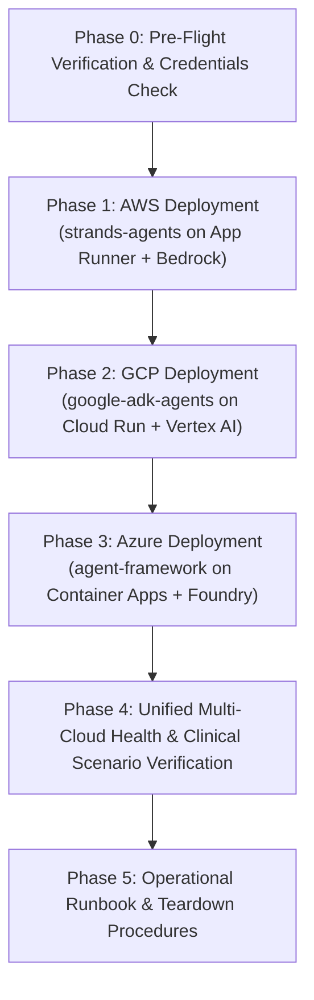

# Implementation Plan: Multi-Cloud Deployment for Clinical Decision Support

*Step-by-step installation and deployment execution plan across AWS, Google Cloud (GCP), and Microsoft Azure.*

---

## 1. Plan Overview & Target Architecture

This plan coordinates the sequential installation and deployment of the three specialized agent framework implementations across their respective cloud runtimes:



### Framework-to-Cloud Service Mapping

| Phase | Cloud Provider | Framework | Compute Runtime | Registry | Model Service |
| :--- | :--- | :--- | :--- | :--- | :--- |
| **Phase 1** | **AWS** | `strands-agents/` | **AWS App Runner** | Amazon ECR | Amazon Bedrock (Claude Sonnet 4.5) |
| **Phase 2** | **Google Cloud** | `google-adk-agents/` | **Google Cloud Run** | Artifact Registry | Vertex AI / Gemini 3.5 Flash |
| **Phase 3** | **Microsoft Azure** | `agent-framework/` | **Azure Container Apps** | Azure Container Registry (ACR) | Azure AI Foundry / OpenAI (`gpt-5`) |

---

## Phase 0: Pre-Flight Verification & Environment Checklist

Before triggering deployments, verify CLI authentication and Docker daemon readiness.

### Step 0.1: Check CLI Authentication

Execute in PowerShell or Bash:
```powershell
# AWS
aws sts get-caller-identity --output table

# Google Cloud
gcloud auth list --filter=status:ACTIVE
gcloud config get-value project

# Azure
az account show --output table

# Docker Engine
docker ps
```

*Expected Exit Criteria:*
- [ ] AWS account ID and caller ARN returned.
- [ ] GCP active account matches project `openagi-codes`.
- [ ] Azure subscription is enabled and active.
- [ ] Docker engine is running and able to build containers.

### Step 0.2: Foundation Model Access Checklist

- [ ] **AWS Bedrock**: Ensure Anthropic Claude model access is enabled under **AWS Bedrock → Model Access** (Region: `us-east-1`).
- [ ] **Google Vertex AI**: `aiplatform.googleapis.com` will be auto-enabled by script; `GEMINI_API_KEY` discovered from `.env` or Secret Manager.
- [ ] **Azure AI Foundry / OpenAI**: Ensure `AZURE_OPENAI_ENDPOINT` or `OPENAI_API_KEY` is configured (or offline mock fallback accepted).

---

## Phase 1: AWS Deployment — `strands-agents` on AWS App Runner

*Target Component:* [strands-agents](file:///c:/repositories/repos/multiagent-retrieval-gaps/strands-agents)  
*Containerfile:* [strands-agents/Dockerfile](file:///c:/repositories/repos/multiagent-retrieval-gaps/strands-agents/Dockerfile)  
*Scripts:* [deployment/aws-scripts/deploy.ps1](file:///c:/repositories/repos/multiagent-retrieval-gaps/deployment/aws-scripts/deploy.ps1) & [deploy.sh](file:///c:/repositories/repos/multiagent-retrieval-gaps/deployment/aws-scripts/deploy.sh)

### Step 1.1: ECR Repository Setup
1. Verify/create Amazon ECR repository `strands-clinical-agents` in `us-east-1`.
2. Enable image scan on push for security compliance.

### Step 1.2: App Runner IAM Roles
1. **ECR Access Role** (`AppRunnerECRAccessRole`): Grants App Runner permission to pull container images from Amazon ECR using `AWSAppRunnerServicePolicyForECRAccess`.
2. **Bedrock Instance Role** (`ClinicalAgentBedrockRole`): Grants container instances permission to invoke Amazon Bedrock foundation models (`bedrock:InvokeModel`, `bedrock:InvokeModelWithResponseStream`, `bedrock-agent-runtime:*`).

### Step 1.3: Container Build & Push
1. Authenticate Docker to Amazon ECR:
   ```powershell
   aws ecr get-login-password --region us-east-1 | docker login --username AWS --password-stdin <ACCOUNT_ID>.dkr.ecr.us-east-1.amazonaws.com
   ```
2. Build container from repo root:
   ```powershell
   docker build -f strands-agents/Dockerfile -t <ACCOUNT_ID>.dkr.ecr.us-east-1.amazonaws.com/strands-clinical-agents:latest .
   ```
3. Push image to Amazon ECR.

### Step 1.4: App Runner Service Creation
1. Provision App Runner service `strands-clinical-agents` with:
   - Port: `8000`
   - CPU: `1024` (1 vCPU)
   - Memory: `2048` (2 GB RAM)
   - Health check: HTTP `GET /healthz` (Interval 10s, timeout 5s, threshold 1/3)
   - Environment variables: `ALLOWED_ORIGINS=*`, `MAX_SESSIONS=1000`, `AWS_REGION=us-east-1`
2. App Runner automatically issues a managed HTTPS certificate and public URL (`https://<hash>.us-east-1.awsapprunner.com`).

### Step 1.5: Verification
Execute:
```powershell
cd c:\repositories\repos\multiagent-retrieval-gaps\deployment\aws-scripts
.\test-service.ps1
```
- [ ] `GET /healthz` returns `{"status": "healthy", "service": "aws-strands-agents"}`.
- [ ] `GET /readyz` returns registered tools and model configuration.
- [ ] `POST /api/v1/query` with `{"prompt": "Hb 13.5 | g/dL"}` returns attested LOINC resolution.

---

## Phase 2: Google Cloud Deployment — `google-adk-agents` on Google Cloud Run

*Target Component:* [google-adk-agents](file:///c:/repositories/repos/multiagent-retrieval-gaps/google-adk-agents)  
*Containerfile:* [google-adk-agents/Dockerfile](file:///c:/repositories/repos/multiagent-retrieval-gaps/google-adk-agents/Dockerfile)  
*Scripts:* [deployment/gcloud-scripts/deploy.ps1](file:///c:/repositories/repos/multiagent-retrieval-gaps/deployment/gcloud-scripts/deploy.ps1) & [deploy.sh](file:///c:/repositories/repos/multiagent-retrieval-gaps/deployment/gcloud-scripts/deploy.sh)

### Step 2.1: Enable Required GCP APIs
Enable APIs in project `openagi-codes`:
- `run.googleapis.com` (Cloud Run)
- `artifactregistry.googleapis.com` (Artifact Registry)
- `secretmanager.googleapis.com` (Secret Manager)
- `cloudbuild.googleapis.com` (Cloud Build)
- `aiplatform.googleapis.com` (Vertex AI)

### Step 2.2: Artifact Registry Repository Setup
1. Verify/create Docker repository `clinical-agents` in `europe-west1`.
2. Configure Docker authentication: `gcloud auth configure-docker europe-west1-docker.pkg.dev --quiet`.

### Step 2.3: Secret Management
1. Discover `GEMINI_API_KEY` from environment or `google-adk-agents/src/.env`.
2. Create/update Secret Manager secret `clinical-gemini-api-key`.
3. Grant `roles/secretmanager.secretAccessor` and `roles/aiplatform.user` to default compute service account.

### Step 2.4: Container Build & Push
1. Build container from repo root:
   ```powershell
   docker build -f google-adk-agents/Dockerfile -t europe-west1-docker.pkg.dev/openagi-codes/clinical-agents/clinical-adk-harness:latest .
   ```
2. Push image to Google Artifact Registry.

### Step 2.5: Cloud Run Deployment
Deploy `clinical-agent-harness` to Cloud Run:
- Platform: Managed
- Region: `europe-west1`
- Port: `8000`
- Concurrency: `80`
- Min instances: `0` (scales to zero when idle)
- Max instances: `5`
- Bound Secret: `GEMINI_API_KEY=clinical-gemini-api-key:latest`
- Ingress: Public (`--allow-unauthenticated`)

### Step 2.6: Verification
Execute:
```powershell
cd c:\repositories\repos\multiagent-retrieval-gaps\deployment\gcloud-scripts
.\test-service.ps1
```
- [ ] `GET /healthz` returns `{"status": "healthy", "service": "google-adk-harness"}`.
- [ ] `GET /readyz` returns 6 registered FastMCP clinical tools.
- [ ] `POST /api/v1/sessions` creates isolated session UUID.
- [ ] `POST /api/v1/query` returns `[Attested ✓]` result.

---

## Phase 3: Microsoft Azure Deployment — `agent-framework` on Azure Container Apps

*Target Component:* [agent-framework](file:///c:/repositories/repos/multiagent-retrieval-gaps/agent-framework)  
*Containerfile:* [agent-framework/Dockerfile](file:///c:/repositories/repos/multiagent-retrieval-gaps/agent-framework/Dockerfile)  
*Scripts:* [deployment/az-scripts/deploy.ps1](file:///c:/repositories/repos/multiagent-retrieval-gaps/deployment/az-scripts/deploy.ps1) & [deploy.sh](file:///c:/repositories/repos/multiagent-retrieval-gaps/deployment/az-scripts/deploy.sh)

### Step 3.1: Resource Group & ACR Provisioning
1. Create Resource Group `rg-clinical-agents` in `westeurope`.
2. Provision Azure Container Registry `acrclinagents<hash>` (SKU: Basic, admin-enabled: true).

### Step 3.2: Container Apps Managed Environment
1. Provision Azure Container Apps Environment `cae-clinical-agents` in `westeurope`.

### Step 3.3: Container Build & Push
1. Build and push container from `agent-framework/Dockerfile`:
   - Either via local Docker (`docker build` + `docker push`), OR
   - Remotely via Azure Cloud Tasks (`az acr build --registry <ACR> ...`).

### Step 3.4: Azure Container App Deployment
1. Deploy `maf-clinical-agents` to Azure Container Apps:
   - Target port: `8000`
   - Ingress: `external`
   - CPU: `1.0` vCPU
   - Memory: `2.0Gi`
   - Min replicas: `0`
   - Max replicas: `5`
   - Forward AI credentials (`AZURE_OPENAI_ENDPOINT`, `OPENAI_API_KEY`, etc. if configured).
2. Retrieve public URL: `https://<APP_NAME>.<ENV_DEFAULT_DOMAIN>`.

### Step 3.5: Verification
Execute:
```powershell
cd c:\repositories\repos\multiagent-retrieval-gaps\deployment\az-scripts
.\test-service.ps1
```
- [ ] `GET /healthz` returns `{"status": "healthy", "service": "azure-agent-framework"}`.
- [ ] `GET /readyz` returns MAF model configuration and clinical tools.
- [ ] `POST /api/v1/query` executes MAF Declarative Agent workflow.

---

## Phase 4: Multi-Cloud End-to-End Clinical Scenario Validation

Run validation queries across all three live endpoints:

### Scenario Matrix

| Scenario | Clinician Input | Safety Gate Status | Expected Route | Verification Criteria |
| :--- | :--- | :--- | :--- | :--- |
| **A1: Ambiguous Test** | `Hb 13.5` | `AMBIGUOUS` | `CLARIFY` | Asks to clarify between Blood vs Plasma Hb; no guessing |
| **A2: Unit Mismatch** | `Hb 13.5 \| mg/dL` | `UNIT_MISMATCH` | `CLARIFY` | Flags invalid unit `mg/dL`; suggests `g/dL` |
| **A3: Valid Resolution** | `Hb 13.5 \| g/dL` | `RESOLVED` | `PROCEED` | Returns `[Attested ✓]` badge, reference range `13.8 - 17.2 g/dL` |
| **B: CSF Panel Sequence** | CSF Workup Order | Evaluates tube sequencing | Safe routing | Verifies Tube 1 Chem, Tube 2 Micro, Tube 3 Hema |
| **C: Calcium Collision** | `Calcium 4.8 \| total \| mg/dL` | `RANGE_COLLISION` | `CLARIFY` | Detects ionized vs total look-alike collision |

---

## Phase 5: Monitoring, Operations & Teardown

### Operational Inspection Commands

```powershell
# AWS App Runner Logs
aws apprunner describe-service --service-arn <SERVICE_ARN> --region us-east-1

# Google Cloud Run Logs
gcloud run services describe clinical-agent-harness --region europe-west1
gcloud logging read "resource.type=cloud_run_revision AND resource.labels.service_name=clinical-agent-harness" --limit=20

# Azure Container App Logs
az containerapp logs show --name maf-clinical-agents --resource-group rg-clinical-agents --follow
```

### Complete Teardown Commands

When testing is complete, tear down each environment with zero stranded costs:

```powershell
# 1. Teardown AWS
cd c:\repositories\repos\multiagent-retrieval-gaps\deployment\aws-scripts
.\destroy.ps1

# 2. Teardown GCP
cd c:\repositories\repos\multiagent-retrieval-gaps\deployment\gcloud-scripts
.\destroy.ps1

# 3. Teardown Azure
cd c:\repositories\repos\multiagent-retrieval-gaps\deployment\az-scripts
.\destroy.ps1
```
