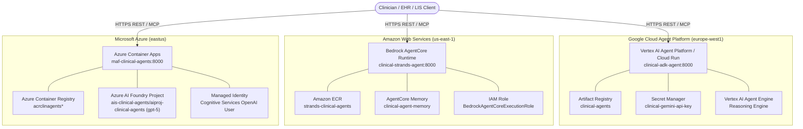

# Multi-Cloud Deployment Guide: Clinical Decision Support Agent Harness

*Unified multi-agent clinical decision support architecture deployed across Google Cloud (Agent Platform), Amazon Web Services (Bedrock AgentCore), and Microsoft Azure (AI Foundry + Container Apps).*

---

## 1. Executive Overview & Architecture

The **Laboratory Medicine Decision Support System** provides deterministic safety gating, LOINC ontology grounding, and multi-agent clinical synthesis.

All three cloud providers run production-grade continuous agent harnesses exposing FastAPI REST endpoints, FastMCP tools, and progressive disclosure token budgeting on port **8000**:



### Multi-Cloud Service Comparison

| Cloud Provider | Framework Deployed | Target Compute / Agent Service | Foundation Model Backend | Authentication & Secrets | Target Port | Health Check |
| :--- | :--- | :--- | :--- | :--- | :--- | :--- |
| **AWS** | **`strands-agents/`** (AWS Strands SDK) | **Amazon Bedrock AgentCore Runtime** (Gateway, Memory, Policy) | Claude Sonnet 4.5 (`anthropic.claude-sonnet-4-5-20251203-v1:0`) | IAM Role (`BedrockAgentCoreExecutionRole`) | 8000 | `/healthz`, `/readyz` |
| **Google Cloud** | **`google-adk-agents/`** (Google ADK 2.0) | **Google Cloud Agent Platform** (Vertex AI Reasoning Engine / Cloud Run) | Gemini 2.0 Flash (`gemini-2.0-flash-001`) | Secret Manager (`GEMINI_API_KEY`) + `roles/aiplatform.user` | 8000 | `/healthz`, `/readyz` |
| **Microsoft Azure** | **`agent-framework/`** (Microsoft Agent Framework) | **Azure Container Apps** (ACA) | Azure AI Foundry / Azure OpenAI (`gpt-5` / `gpt-4o`) | System-Assigned Managed Identity (`Cognitive Services OpenAI User`) | 8000 | `/healthz`, `/readyz` |

---

## 2. Cloud AI Model Services Setup

Each framework connects to its native cloud LLM provider, with automated IAM roles, environment secrets, and deterministic offline safety fallback:

```mermaid
flowchart LR
    subgraph AWS_Bedrock["AWS Bedrock AgentCore"]
        Strands["strands-agents/"] -->|IAM Execution Role| Bedrock["Bedrock AgentCore\nClaude Sonnet 4.5"]
        Strands -.->|Fallback| DetMock1["Deterministic SafetyGateEngine / Mock"]
    end

    subgraph GCP_Vertex["GCP Agent Platform"]
        ADK["google-adk-agents/"] -->|Secret Manager / ADC| VertexAI["Vertex AI Agent Platform\nGemini 2.0 Flash"]
        ADK -.->|Fallback| DetMock2["Deterministic SafetyGateEngine / Mock"]
    end

    subgraph Azure_Foundry["Azure AI Foundry"]
        MAF["agent-framework/"] -->|Managed Identity (RBAC)| AzureAI["Azure AI Foundry Project\ngpt-5 (ais-clinical-agents)"]
        MAF -.->|Fallback| DetMock3["Deterministic SafetyGateEngine / Mock"]
    end
```

### 1. Amazon Bedrock AgentCore Setup (AWS)
- **Model Used**: Anthropic Claude Sonnet 4.5 (`anthropic.claude-sonnet-4-5-20251203-v1:0`).
- **Target Region**: `us-east-1` (recommended for Bedrock AgentCore features and Claude availability).
- **Setup in AWS**:
  1. Ensure model access is enabled at [Bedrock Model Access](https://console.aws.amazon.com/bedrock/home?region=us-east-1#/modelaccess).
  2. The deployment script (`deploy.ps1` / `deploy.sh`) automatically provisions:
     - IAM Role `BedrockAgentCoreExecutionRole` with access to `bedrock-agentcore:*`, `bedrock-agent-runtime:*`, ECR, and CloudWatch Logs.
     - AgentCore Memory resource (`clinical-agent-memory`) for short- and long-term session persistence.
     - Bedrock AgentCore Runtime (`clinical-strands-agent`) with fallback to App Runner with `AGENTCORE_ENABLED=true`.
     - AgentCore Gateway endpoint for API routing and observability.
- **Offline / CI Mode**: If model access is not yet activated, `strands-agents` safely falls back to the deterministic pure-code `SafetyGateEngine` and `MockBedrockModel`.

### 2. Google Cloud Agent Platform Setup (GCP)
- **Model Used**: Gemini 2.0 Flash (`gemini-2.0-flash-001`) via Google ADK 2.0.
- **Target Region**: `europe-west1` (or `us-central1`).
- **Setup in GCP**:
  1. The deployment script enables `aiplatform.googleapis.com`, `discoveryengine.googleapis.com`, `dialogflow.googleapis.com`, `run.googleapis.com`, and `artifactregistry.googleapis.com`.
  2. Provisions Secret Manager secret `clinical-gemini-api-key` and grants both `roles/secretmanager.secretAccessor` and `roles/aiplatform.user` to the compute service account.
  3. Provisions Vertex AI Reasoning Engine (Agent Engine) and deploys Cloud Run service (`clinical-adk-agent`) with Agent Platform runtime flags (`AGENT_PLATFORM_ENABLED=true`, `VERTEX_AI_PROJECT`, `GEMINI_MODEL`).
  4. Registers the agent with Vertex AI Agent Builder.
- **Offline / CI Mode**: When `GEMINI_API_KEY` is omitted, the service boots with `offline_mode: true` (alerted in `/readyz` as `status: degraded`) and deterministically enforces all 6 safety gap detectors.

### 3. Azure AI Foundry & Microsoft Agent Framework Setup (Azure)
- **Model Used**: `gpt-5` / `gpt-4o` via Microsoft Agent Framework (`agent-framework`).
- **Target Region**: `eastus` / `eastus2`.
- **Setup in Azure**:
  1. The deployment script automatically discovers or provisions an Azure AI Services account (`kind: AIServices`) and an Azure AI Foundry Project (`az cognitiveservices account project create`).
  2. Connects to the project endpoint (e.g. `https://<account>.services.ai.azure.com/api/projects/<project>`).
  3. Deploys the Container App (`maf-clinical-agents`) with a **System-Assigned Managed Identity**.
  4. Automatically assigns the keyless RBAC role **`Cognitive Services OpenAI User`** to the container's identity, eliminating raw API keys.
  5. The runtime utilizes `DefaultAzureCredential()` in `agent-framework/src/models/provider.py` for keyless authentication.
- **Offline / CI Mode**: If endpoints are omitted, `agent-framework` activates `MAF_OFFLINE_MODE=true` and runs the deterministic safety workflow offline.

---

## 3. Prerequisites & Verification

All three CLI tools (`gcloud`, `aws`, `az`), `docker`, and Git Bash for Windows should be installed and authenticated on your local workstation.

Verify authentication before proceeding:

```bash
# Google Cloud
gcloud auth list
gcloud config get-value project

# AWS
aws sts get-caller-identity

# Azure
az account show --output table

# Docker Daemon
docker version
```

In PowerShell:
```powershell
gcloud auth list
aws sts get-caller-identity
az account show --output table
docker version
```

---

## 4. Amazon Web Services (AWS) Deployment (`deployment/aws-scripts/`)

Deploys the AWS Strands Agents SDK solution (`strands-agents/`) to **Amazon Bedrock AgentCore Runtime** with **Amazon ECR** and **AgentCore Memory**.

### Quickstart (1 Command)

**Bash / Git Bash:**
```bash
cd deployment/aws-scripts
chmod +x *.sh
./deploy.sh
```

**PowerShell:**
```powershell
cd deployment\aws-scripts
.\deploy.ps1 -AwsRegion us-east-1
```

### Script Parameters & Configuration (`deployment/aws-scripts/config.env`)

```ini
AWS_REGION="us-east-1"
AGENT_NAME="clinical-strands-agent"
ECR_REPO_NAME="strands-clinical-agents"
IMAGE_TAG="latest"
BEDROCK_MODEL_ID="anthropic.claude-sonnet-4-5-20251203-v1:0"
AGENT_ROLE_NAME="BedrockAgentCoreExecutionRole"
MEMORY_NAME="clinical-agent-memory"
PORT=8000
```

### Manual Deployment Walkthrough with `aws` CLI

```bash
# 1. Variables
AWS_REGION="us-east-1"
ACCOUNT_ID="$(aws sts get-caller-identity --query Account --output text)"
ECR_REPO="strands-clinical-agents"
AGENT_NAME="clinical-strands-agent"
ECR_URI="${ACCOUNT_ID}.dkr.ecr.${AWS_REGION}.amazonaws.com/${ECR_REPO}"

# 2. Create Amazon ECR Repository
aws ecr create-repository \
  --repository-name "${ECR_REPO}" \
  --region "${AWS_REGION}" \
  --image-scanning-configuration scanOnPush=true

# 3. Build & push Docker image from strands-agents/Dockerfile
cd ../..
aws ecr get-login-password --region "${AWS_REGION}" | docker login --username AWS --password-stdin "${ECR_URI}"
docker build -f strands-agents/Dockerfile -t "${ECR_URI}:latest" .
docker push "${ECR_URI}:latest"

# 4. Create Bedrock AgentCore IAM Execution Role
aws iam create-role \
  --role-name BedrockAgentCoreExecutionRole \
  --assume-role-policy-document '{"Version":"2012-10-17","Statement":[{"Effect":"Allow","Principal":{"Service":["bedrock.amazonaws.com","lambda.amazonaws.com","build.apprunner.amazonaws.com","tasks.apprunner.amazonaws.com"]},"Action":"sts:AssumeRole"}]}'

aws iam put-role-policy \
  --role-name BedrockAgentCoreExecutionRole \
  --policy-name AgentCoreFullAccess \
  --policy-document '{"Version":"2012-10-17","Statement":[{"Effect":"Allow","Action":["bedrock:*","bedrock-agentcore:*","bedrock-agent-runtime:*","ecr:*","logs:*","secretsmanager:GetSecretValue"],"Resource":"*"}]}'

ROLE_ARN="$(aws iam get-role --role-name BedrockAgentCoreExecutionRole --query Role.Arn --output text)"

# 5. Provision AgentCore Memory Resource
aws bedrock-agentcore create-memory-resource \
  --cli-input-json "{\"name\":\"clinical-agent-memory\",\"description\":\"Session memory\",\"memoryExecutionRoleArn\":\"${ROLE_ARN}\"}" \
  --region "${AWS_REGION}"
```

### Verification & Testing
```bash
./test-service.sh
# or in PowerShell:
.\test-service.ps1
```

### Teardown
```bash
./destroy.sh --force
# or in PowerShell:
.\destroy.ps1 -Force
```

---

## 5. Google Cloud Deployment (`deployment/gcloud-scripts/`)

Deploys the Google ADK continuous clinical agent harness (`google-adk-agents/`) to **Google Cloud Agent Platform** (Vertex AI Reasoning Engine / Cloud Run) using **Artifact Registry** and **Secret Manager**.

### Quickstart (1 Command)

**Bash / Git Bash:**
```bash
cd deployment/gcloud-scripts
chmod +x *.sh
./deploy.sh
```

**PowerShell:**
```powershell
cd deployment\gcloud-scripts
.\deploy.ps1 -ProjectId openagi-codes -Region europe-west1
```

### Script Parameters & Configuration (`deployment/gcloud-scripts/config.env`)

```ini
PROJECT_ID="openagi-codes"
REGION="europe-west1"
AGENT_RESOURCE_NAME="clinical-adk-agent"
REPO_NAME="clinical-agents"
IMAGE_NAME="clinical-adk-harness"
MODEL_ID="gemini-2.0-flash-001"
PORT=8000
CPU="1"
MEMORY="2Gi"
MIN_INSTANCES=0
MAX_INSTANCES=10
```

### Manual Deployment Walkthrough with `gcloud`

```bash
# 1. Variables
PROJECT_ID="$(gcloud config get-value project)"
REGION="europe-west1"
REPO_NAME="clinical-agents"
IMAGE_NAME="clinical-adk-harness"
SERVICE_NAME="clinical-adk-agent"
IMAGE_URI="${REGION}-docker.pkg.dev/${PROJECT_ID}/${REPO_NAME}/${IMAGE_NAME}:latest"

# 2. Enable Agent Platform APIs
gcloud services enable \
  aiplatform.googleapis.com \
  artifactregistry.googleapis.com \
  secretmanager.googleapis.com \
  cloudbuild.googleapis.com \
  run.googleapis.com \
  discoveryengine.googleapis.com \
  dialogflow.googleapis.com \
  --project="${PROJECT_ID}"

# 3. Create Artifact Registry Docker repository
gcloud artifacts repositories create "${REPO_NAME}" \
  --repository-format=docker \
  --location="${REGION}" \
  --description="Clinical Agent Platform containers" \
  --project="${PROJECT_ID}"

# 4. Build and push container image
cd ../..
gcloud auth configure-docker "${REGION}-docker.pkg.dev" --quiet
docker build -f google-adk-agents/Dockerfile -t "${IMAGE_URI}" .
docker push "${IMAGE_URI}"

# 5. Store GEMINI_API_KEY and grant Vertex AI permissions
gcloud secrets create clinical-gemini-api-key --replication-policy="automatic" --project="${PROJECT_ID}"
echo -n "${GEMINI_API_KEY}" | gcloud secrets versions add clinical-gemini-api-key --data-file=- --project="${PROJECT_ID}"

PROJECT_NUM="$(gcloud projects describe ${PROJECT_ID} --format='value(projectNumber)')"
gcloud secrets add-iam-policy-binding clinical-gemini-api-key \
  --member="serviceAccount:${PROJECT_NUM}-compute@developer.gserviceaccount.com" \
  --role="roles/secretmanager.secretAccessor" \
  --project="${PROJECT_ID}"

gcloud projects add-iam-policy-binding "${PROJECT_ID}" \
  --member="serviceAccount:${PROJECT_NUM}-compute@developer.gserviceaccount.com" \
  --role="roles/aiplatform.user"

# 6. Deploy to Cloud Run with Agent Platform environment
gcloud run deploy "${SERVICE_NAME}" \
  --image="${IMAGE_URI}" \
  --platform=managed \
  --region="${REGION}" \
  --port=8000 \
  --cpu=1 \
  --memory=2Gi \
  --min-instances=0 \
  --max-instances=10 \
  --set-env-vars="ALLOWED_ORIGINS=*,MAX_SESSIONS=1000,VERTEX_AI_PROJECT=${PROJECT_ID},VERTEX_AI_LOCATION=${REGION},GEMINI_MODEL=gemini-2.0-flash-001,AGENT_PLATFORM_ENABLED=true" \
  --set-secrets="GEMINI_API_KEY=clinical-gemini-api-key:latest" \
  --allow-unauthenticated \
  --project="${PROJECT_ID}"
```

### Verification & Testing
```bash
./test-service.sh
# or in PowerShell:
.\test-service.ps1
```

### Teardown
```bash
./destroy.sh --force
# or in PowerShell:
.\destroy.ps1 -Force
```

---

## 6. Microsoft Azure Deployment (`deployment/az-scripts/`)

Deploys the Microsoft Agent Framework solution (`agent-framework/`) to **Azure Container Apps (ACA)** wired with **Azure AI Foundry** and **Managed Identity RBAC**.

### Quickstart (1 Command)

**Bash / Git Bash:**
```bash
cd deployment/az-scripts
chmod +x *.sh
./deploy.sh
```

**PowerShell:**
```powershell
cd deployment\az-scripts
.\deploy.ps1 -ResourceGroup rg-clinical-agents -Location eastus
```

### Script Parameters & Configuration (`deployment/az-scripts/config.env`)

```ini
RESOURCE_GROUP="rg-clinical-agents"
LOCATION="eastus"
ENVIRONMENT_NAME="cae-clinical-agents"
APP_NAME="maf-clinical-agents"
IMAGE_NAME="agent-framework"
IMAGE_TAG="latest"
PORT=8000
CPU="1.0"
MEMORY="2.0Gi"
MIN_REPLICAS=0
MAX_REPLICAS=5

# Azure AI Foundry Configuration (Azure CAF Standard: ais-*, aiproj-*)
AI_FOUNDRY_ACCOUNT_NAME="ais-clinical-agents"
AI_FOUNDRY_PROJECT_NAME="aiproj-clinical-agents"
AI_FOUNDRY_RESOURCE_GROUP="rg-clinical-agents"
FOUNDRY_MODEL="gpt-5"
```

### Manual Deployment Walkthrough with `az` CLI

```bash
# 1. Variables
RESOURCE_GROUP="rg-clinical-agents"
LOCATION="eastus"
ACR_NAME="acrclinagents$(date +%s | cut -c5-10)"
ENVIRONMENT_NAME="cae-clinical-agents"
APP_NAME="maf-clinical-agents"
AI_ACCOUNT="ais-clinical-agents"
AI_PROJECT="aiproj-clinical-agents"
TARGET_AI_RG="rg-clinical-agents"

# 2. Create Resource Group & ACR
az group create --name "${RESOURCE_GROUP}" --location "${LOCATION}"
az acr create --resource-group "${RESOURCE_GROUP}" --name "${ACR_NAME}" --sku Basic --admin-enabled true

ACR_LOGIN_SERVER="$(az acr show --name ${ACR_NAME} --query loginServer -o tsv)"
ACR_USER="$(az acr credential show --name ${ACR_NAME} --query username -o tsv)"
ACR_PASS="$(az acr credential show --name ${ACR_NAME} --query passwords[0].value -o tsv)"

# 3. Build container using Azure ACR Tasks from agent-framework/Dockerfile
cd ../..
az acr build \
  --registry "${ACR_NAME}" \
  --image "agent-framework:latest" \
  --file "agent-framework/Dockerfile" \
  .

# 4. Query AI Foundry Project Endpoint
FOUNDRY_ENDPOINT="$(az cognitiveservices account project show --name ${AI_ACCOUNT} --resource-group ${TARGET_AI_RG} --project-name ${AI_PROJECT} --query 'properties.endpoints."AI Foundry API"' -o tsv)"
AI_ACCOUNT_ID="$(az cognitiveservices account show --name ${AI_ACCOUNT} --resource-group ${TARGET_AI_RG} --query id -o tsv)"

# 5. Create Azure Container Apps Environment
az containerapp env create \
  --name "${ENVIRONMENT_NAME}" \
  --resource-group "${RESOURCE_GROUP}" \
  --location "${LOCATION}"

# 6. Deploy Azure Container App with System-Assigned Managed Identity
az containerapp create \
  --name "${APP_NAME}" \
  --resource-group "${RESOURCE_GROUP}" \
  --environment "${ENVIRONMENT_NAME}" \
  --image "${ACR_LOGIN_SERVER}/agent-framework:latest" \
  --target-port 8000 \
  --ingress external \
  --registry-server "${ACR_LOGIN_SERVER}" \
  --registry-username "${ACR_USER}" \
  --registry-password "${ACR_PASS}" \
  --system-assigned \
  --cpu 1.0 \
  --memory 2.0Gi \
  --min-replicas 0 \
  --max-replicas 5 \
  --env-vars ALLOWED_ORIGINS=* MAX_SESSIONS=1000 AZURE_AI_FOUNDRY_PROJECT_ENDPOINT="${FOUNDRY_ENDPOINT}" FOUNDRY_MODEL="gpt-5"

# 7. Grant Container App Managed Identity access to Azure AI Foundry
APP_PRINCIPAL_ID="$(az containerapp show --name ${APP_NAME} --resource-group ${RESOURCE_GROUP} --query identity.principalId -o tsv)"
az role assignment create \
  --assignee-object-id "${APP_PRINCIPAL_ID}" \
  --assignee-principal-type "ServicePrincipal" \
  --role "Cognitive Services OpenAI User" \
  --scope "${AI_ACCOUNT_ID}"
```

### Verification & Testing
```bash
./test-service.sh
# or in PowerShell:
.\test-service.ps1
```

### Teardown
```bash
./destroy.sh --force
# or in PowerShell:
.\destroy.ps1 -Force
```

---

## 7. REST API Reference & Endpoints

All deployed instances expose the following REST API endpoints:

| Method | Endpoint | Description |
| :--- | :--- | :--- |
| `GET` | `/healthz` | Liveness probe (HTTP 200 `{"status": "healthy"}`) |
| `GET` | `/readyz` | Readiness probe and registered MCP tools discovery |
| `POST` | `/api/v1/sessions` | Initializes a new isolated clinician conversation session |
| `GET` | `/api/v1/sessions/{id}` | Retrieves turn history and state for an active session |
| `POST` | `/api/v1/query` | Submits an order/query through deterministic safety gating and synthesis |

### Sample Request: Ambiguity Resolution (`Hb 13.5 | g/dL`)

```bash
curl -X POST "https://<YOUR_DEPLOYED_SERVICE_URL>/api/v1/query" \
  -H "Content-Type: application/json" \
  -d '{
    "prompt": "Hb 13.5 | g/dL",
    "user_id": "dr_clinician"
  }'
```

### Sample Response: Grounded & Attested Interpretation
```json
{
  "session_id": "4a7f0529-57e1-4560-951b-c744230b5b18",
  "text": "[Attested ✓] Hemoglobin 13.5 g/dL (LOINC 718-7) is within adult reference interval (13.8 - 17.2 g/dL). No panic limits breached.",
  "route": "PROCEED",
  "status": "RESOLVED",
  "attested": true,
  "is_hitl_paused": false,
  "tool_calls_count": 3,
  "clarification": null
}
```

---

## 8. Security & Clinical Guardrail Best Practices

1. **Deterministic Safety Gating (Fail-Closed)**:
   The `SafetyGateEngine` executes without LLM calls. The route strictly maps `RESOLVED -> PROCEED`; all other statuses (`AMBIGUOUS`, `UNIT_MISMATCH`, `NOT_FOUND`, `RANGE_COLLISION`, `UNKNOWN`) fail closed to `CLARIFY`.
2. **Keyless Zero-Trust IAM Privileges**:
   - **Google Cloud**: Service account binds `roles/secretmanager.secretAccessor` and `roles/aiplatform.user`.
   - **AWS**: Bedrock AgentCore execution role binds scoped `bedrock-agentcore:*` and `bedrock-agent-runtime:*` policies.
   - **Azure**: System-Assigned Managed Identity binds the `Cognitive Services OpenAI User` RBAC role directly to the Azure AI Services resource for keyless `DefaultAzureCredential()` calls.
3. **Session Fixation Prevention**:
   All session IDs are server-issued UUIDs. Client-supplied IDs in `POST /api/v1/query` are ignored for new sessions.
4. **Memory Management**:
   The session cap (`MAX_SESSIONS`, default `1000`) and prompt length cap (`MAX_PROMPT_LENGTH`, default `2000`) prevent unbounded memory growth in production containers.
