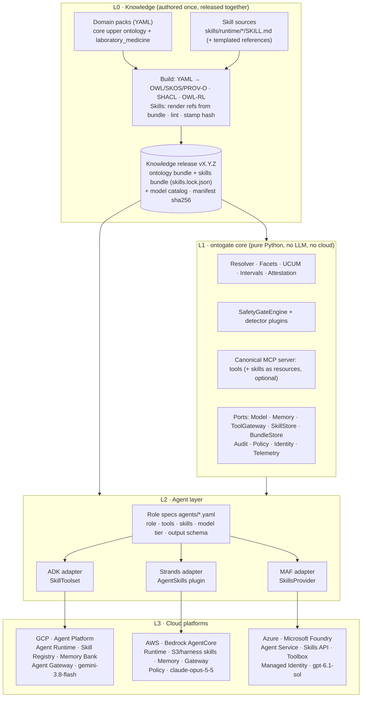
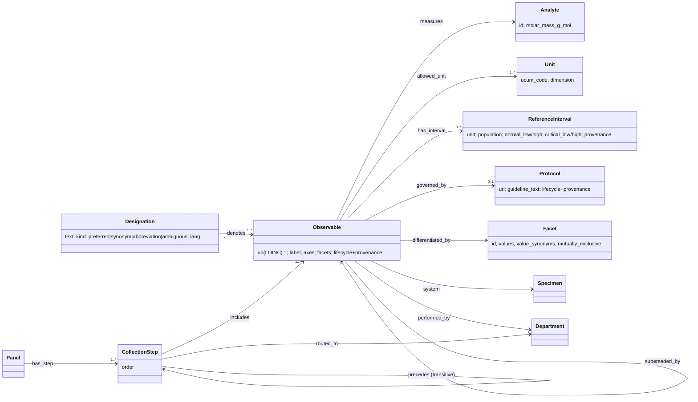
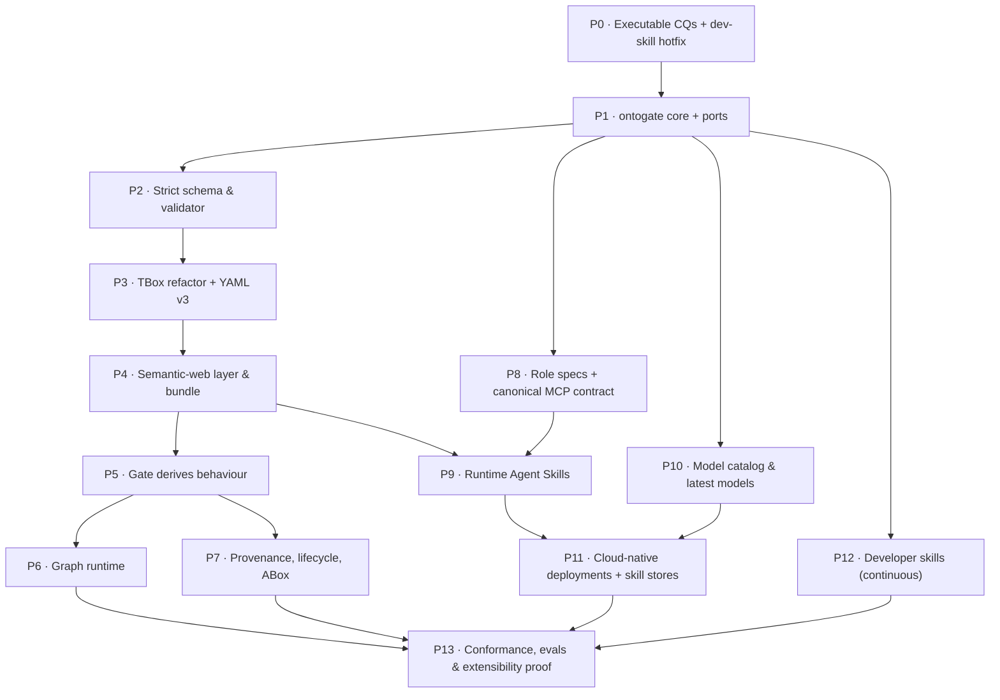

# Ontology Engineering Review & Implementation Plan

*A review of the laboratory-medicine knowledge layer from an ontology-engineering perspective, refined into a phased plan. The target is a reusable, standards-based (SKOS / OWL / SHACL / PROV-O), multicloud-native multi-agent system whose role behaviour is packaged as portable **Agent Skills**.*

October 2026 · Revision 3 · Scope: `config/`, `.agents/`, all three framework folders, `deployment/`, `knowledge/`

> **Revision history**
> - **R1:** ontology-engineering review and phased refactor.
> - **R2:** SKOS/OWL/SHACL promoted to core; reusable layered architecture; cloud-native designs for Strands on Bedrock AgentCore, ADK on Gemini Enterprise Agent Platform, and MAF on Microsoft Foundry; latest model per cloud.
> - **R3:** **Multi-Agent Skills.**
>   - Role behaviour moves out of hard-coded prompts into role-scoped Agent Skills (`SKILL.md`, agentskills.io format), authored once and loaded natively by ADK, Strands and MAF.
>   - Skills are governed in each cloud's skill store: Skill Registry, S3/AgentCore, Foundry Skills API.
>   - Skills are modelled in the ontology and validated by SHACL.
>   - Developer skills for coding agents are rebuilt.

---

## 1. Thesis

The system's safety claim is: *"the ontology defines what a term means, and when to stop."* The deterministic gate is the right architecture for that claim, but the knowledge behind it is scattered. Three different kinds of knowledge are currently mixed together:

| Kind of knowledge | Question it answers | Today | Target home |
| :--- | :--- | :--- | :--- |
| **Declarative** | *What* does a term mean? What are its units, facets, ranges and look-alikes? | 4 YAML files + regex over prose + hard-coded tables | **Ontology bundle** (OWL/SKOS/SHACL, compiled) |
| **Normative (safety)** | *Whether* the system may proceed | `SafetyGateEngine`, partly re-encoded in tools | **Deterministic gate** (`ontogate`, code only) |
| **Procedural** | *How* each agent role should behave: ask, cite, phrase, sequence | Long instruction strings duplicated across ADK Python, Strands Python and MAF YAML | **Agent Skills** (`SKILL.md`, role-scoped, progressive disclosure) |

**Design rule: the ontology says *what*, the gate says *whether*, skills say *how*.**

- A skill may never contain a clinical number, a routing decision or a resolution rule.
- The ontology never contains prompt text.
- The gate never reads a skill.

The target state:

1. **One ontology, authored once, compiled to standards.** It produces a versioned, hashed ontology bundle.
2. **One deterministic gate library**, framework-agnostic, with plugin points.
3. **One set of role-scoped Agent Skills**, authored once and loaded natively by all three frameworks. They are governed in each cloud's skill store and pinned to the same bundle hash.
4. **Thin framework and cloud adapters**, each on its platform's managed runtime and latest first-party model.
5. **Provable cross-cloud parity.** The same bundle, skill lock and competency questions produce identical gate decisions on GCP, AWS and Azure.

The invariants in `.agents/rules/agent-invariants.md` hold throughout (§13).

---

## 2. Review Method

| Lifecycle activity | Question asked | Evidence used |
| :--- | :--- | :--- |
| **Specification** | Are competency questions executed? | Ran every scenario `test_cases` entry through `parse()` → `SafetyGateEngine` |
| **Conceptualization** | Are terms, concepts, qualifiers, units, ranges and panels distinct entities? | `core/models.py`, domain YAML |
| **Formalization** | Is the model machine-checkable? | Integrity probe (dangling links, missing protocols, symmetry, units) |
| **Integration** | One model, aligned with LOINC/UCUM/SKOS? | Diffed ADK, Strands and MAF cores |
| **Evaluation** | Do derived behaviours match intended semantics? | Gate probes; numeric bounds parsed from prose |
| **Maintenance** | Provenance, lifecycle, versioning, TBox/ABox? | OKF fields, overlays, `knowledge/log.md` |
| **Deployment & reuse** | Same ontology and model policy on every cloud? | Deploy scripts, AgentCore template, model constants |
| **Procedural knowledge** *(R3)* | Is role behaviour packaged once, scoped per role, and versioned? Are developer skills accurate? | Agent instruction sources in all frameworks; MCP tool names; `.agents/skills/*/SKILL.md` checked against code |

---

## 3. What Is Already Right (keep)

- **Deterministic, fail-closed gate.** It is pure code, refuses an empty detector list, and only `RESOLVED` proceeds.
- **Canonical URIs as identity**, and URI-bound protocol retrieval.
- **Ambiguity as a first-class outcome** (`AMBIGUOUS`, `UNIT_MISMATCH`, `RANGE_COLLISION`).
- **OKF operational metadata.** Provenance, trust, lifecycle, freshness and attestation are a sound meta-model.
- **Input boundary hardening.**
- **Shared config and typed A2A contracts across three frameworks.**
- **A rich AgentCore CloudFormation template.**
- **Developer skills and rules already exist** (`.agents/skills/`, `.agents/rules/`) in the open SKILL.md format. The pattern is right; the content needs to catch up (H3).

---

## 4. Findings

Severity: 🔴 safety or correctness · 🟠 model integrity · 🟡 maintainability.

### A. Specification

**A1 🔴 The scenario `test_cases` are the project's competency questions, but no test runs them.** Running them gives **9/13 passing**. All four Scenario C (calcium) cases fail:

| Test case | Input | Expected | Actual | Root cause |
| :--- | :--- | :--- | :--- | :--- |
| `tc_calcium_unqualified_collision` | `Calcium 4.8` | `RANGE_COLLISION` | `AMBIGUOUS` | `AmbiguityDetector` runs first, so range collision is unreachable for `calcium` |
| `tc_calcium_qualified_total` | `Calcium 4.8 \| total` | `RESOLVED` | `UNIT_MISMATCH` | Positional grammar: one pipe means *unit* |
| `tc_calcium_qualified_ionized` | `Calcium 4.8 \| ionized` | `RESOLVED` | `UNIT_MISMATCH` | Same |
| `tc_calcium_normal_both` | `Calcium 9.0` | `RESOLVED` | `AMBIGUOUS` | The expectation itself is wrong: 9.0 mg/dL is CRITICAL_HIGH for ionized calcium |

### B. Conceptualization

- **B1 🔴 Terms are conflated with concepts.** Ambiguous abbreviations are stored as `alt_labels` of every concept they might denote (`hb` on HbA1c, `calcium` on ionized calcium).
- **B2 🔴 Qualifiers are not modelled as facets.** They are found by substring matching plus a hard-coded `_QUALIFIER_OPPOSITES` table, duplicated twice. Correct inputs are blocked: `total calcium 4.8 mg/dL`, `ionized calcium 4.8 mg/dL` and `ica 1.2 mmol/L` all return `MISSING_QUALIFIER`.
- **B3 🔴 Reference intervals have two sources of truth, one of them prose.**
  - HbA1c: the upper bound is read as a lower bound `(5.7, None)`, and its panic limit is unparseable.
  - Hb: the male range is applied to all patients.
- **B4 🟠 Units are free strings; conversion lives in code.** The analyte is sniffed from guideline prose with a calcium default. `mmol/L` sits on a `[Mass/volume]` LOINC code.
- **B5 🟠 Specimen and department are uncontrolled strings.**
- **B6 🟡 Panel membership and order are implicit** (`PART_OF` unused; tube order is a bare integer).
- **B7 🟠 Relation semantics are overloaded and unchecked.** `see_also` is used as a hazard; `governed_by` is dangling; unknown link kinds are coerced to `see_also`.
- **B8 🟡 Collision families are duplicated per unit.**

### C. Formalization

- **C1 🟠 The loader accepts anything** (`.get()` defaults, no `extra="forbid"`).
- **C2 🟠 There are no referential-integrity checks.** There is 1 dangling link and 5 concepts with no protocol and no declared reason.

### D. Integration

- **D1 🔴 Three copies of the schema have drifted.** Strands lacks the whole OKF layer, and 4 of its 6 detectors differ. MAF loads ADK through `importlib` + `sys.modules`.
- **D2 🟠 Two resolvers with different semantics** (substring vs whole-word).
- **D3 🟠 Domain knowledge is hard-coded in code** (`check_calcium`, `_QUALIFIER_OPPOSITES`, unit lists, conversion factors).
- **D4 🟠 Input parsing is positional, not vocabulary-driven.**

### E. Maintenance

- **E1 🟠 Provenance contradicts the disclaimer.** Values are described as Gemini-generated and not validated, yet tagged `verified_by: human:*`.
- **E2 🟡 Scenario overlays bypass the meta-model.** Troponin has no provenance and no intervals.
- **E3 🟡 Versions are declared but never checked;** `superseded_by` is unused.

### F. TBox / ABox

- **F1 🔴 Patient observations are written into the git-tracked knowledge corpus** (`knowledge/log.md`, 14 entries, one per run).

### G. Reuse, multicloud & model policy

- **G1 🟠 The ontology is not a distributable, hashed artifact.**
- **G2 🟠 Model IDs drift.**
  - GCP: `gemini-2.0-flash-001` / `2.5-flash` / `3.5-flash`.
  - AWS: two different Sonnet 4.5 strings.
  - Azure: configured `gpt-5`, but `gpt-4o` is actually deployed.
- **G3 🟠 GCP does not deploy the ADK agent to Agent Runtime.** It deploys a LangChain wrapper with Cloud Run as a fallback.
- **G4 🟡 The AgentCore template provisions PaymentManager, Browser and Code Interpreter**, which are unused, and grants `bedrock-agentcore:*`.
- **G5 🟡 Agent roles are re-declared per framework.**
- **G6 🟡 There is no cross-cloud conformance check.**

### H. Procedural knowledge & skills *(new in R3)*

**H1 🟠 There is no canonical tool contract, so role behaviour cannot be shared.** The same capability has different tool names per framework:

| Capability | ADK (`harness/mcp_server.py`) | Strands / MAF (`src/tools/`) |
| :--- | :--- | :--- |
| Term resolution | `resolve_lab_term` | `resolve_ontology` |
| Safety gate | `evaluate_safety_gate` | `run_safety_gate` |
| Protocol | `fetch_grounded_protocol` | `fetch_protocol` |
| Parse | (workflow node) | `parse_clinician_input` |
| Clarification | (workflow node) | `build_clarification_prompt` |

A skill that says "call `resolve_lab_term`" is wrong on two of three frameworks.

**H2 🟠 Role behaviour is procedural knowledge hard-coded three times and always loaded.**
- ADK keeps it in `instruction=` strings (e.g. `synthesis_agent.py`).
- Strands keeps it in `system_prompt=` strings (5 agent files).
- MAF keeps it in 200 lines of `kind: Prompt` YAML.

Edits drift independently. Every role carries its full instructions in every turn, with no progressive disclosure, and nothing versions or reviews this knowledge like the ontology.

**H3 🟡 The developer skills are stale and would produce broken code.**
- `add-gap-detector` instructs coding agents to return `DetectorResult`, which does not exist (the real type is `GapEvaluationResult`).
- It tells them to append to `self._detectors`, but the engine uses `self.detectors`.
- It shows a plain class, but detectors must subclass `GapDetector` and implement `gap_name`.
- Every developer skill targets `google-adk-agents/` only, so Strands and MAF are invisible to coding agents.

**H4 🟡 "Skill" is polysemous in the target stack**, which is the same failure mode as B1, but in our own vocabulary. It can mean:
- an **Agent Skill package** (`SKILL.md`, agentskills.io);
- an **A2A AgentCard `skills[]`** entry (an advertised capability);
- a **Gemini Enterprise assistant skill** (end-user product);
- a **developer skill** for coding agents.

Without a glossary and typed terms, plans, code and dashboards will conflate them. §8.1 defines the terms.

---

## 5. Target Architecture

### 5.1 Layered, reusable design



### 5.2 Extensibility mechanisms

| Extension | Mechanism | Code change? |
| :--- | :--- | :--- |
| Synonym, abbreviation, ambiguous term | `designation` in the domain pack | No |
| New look-alike pair | Observables + `confusable_with` + intervals | No |
| New qualifier dimension | New `facet`. The clarification skill's question templates regenerate from it | No |
| New unit or analyte | UCUM unit + `analyte.molar_mass` | No |
| New specimen panel | `Panel` + ordered `CollectionStep`s; the sequencing skill references regenerate | No |
| **Change how a role behaves** (tone, citation format, caveat wording, clarification style) | Edit that role's `SKILL.md` → new skill version → eval → promote | **No** |
| **New agent role** | Role spec + its skill(s) + tool grants | No, if it uses existing tools |
| **New clinical domain** | New domain pack on the core ontology + a domain skill | No, unless it needs a new hazard class |
| New hazard class | Detector plugin (`ontogate.detectors` entry point) | Yes, one plugin |
| New framework or cloud | L2/L3 adapter | Yes, adapter only |

### 5.3 Knowledge release — the unit of distribution

A **knowledge release** has three parts that are versioned and released together. Each deployment pins one release.

| Artifact | Contents | Integrity |
| :--- | :--- | :--- |
| **Ontology bundle** | `runtime.json` (pre-materialised lookups), `ontology.ttl`/`.jsonld`, `shapes.ttl`, `okf/` | sha256 per file in `manifest.json` |
| **Skills bundle** | One directory/zip per skill (`SKILL.md` + `references/`), with rendered references generated from the same bundle | `skills.lock.json`: name, version, sha256, `bundle_sha256` each skill was rendered from |
| **Model catalog** | `config/models.yaml` snapshot | sha256 |

At startup each runtime does two things:
1. It verifies the bundle hash, and that every loaded skill's hash matches `skills.lock.json`.
2. It refuses to start on a mismatch (fail-closed).

Every audit record carries `bundle_sha256` and `skills_lock_sha256`.

---

## 6. Target Ontology (TBox)



### Relation catalogue

| Relation | Domain → Range | OWL characteristics | Replaces |
| :--- | :--- | :--- | :--- |
| `denotes` | Designation → Observable | many-to-many; >1 ⇒ ambiguous | polysemous `alt_labels` |
| `confusableWith` | Observable → Observable | Symmetric, Irreflexive | `see_also` (hazard) |
| `governedBy` | Observable → Protocol | Functional | dangling `governed_by` |
| `hasInterval` | Observable → ReferenceInterval | inverse `intervalOf` | `ranges.yaml` + prose |
| `differentiatedBy` | Observable → Facet | — | substring inference |
| `measures` | Observable → Analyte | Functional | prose sniffing |
| `includes` / `memberOf` | CollectionStep ↔ Observable | inverseOf | unused `PART_OF` |
| `precedes` | CollectionStep → CollectionStep | Transitive, Asymmetric | `tube: int` |
| `supersededBy` | Observable → Observable | functional, acyclic | kept |
| `rdfs:seeAlso` | any → any | informational only | narrowed `see_also` |

### Refined YAML (calcium example)

```yaml
facets:
  fraction:
    values: [total, ionized]
    value_synonyms: { free: ionized, tca: total, ica: ionized }
    mutually_exclusive: true
analytes:
  calcium: { molar_mass_g_mol: 40.078 }
observables:
  "loinc:17861-6":
    label: "Calcium [Mass/volume] in Serum or Plasma"
    axes: { component: Calcium, property: MCnc, time: Pt, system: Ser/Plas, scale: Qn }
    measures: calcium
    facets: { fraction: total }
    units: ["mg/dL"]
    system: specimen:serum_plasma
    performed_by: dept:clinical_biochemistry
    confusable_with: ["loinc:17864-0"]
    governed_by: protocol:total_calcium_adult
    provenance: { generated_by: …, verified_by: …, sources: [...] }
designations:
  "calcium":       { denotes: ["loinc:17861-6", "loinc:17864-0"] }
  "total calcium": { denotes: ["loinc:17861-6"], kind: preferred }
  "ica":           { denotes: ["loinc:17864-0"], kind: abbreviation }
reference_intervals:
  - observable: "loinc:17861-6"
    unit: "mg/dL"
    population: { sex: any, age_band: adult }
    normal: [8.5, 10.5]
    critical: [6.0, 13.0]
    provenance: { generated_by: "reference_agent/gemini-2.5-pro", verified_by: null }
```

### Derived gate behaviour

| Decision | Derivation |
| :--- | :--- |
| Candidates | `{o \| designation(term).denotes o}` |
| Unit filter | UCUM-normalised unit ∈ `o.units`; none remain → `UNIT_MISMATCH` |
| Qualifier narrowing / contradiction | facet value synonyms; mismatch with the resolved facet value → contradiction |
| Missing qualifier | candidates > 1 and they differ on a facet → ask for that facet's values |
| Range collision | candidates > 1 + a value present → classify per interval; divergent → `RANGE_COLLISION` with readings, else `AMBIGUOUS` (both → `CLARIFY`) |
| Missing population | intervals differ by sex or age and the context lacks it → `MISSING_QUALIFIER` |
| Panel scope | `precedes`-ordered steps filtered by a `Department` entity |

---

## 7. Semantic-Web Layer (SKOS · OWL · SHACL · PROV-O)

### 7.1 Vocabulary mapping

| Concept | Standard | Representation |
| :--- | :--- | :--- |
| Domain vocabulary | SKOS | one `skos:ConceptScheme` per pack |
| Observable | SKOS + OWL | `skos:Concept` + `lab:Observable`; `skos:exactMatch <https://loinc.org/17861-6/>` |
| Designation | **SKOS-XL** | `skosxl:Label` with `lab:denotes` (multi-target) and `lab:designationKind` |
| Facet / value | SKOS | facet = `skos:ConceptScheme`; values are concepts; synonyms are `altLabel` |
| Unit | UCUM literal | optional `skos:closeMatch` to QUDT |
| ReferenceInterval | OWL | typed numeric datatype properties + population restrictions |
| Provenance | **PROV-O** | `prov:wasGeneratedBy` / `wasAttributedTo` / `wasDerivedFrom`; trust tier derived |
| Lifecycle | OWL + DCTERMS | `owl:deprecated`, `dcterms:isReplacedBy`, `lab:staleAfter` |
| **Agent role, skill, tool** *(R3)* | OWL (`ag:` meta-ontology, §8.6) | `ag:Role`, `ag:SkillPackage`, `ag:Tool`, `ag:A2ACapability` |

### 7.2 SHACL shapes (single source of integrity rules)

| Shape | Rule |
| :--- | :--- |
| `ObservableShape` | exactly 1 `measures`; ≥ 1 unit; `Qn` ⇒ intervals or a declared reason |
| `UnitPropertyShape` | unit dimension matches the LOINC Property axis |
| `IntervalShape` | `critLow < normLow < normHigh < critHigh`; unit ∈ observable units |
| `ConfusableShape` | `confusableWith` symmetric |
| `SequenceShape` | `precedes` acyclic; step department = observable department |
| `ProvenanceShape` | `verifiedBy human:*` must not coexist with `lab:clinicallyUnvalidated` |
| `DesignationShape` | > 1 `denotes` ⇒ `kind = ambiguous` |
| **`RoleSkillShape`** *(R3)* | every skill a role uses requires only tools that role is granted; `safety_guard` uses **no** skills and **no** model |
| **`SkillShape`** *(R3)* | name matches `^[a-z0-9]([a-z0-9-]*[a-z0-9])?$`, ≤ 64 chars; description ≤ 1,024 chars; `derivedFromBundle` equals the release bundle hash; no `scripts/` for `riskClass = clinical` |
| **`ToolShape`** *(R3)* | every tool named by a role or skill exists in the canonical MCP contract |

### 7.3 Build pipeline

`ontogate build` runs these steps:

1. Load YAML into Pydantic (`extra="forbid"`).
2. Emit RDF (`rdflib`).
3. Validate with SHACL (`pyshacl`).
4. Materialise with OWL-RL (`owlrl`).
5. Run competency questions as SPARQL.
6. Emit the bundle.
7. **Run `ontogate skills build`**: render skill references from the bundle, lint the skills, write `skills.lock.json`.
8. Write the release manifest.

Reasoning happens at build time only.

---

## 8. Multi-Agent Skills Architecture *(new in R3)*

### 8.1 Glossary (resolves H4)

| Term (use exactly) | Meaning | Format / home |
| :--- | :--- | :--- |
| **Runtime skill** | Procedural knowledge loaded by a clinical agent role at run time | `skills/runtime/<name>/SKILL.md` (agentskills.io) |
| **Domain skill** | A runtime skill whose references are generated from a domain pack (vocabulary guidance, no numbers) | `skills/domains/<pack>/SKILL.md` |
| **Developer skill** | Procedural knowledge for coding agents maintaining this repo | `.agents/skills/<name>/SKILL.md` |
| **A2A capability** | An entry in an A2A AgentCard `skills[]` advertising what a deployed agent can do. **Not** a skill package | Generated from role specs |
| **Tool** | A deterministic function on the canonical MCP server | `ontogate` MCP |

### 8.2 What belongs where

| Content | Ontology bundle | Gate (code) | Runtime skill | Role spec |
| :--- | :---: | :---: | :---: | :---: |
| Meaning of a term, units, facets, look-alikes | ✅ | — | ❌ | — |
| Reference/critical numbers | ✅ | — | ❌ **never** | — |
| Whether to proceed (routing) | — | ✅ | ❌ **never** | — |
| How to phrase a clarification question for a missing facet | — | — | ✅ | — |
| How to cite URI-bound protocol data, badge rules, caveats for unverified or stale knowledge | — | — | ✅ | — |
| Output schema, tool grants, model tier, skill list | — | — | — | ✅ |
| Vocabulary hints (which designations are ambiguous, which facets exist) | source | — | generated reference | — |

The lint step (§8.5) enforces the ❌ cells.

### 8.3 Runtime skill catalogue and role matrix

| Skill | Purpose | Generated references (from bundle) | Tools it may name |
| :--- | :--- | :--- | :--- |
| `clinical-triage` | Order of operations for every query: parse → resolve → gate → branch; never answer before the gate | — | `parse_clinician_input`, `resolve_lab_term`, `evaluate_safety_gate` |
| `lab-term-resolution` | How to present candidates; never pick among ambiguous candidates | `designation-index.md` (ambiguous designations → candidate labels) | `resolve_lab_term` |
| `clarification-dialogue` | One question per missing facet; offer exactly the ontology's facet values; never suggest a "likely" answer | `facet-questions.md` (per facet: question template + allowed values) | `build_clarification_prompt` |
| `grounded-synthesis` | Only cite `fetch_grounded_protocol` output for the resolved URI; numbers only from `attest_computation`; `[Attested ✓]` rules; trust-tier and staleness caveats | `trust-caveats.md` (tier → mandated wording) | `fetch_grounded_protocol`, `attest_computation` |
| `specimen-sequencing` | Present `panel_workup` output in the returned order, with no reordering or merging | `panels.md` (panel names, departments; no numbers) | `panel_workup` |
| `protocol-retrieval` | URI-bound retrieval; refuse cross-URI aggregation | — | `fetch_grounded_protocol` |
| `domain-laboratory-medicine` | Domain orientation: what the pack covers and what it does not | `okf/index.md` + per-observable OKF summaries (numbers stripped) | none |

| Role | Model? | Skills loaded | Tool grants |
| :--- | :---: | :--- | :--- |
| triage_orchestrator | ✅ | `clinical-triage` | parse, resolve, gate |
| ontology_resolver | ✅ | `lab-term-resolution`, `domain-laboratory-medicine` | resolve |
| **safety_guard** | ❌ **code node** | **none** | gate (in-process) |
| protocol_retriever | ✅ | `protocol-retrieval` | fetch protocol |
| clinical_synthesizer | ✅ | `grounded-synthesis`, `domain-laboratory-medicine` | fetch protocol, attest |
| clarification_coordinator | ✅ | `clarification-dialogue` | build clarification |
| panel_coordinator *(split out of triage)* | ✅ | `specimen-sequencing` | panel_workup |

Role-scoped loading gives two benefits:
- **Least privilege:** a role cannot "discover" another role's procedure.
- **Small context:** each role sees about 100 tokens of metadata per skill (L1), loads the body only on activation (L2), and loads references only when needed (L3).

### 8.4 Example runtime skill

```markdown
---
name: grounded-synthesis
description: Write the clinician-facing answer after the safety gate returned PROCEED. Use only protocol data fetched for the resolved LOINC URI and numbers returned by attest_computation.
license: Proprietary
metadata:
  roles: clinical_synthesizer
  risk_class: clinical
  bundle_sha256: "{{ bundle.sha256 }}"
  verified_by: "pending"
---

# Grounded synthesis

You run only after the safety gate returned PROCEED. If you do not see a
PROCEED gate result in this session, stop and hand back to the clarification coordinator.

## Rules
1. Call `fetch_grounded_protocol` with the resolved URI. Use no other source.
2. Every number you state must come from an `attest_computation` result in
   this session. If attestation did not pass, say the value could not be attested.
3. Add the `[Attested ✓]` badge only when the attestation verdict is PASS.
4. Apply the caveat for the protocol's trust tier from `references/trust-caveats.md`.
5. Never combine data from two URIs in one answer.

See `references/trust-caveats.md` for mandated wording.
```

### 8.5 Skill build, lint and lock

`ontogate skills build`:

1. **Render** `references/*.md.j2` templates from the ontology bundle (designations, facets, panels, trust tiers). Rendered output goes to `dist/skills/` and is never hand-edited.
2. **Stamp** `metadata.bundle_sha256` and a semver per skill.
3. **Validate** against the agentskills.io specification, plus the platform constraints:
   - name regex and ≤ 64 chars;
   - description ≤ 1,024 chars;
   - **unquoted** `name`/`description` (Foundry requirement);
   - zip ≤ 10 MB and SKILL.md at the root (Skill Registry requirement);
   - body ≤ ~5k tokens.
4. **Clinical lint** (blocking for `risk_class: clinical`):
   - no `scripts/` directory;
   - no number-plus-clinical-unit patterns (e.g. `\d+(\.\d+)?\s*(mg/dL|mmol/L|g/dL|ng/L|ng/mL|%)`);
   - no routing verbs (e.g. "proceed if", "assume the unit");
   - tool names ⊆ the canonical MCP contract;
   - no `https://` skill sources.
5. **SHACL** `RoleSkillShape`, `SkillShape` and `ToolShape` over the `ag:` graph.
6. **Lock**: write `skills.lock.json` (name, version, sha256 of the directory, bundle hash) and zip each skill for upload.

### 8.6 Skills in the ontology (`ag:` meta-ontology)

```text
ag:Role            — triage_orchestrator, …, safety_guard (ag:isCodeNode true)
ag:SkillPackage    — grounded-synthesis, …  (ag:riskClass, ag:version, ag:derivedFromBundle)
ag:Tool            — resolve_lab_term, …    (ag:deterministic true)
ag:A2ACapability   — AgentCard skills[] entries, generated from roles
ag:usesSkill       Role → SkillPackage
ag:grantedTool     Role → Tool
ag:requiresTool    SkillPackage → Tool
ag:advertises      Role → A2ACapability
prov:wasDerivedFrom SkillPackage → ontology bundle
```

This makes "a skill may not require a tool its role is not granted" a SHACL violation, not a code-review hope.

### 8.7 Framework loading (native, behind `SkillStorePort`)

| Framework | Native loader (verified Oct 2026) | Progressive-disclosure tools | Hardening |
| :--- | :--- | :--- | :--- |
| **Google ADK** (Python ≥ 1.25.0; Skills marked **experimental**) | `from google.adk.skills import load_skill_from_dir`; `from google.adk.tools import skill_toolset` → `skill_toolset.SkillToolset(skills=[...])` in `Agent(tools=[...])` | `list_skills`, `load_skill`, `load_skill_resource` | Clinical skills ship no `scripts/`, so `run_skill_script` has nothing to run. The adapter asserts the script tool is absent |
| **Strands Agents** | `from strands.vended_plugins.skills import AgentSkills` → `Agent(plugins=[AgentSkills(skills=[paths])])` | `skills` tool (`skill_name` arg) | Adapter passes **local paths only** (no `https://` sources); `strict=True` |
| **Microsoft Agent Framework** (Python, v1.0) | `from agent_framework import SkillsProvider` → `SkillsProvider.from_paths(skill_paths=...)` in `Agent(context_providers=[...])` | `load_skill`, `read_skill_resource` | Python script execution is not offered (listed as future work); keep it that way for clinical roles |

The adapter builds one loader per role from `agents/<role>.yaml → skills[]`. All three read the same `dist/skills/` directories, whose hashes were checked against `skills.lock.json`.

### 8.8 Cloud skill stores (governance and delivery)

| | **GCP** | **AWS** | **Azure** |
| :--- | :--- | :--- | :--- |
| Governed store | **Skill Registry** (Gemini Enterprise Agent Platform): skills with immutable **revisions** | **S3**: versioned prefix per release (`s3://…/skills/<release>/<name>/`), execution-role read only | **Foundry Skills API**: immutable `SkillVersion`, `default_version` |
| Status | Preview | AgentCore harness skills documented (S3, Git, path, AWS Skills); Strands plugin GA in SDK | **Preview** (`Foundry-Features: Skills=V1Preview`) |
| Publish (CI) | Upload zip per skill → new revision | `aws s3 sync dist/skills s3://…/<release>/` | `create_from_files(name, zip)` → new version |
| Delivery to runtime | Pinned revisions synced into the container at build (preferred) or at startup → `SkillToolset` | **Baked into the image** at the release path (preferred), or S3 path fetched at session start; Strands `AgentSkills` reads local paths | **Direct injection**: download the **pinned version** into the hosted agent's `skills/` → `SkillsProvider` |
| Version pinning | revision IDs recorded in `skills.lock.json` | release prefix + sha256 | **explicit `version`**, never `default_version` in production |
| Not used for clinical roles | — | `awsSkills` (AWS Agent Toolkit catalog), Git sources | catalog skills (docx, pptx…); toolbox auto-follow of `default_version` |

**Optional, cross-cloud: skills over MCP.** Foundry toolboxes expose skills as MCP Resources (`resources/list` / `resources/read`), following the proposed MCP Skills extension (SEP-2640). The canonical `ontogate` MCP server can serve the locked skills the same way, giving one endpoint for tools and skills on every cloud. This is gated on the SEP's status and client support, and is evaluated in P13, not assumed.

### 8.9 Skill lifecycle and governance

- **Provenance:** skills carry OKF/PROV metadata (`generated_by`, `verified_by`, `status`, `stale_after`) like any knowledge artifact. `risk_class: clinical` skills need a clinical reviewer in `CODEOWNERS` before `verified_by` can name a human.
- **Promotion:** author → lint → offline tests → eval (P13) → publish as a new immutable version in each cloud store → bump `skills.lock.json` in the release → deploy. Rollback means pinning the previous release.
- **Security:**
  - Skills are instructions, so they are a prompt-injection surface. Only first-party, hash-locked skills are loaded.
  - Runtime fetch from the open internet is never allowed.
  - Third-party skill catalogs are never used for clinical roles.
  - A runtime skill can never change a gate outcome, because the gate runs as code before and independently of any model.

---

## 9. Multicloud Platform Design

### 9.1 Cloud ↔ framework ↔ model ↔ skills

| | **Google Cloud** | **AWS** | **Microsoft Azure** |
| :--- | :--- | :--- | :--- |
| Framework | Google ADK | Strands Agents | Microsoft Agent Framework |
| Managed runtime | Gemini Enterprise Agent Platform — **Agent Runtime** (`google-cloud-agentplatform` 2.x) | **Bedrock AgentCore Runtime** | **Foundry Agent Service** hosted agent (ACA fallback) |
| Primary model | **`gemini-3.8-flash`** (GA 2026-09-02) | **Claude Opus 5.5**: `global.anthropic.claude-opus-5-5` | **`gpt-6.1-sol`** (2026-09-29), Responses API |
| Skills store | Skill Registry (preview) | S3 versioned prefix / image | Foundry Skills API (preview) |
| Skills loader | `SkillToolset` | `AgentSkills` plugin | `SkillsProvider` |
| Session / memory | Sessions · Memory Bank | AgentCore Memory | Foundry threads · memory (confirm) |
| Tool gateway (MCP) | Agent Gateway + Agent Registry | AgentCore Gateway | Foundry toolbox / MCP connection |
| Identity | Service account; IAM Unified Access Policies | AgentCore Identity | Managed Identity |
| Cloud policy (additive only) | Agent Gateway semantic governance; VPC-SC | AgentCore Policy (Cedar) | Foundry guardrails |
| Observability | Cloud Trace (OTel) | AgentCore Observability | Application Insights (OTel) |
| Evaluation | Agent Platform evaluation | AgentCore Evaluations + Strands Evals | Foundry evaluations |
| Bundle store | Artifact Registry (OCI) / GCS | ECR (OCI) / S3 | ACR (OCI) / Blob |
| Audit (ABox) | Cloud Logging → BigQuery | CloudWatch → S3 | Log Analytics |

### 9.2 Model catalog

```yaml
# config/models.yaml
catalog:
  gemini-3.8-flash:      { provider: gcp,   released: 2026-09-02, status: ga }
  gemini-3.5-flash-lite: { provider: gcp,   released: 2026-07-21, status: ga }
  claude-opus-5-5:       { provider: aws,   bedrock_id: global.anthropic.claude-opus-5-5, status: ga }
  claude-sonnet-5-5:     { provider: aws,   bedrock_id: global.anthropic.claude-sonnet-5-5, status: ga }   # verify profile
  claude-haiku-5-5:      { provider: aws,   bedrock_id: global.anthropic.claude-haiku-5-5, status: ga }    # verify profile
  gpt-6.1-sol:           { provider: azure, version: 2026-09-29, api: responses, status: ga }
  gpt-6-sol:             { provider: azure, version: 2026-09-22, api: responses, status: ga }
deployments:
  gcp:   { default: gemini-3.8-flash }
  aws:   { default: claude-opus-5-5, effort: high }
  azure: { default: gpt-6.1-sol, reasoning_effort: medium }
  role_overrides: {}    # only after eval parity (P13)
```

### 9.3 Model integration rules

| Scope | Rule |
| :--- | :--- |
| All | The model never routes; the gate is code. No forced `tool_choice`: the workflow calls tools |
| All | Refusal, safety block, truncation or schema-invalid tool input → `CLARIFY` (`MODEL_UNAVAILABLE`), never a silent model switch |
| All | Structured outputs for agent-to-agent payloads |
| All | **Skill activation is observable:** `load_skill` / `skills` calls are traced (skill name + version) so evals can assert the right skill was used |
| Claude Opus 5.5 | Thinking can't be disabled, and effort defaults to `medium`, so set it per role. Check `stop_reason == "refusal"`. No prefill, no forced tool choice |
| Gemini 3.8 Flash | Pin the exact ID; track `retire_after` (short Flash lifecycle) |
| GPT-6.1 Sol | Responses API; `reasoning_effort` per role; confirm region or data-zone availability |
| Down-tiering a role | Only with eval parity (P13) |

### 9.4 Cross-cloud interoperability

- **One canonical MCP contract** on every cloud, with the same image and the same bundle hash.
- **A2A AgentCards** generated from role specs. Each card's `skills[]` lists **A2A capabilities** (§8.1), never skill-package contents.
- **OTel GenAI** attributes `bundle_sha256`, `skills_lock_sha256`, `skill.name`, `skill.version`, `gate.status` and `gate.route` on every span.

---

## 10. Implementation Plan

Four tracks:
- **O:** ontology.
- **S:** skills.
- **P:** platform.
- **D:** developer skills, which runs alongside everything and updates as each phase lands.



Effort: **S** ≤ 1 day · **M** 2–4 days · **L** 1–2 weeks.

### P0 — Executable competency questions + developer-skill hotfix (S) · O, D

| Step | Change |
| :--- | :--- |
| 0.1 | `test_competency_questions.py`: every scenario `test_cases` → `parse()` → gate; assert gap, route, concept, candidates and readings |
| 0.2 | Fix the wrong expectation `tc_calcium_normal_both` |
| 0.3 | Add CQs for over-blocking and for population context |
| 0.4 | `xfail(strict=True, reason="P5")` on failing CQs, outside `test_gate.py` |
| 0.5 | CQ export (`cq/*.yaml`) reusable as SPARQL (P4) and against live endpoints (P13) |
| 0.6 | **Hotfix `add-gap-detector`** (H3): `GapEvaluationResult`, subclass `GapDetector` + `gap_name`, `self.detectors`. Add a test that executes every Python snippet in `.agents/skills/**` against the codebase where feasible |

### P1 — `ontogate` shared core + ports (M) · O, P

| Step | Change |
| :--- | :--- |
| 1.1 | `shared/ontogate/` package: models, loader, registry, resolver, units, intervals, attestation, graph, detectors, engine, ports, MCP server |
| 1.2 | Ports: `ModelPort`, `MemoryPort`, `ToolGatewayPort`, **`SkillStorePort`**, `BundleStorePort`, `AuditPort`, `PolicyPort`, `IdentityPort`, `TelemetryPort`, each with local adapters |
| 1.3 | Entry points: `ontogate.detectors`, `ontogate.unit_converters`, `ontogate.bundle_stores`, **`ontogate.skill_stores`** |
| 1.4 | Remove the Strands copies and MAF shims; keep thin re-exports |
| 1.5 | One resolver semantics |
| 1.6 | Dockerfiles install `shared/` as a wheel |

### P2 — Strict schema & validator (M) · O

`extra="forbid"`; unknown link kinds raise; `python -m ontogate.validate` (all integrity rules); JSON Schema export; a negative fixture per rule.

### P3 — TBox refactor & YAML v3 (L) · O

Upper ontology/domain pack split; new entities; `migrate_v2_to_v3.py`; unit/Property ADR; LOINC verification; golden equivalence test.

### P4 — Semantic-web layer & bundle (L) · O

| Step | Change |
| :--- | :--- |
| 4.1 | Persistent IRI namespace ADR |
| 4.2 | RDF emit (OWL/SKOS/SKOS-XL/PROV-O) |
| 4.3 | `shapes.ttl` incl. **`RoleSkillShape`, `SkillShape`, `ToolShape`** over the `ag:` meta-ontology (§8.6) |
| 4.4 | OWL-RL materialisation at build |
| 4.5 | CQs as SPARQL |
| 4.6 | Bundle + `manifest.json` |
| 4.7 | OKF export (feeds `domain-laboratory-medicine` references) |
| 4.8 | OCI publishing; runtime hash verification |

### P5 — Gate derives behaviour (L) · O

Facet-based ambiguity and qualifiers; range collision within resolution; UCUM conversion; structured intervals in attestation; ontology-aware parser; population context; audit with `bundle_sha256`. **Exit:** all strict-xfail CQs pass; no analyte names in gate code.

### P6 — Graph runtime (S) · O

Materialised edges; protocol nodes; `precedes` validation; designation-aware OKF index.

### P7 — Provenance, lifecycle & ABox separation (M) · O

Honest provenance; trust policy as config; validated overlays; TBox-only `knowledge/log.md`, audit via `AuditPort` with no raw patient values; deprecation fixture.

### P8 — Role specs + canonical MCP contract (M) · S, P

| Step | Change |
| :--- | :--- |
| 8.1 | **Canonical tool names** (fixes H1): `parse_clinician_input`, `resolve_lab_term`, `evaluate_safety_gate`, `fetch_grounded_protocol`, `attest_computation`, `build_clarification_prompt`, `panel_workup` (generalises `csf_workup`). `check_calcium` is retired in P5. Old names are kept as deprecated aliases for one release |
| 8.2 | One `ontogate` MCP server is the only tool implementation. ADK, Strands and MAF bind to it (in-process in dev, remote via the gateway in prod). Contract tests assert every tool returns a dict with `status` (invariant 3) |
| 8.3 | `agents/<role>.yaml`: `role`, `uses_model`, `tools[]`, `skills[]`, `output_schema`, `model_tier`, plus a **short** base instruction (≤ 10 lines). Procedural detail moves to skills in P9 |
| 8.4 | Generators: role spec → ADK `Agent`, Strands `Agent`, MAF `kind: Prompt` YAML (generated, drift-checked in CI) |
| 8.5 | `safety_guard` is a code node in every framework: `uses_model: false`, `skills: []` (SHACL-enforced) |
| 8.6 | A2A AgentCards generated from role specs (§9.4) |

*Exit criteria:* one tool contract across all frameworks; one instruction source per role; MAF YAML is generated.

### P9 — Runtime Agent Skills (L) · S

| Step | Change |
| :--- | :--- |
| 9.1 | ADR **"What goes in a skill"**: the §8.2 table, the glossary in §8.1, and the clinical lint rules |
| 9.2 | Author the 7 runtime skills in §8.3 by **extracting** procedural content from today's ADK `instruction=`, Strands `system_prompt=` and MAF YAML (fixes H2). Base instructions shrink to identity + "use your skills" |
| 9.3 | Reference templates (`references/*.md.j2`): designation index, facet questions, trust caveats, panels, OKF index, all **rendered from the bundle** |
| 9.4 | `ontogate skills build`: render, stamp, validate against agentskills.io + platform limits, clinical lint, SHACL (`ag:` graph), `skills.lock.json`, zips |
| 9.5 | `SkillStorePort` adapters: local `dist/skills/` (dev/CI); GCP Skill Registry; S3; Foundry Skills API (wired in P11) |
| 9.6 | Framework loaders per §8.7, built per role from `agents/<role>.yaml`: ADK `SkillToolset`, Strands `AgentSkills`, MAF `SkillsProvider`. Hash check against the lock at startup, fail-closed |
| 9.7 | Offline tests per framework: each role advertises **exactly** its skills; `safety_guard` loads none; the script tool is absent; no remote sources; loaded content hash = lock; activation is traced |
| 9.8 | Provenance + `CODEOWNERS` for `skills/runtime/**` (clinical reviewer) and `skills/domains/**` (ontology owner) |
| 9.9 | Skill CQs: for each scenario, the expected skill activations (e.g. `Calcium 4.8 \| mg/dL` → gate `RANGE_COLLISION` → `clarification-dialogue` loaded, `grounded-synthesis` **not** loaded) |

*Exit criteria:* no role prompt contains procedural detail beyond its base instruction. The same `skills.lock.json` loads on all three frameworks offline. Lint and SHACL are clean.

### P10 — Model catalog & latest models (S–M) · P

`config/models.yaml`. Then:
- **GCP** → `gemini-3.8-flash`.
- **AWS** → `global.anthropic.claude-opus-5-5`, with per-role effort and refusal → `CLARIFY`.
- **Azure** → `gpt-6.1-sol` via the Responses API, fixing the hard-coded `gpt-4o`.

Add a CI guard against stray model IDs and a retirement warning.

### P11 — Cloud-native deployments + skill stores (L) · P, S

**GCP — ADK on Gemini Enterprise Agent Platform**

| Step | Change |
| :--- | :--- |
| 11.G1 | ADK app on **Agent Runtime** via `google-cloud-agentplatform` 2.x (replaces the LangChain path); Cloud Run only as `--target cloudrun` |
| 11.G2 | Sessions; Memory Bank for non-PHI preferences only |
| 11.G3 | `ontogate` MCP in Agent Registry, routed via Agent Gateway (VPC-SC, IAM UAP) |
| 11.G4 | **Skill Registry:** CI uploads each skill zip as a new revision; the revision IDs go into `skills.lock.json`; the image build pulls the pinned revisions into `dist/skills/` |
| 11.G5 | Telemetry to Cloud Trace; audit to BigQuery; bundle from Artifact Registry |
| 11.G6 | `ALLOW_UNAUTHENTICATED=false` |

**AWS — Strands on Bedrock AgentCore**

| Step | Change |
| :--- | :--- |
| 11.A1 | Strands on **AgentCore Runtime** with Claude Opus 5.5 |
| 11.A2 | AgentCore Memory (short-term; long-term non-PHI only) |
| 11.A3 | `ontogate` MCP as an AgentCore Gateway target; AgentCore Policy (Cedar) allows only canonical tools |
| 11.A4 | **Skills:** sync to `s3://…/skills/<release>/` (execution role: `s3:GetObject`, `s3:ListBucket` only on that prefix); bake the same files into the image at the lock path for the Strands `AgentSkills` plugin. Do not enable `awsSkills` or Git sources |
| 11.A5 | Remove PaymentManager, Browser and Code Interpreter from the default stack; scope IAM |
| 11.A6 | AgentCore Observability; `EvalSamplingPercentage` → P13 |

**Azure — MAF on Microsoft Foundry**

| Step | Change |
| :--- | :--- |
| 11.Z1 | MAF as a **Foundry Agent Service** hosted agent (ACA fallback) |
| 11.Z2 | `gpt-6.1-sol`, keyless via Managed Identity |
| 11.Z3 | `ontogate` MCP as a Foundry tool connection |
| 11.Z4 | **Foundry Skills API** (`Foundry-Features: Skills=V1Preview`): CI creates a new immutable version per skill; deploy downloads the **pinned version** (never `default_version`) into the hosted agent's `skills/`; `SkillsProvider.from_paths` loads it |
| 11.Z5 | Application Insights; Log Analytics audit; bundle from ACR |

**Common**

| Step | Change |
| :--- | :--- |
| 11.C1 | One `deploy` entrypoint per cloud reads the knowledge release (bundle + skills lock + model catalog) |
| 11.C2 | `test-service.*` runs CQs (gate + expected skill activations) against the live endpoint; report keyed by `bundle_sha256` + `skills_lock_sha256` |
| 11.C3 | Data protection: no raw patient values in memory, logs, traces or skill stores |

### P12 — Developer skills for coding agents (M, continuous) · D

| Step | Change |
| :--- | :--- |
| 12.1 | Make the existing developer skills framework-agnostic and point them at `shared/ontogate`: `validate-safety-gate`, `validate-mcp-tools` (canonical contract), `validate-a2a-contracts`, `validate-agent-routing` (all three frameworks), `run-test-harness` (all suites) |
| 12.2 | Replace `add-gap-detector` with **`add-hazard-detector`** (plugin entry point + SHACL dependency declaration + CQs) |
| 12.3 | New developer skills: `add-domain-pack`, `add-designation-or-lookalike` (config-only + CQ), `author-runtime-skill` (§8.2 rules + lint), `run-ontology-build`, `run-conformance-suite`, `update-model-catalog`, `deploy-gcp-agent-platform`, `deploy-aws-agentcore`, `deploy-azure-foundry` |
| 12.4 | Developer skills are linted with the same agentskills.io validator (not the clinical lint). Embedded code snippets are executed in CI where feasible so they cannot drift (generalises 0.6) |
| 12.5 | Discovery: `.agents/skills/` stays the source of truth; mirror it into each coding agent's discovery path (e.g. `.claude/skills/`; verify per tool) |
| 12.6 | Each phase's exit criteria include "developer skills updated" |

### P13 — Cross-cloud conformance, evals & extensibility proof (M) · O, S, P

| Step | Change |
| :--- | :--- |
| 13.1 | **Gate parity:** identical `(status, route, resolved_uri, readings, bundle_sha256)` on all three clouds |
| 13.2 | **Skill parity:** identical `skills_lock_sha256` and the same expected skill activations per CQ on all three clouds |
| 13.3 | **LLM evals per role:** grounding, clarification precision (asks exactly for the missing facet), caveat compliance. Run on Agent Platform eval, AgentCore Evaluations + Strands Evals, and Foundry evals |
| 13.4 | **Skill ablation:** each runtime skill on vs off, to show it earns its place; drop skills that do not move the eval |
| 13.5 | Role down-tiering only from 13.3 results |
| 13.6 | Troponin as a full overlay with **no code change** (gate) and **no skill edit** (references regenerate) |
| 13.7 | New look-alike scenario in YAML only |
| 13.8 | **Reuse proof:** a second domain pack + its domain skill, with zero changes to `shared/ontogate` or role specs |
| 13.9 | Evaluate serving skills over MCP (SEP-2640 style) from `ontogate`; adopt only if all three clients support it |
| 13.10 | CI guard: config- or skill-only PRs pass their CQs without touching `shared/` |

---

## 11. Repository Layout (target)

```text
multiagent-retrieval-gaps/
├── ontology/
│   ├── core/                          # upper ontology + ag: meta-ontology + shapes.ttl
│   └── domains/laboratory_medicine/   # domain pack + scenarios (CQs)
├── skills/
│   ├── runtime/<name>/SKILL.md        # role-scoped clinical skills (+ references/*.md.j2)
│   ├── domains/laboratory-medicine/   # domain skill (references generated from bundle)
│   └── skills.lock.json               # written by build; committed per release
├── agents/<role>.yaml                 # role specs: tools, skills, model tier, output schema
├── shared/ontogate/                   # gate, resolver, RDF, SHACL, bundle, skills build, MCP server, ports
├── config/models.yaml                 # model catalog
├── google-adk-agents/  strands-agents/  agent-framework/   # thin adapters (MAF YAML generated)
├── deployment/{gcloud,aws,az}-scripts/                     # deploy a knowledge release
├── .agents/{rules,skills}/            # developer rules and skills (source of truth)
├── knowledge/log.md                   # TBox change log only
└── docs/adr/                          # IRI, unit/Property, bundle signing, trust policy, skills content rules
```

---

## 12. Data Protection Notes for Skills

- Skills, skill references and skill stores contain **no patient data** and **no clinical numbers**. The lint enforces this.
- Skill activation traces record only skill name, version and hash, never user content.
- Memory stores (Memory Bank, AgentCore Memory, Foundry memory) must not be used to "learn" new procedures from conversations. Procedural changes go through skill versioning only.

---

## 13. Invariant Preservation

| Invariant | How the plan preserves it |
| :--- | :--- |
| 1. Gate deterministic, no LLM | `ontogate` has no model dependency; `safety_guard` is a code node with `skills: []` and `uses_model: false`, enforced by SHACL; skills cannot reach the gate |
| 2. Fail-closed: only `RESOLVED` proceeds | `route_for` unchanged; `MODEL_UNAVAILABLE` → `CLARIFY`; a bundle or skill hash mismatch refuses startup |
| 3. MCP tools return a dict with `status` | One canonical MCP server; contract tests |
| 4. A2A typed enums | Unchanged; AgentCard capabilities generated from role specs |
| 5. Attestation badge | `attest_computation` contract unchanged; `grounded-synthesis` instructs badge use only on PASS |
| 6. `test_gate.py` blocking | Never xfailed; runs on all frameworks and clouds |
| 7. Protocols URI-bound | Gate data via `governedBy`; `grounded-synthesis` and `protocol-retrieval` forbid cross-URI aggregation |
| *R3:* skills cannot decide | §8.2 table + clinical lint + `RoleSkillShape`; skills carry no numbers or routing |
| *R3:* cloud policies are additive | Cloud policy layers cannot turn `CLARIFY` into `PROCEED` |

---

## 14. Acceptance Metrics

| Metric | Today | Target |
| :--- | :--- | :--- |
| Scenario CQs passing | 9 / 13 (not in CI) | 100 %, in CI and SPARQL |
| Over-blocked qualified inputs | 3 / 3 | 0 |
| Schema definitions | 2 diverged + 1 shim | 1 |
| Hard-coded analyte branches | `check_calcium`, `_QUALIFIER_OPPOSITES` ×2, calcium default | 0 |
| Numeric limits parsed from prose | 5 | 0 |
| SHACL violations (domain + `ag:`) | not checked | 0 |
| Distinct tool names per capability | up to 2 | 1 (canonical MCP) |
| Places role procedure is written | 3 per role (ADK, Strands, MAF) | 1 (`SKILL.md`) |
| Role context loaded per turn | full instructions always | skill metadata (~100 tokens/skill) + on-demand bodies |
| Developer skills with code that doesn't match the repo | ≥ 1 (`add-gap-detector`) | 0, snippet-tested |
| Model IDs per cloud | GCP 3, AWS 2, Azure 2 (+1 deployed) | 1 each |
| Models | Gemini 2.0/2.5/3.5; Claude Sonnet 4.5; GPT-5/4o | Gemini 3.8 Flash; Claude Opus 5.5; GPT-6.1 Sol |
| ADK on managed runtime | No | Agent Runtime |
| Cross-cloud gate + skill parity | not measured | 100 % |
| Patient values in `knowledge/` | 14, growing | 0 |
| Config/skill-only extension | not possible | proven (P13) |

---

## 15. Open Decisions & Verification Items

| # | Item | Phase |
| :--- | :--- | :--- |
| 1 | Persistent IRI namespace | P4 |
| 2 | Mass vs molar LOINC convention | P3 |
| 3 | Gemini 3.1 Pro GA ID vs `-preview` | P10 |
| 4 | Bedrock global profiles for Opus/Sonnet/Haiku 5.5 in `us-east-1` | P10 |
| 5 | `gpt-6.1-sol` availability in `eastus` | P10 |
| 6 | Foundry hosted MAF agents: region and memory offering | P11 |
| 7 | Bundle and skill signing (cosign/Notation) | P4 / P9 |
| 8 | Data-residency regions | P11 |
| 9 | **ADK Skills is experimental (≥ 1.25.0)**: pin the ADK version; track API changes | P9 |
| 10 | **GCP Skill Registry and Foundry Skills API are preview**: acceptable for non-prod; production fallback is image-baked, hash-locked skills (the same files) | P11 |
| 11 | MCP Skills extension (SEP-2640) maturity and client support across ADK/Strands/MAF | P13 |
| 12 | Whether the AgentCore *managed harness* (`skills` config) replaces the custom Strands container, or stays an alternative | P11 |
| 13 | Clinical reviewer for `skills/runtime/**` (`CODEOWNERS`) | P9 |

---

## 16. Out of Scope

- Clinical validation of reference intervals (provenance is made honest, not validated).
- Replacing YAML authoring with an OWL editor or triple store.
- Request-time OWL reasoning.
- Skill scripts for clinical roles. All computation goes through attested MCP tools.
- Multi-provider models within one cloud. The catalog supports it, but each cloud is pinned to its own first-party family.

### Sources (checked 2026-10-11)

- **Agent Skills:** [agentskills.io](https://agentskills.io/home) · [ADK Skills](https://adk.dev/skills/) · [Google Developers Blog: ADK agents with skills](https://developers.googleblog.com/developers-guide-to-building-adk-agents-with-skills/) · [Strands AgentSkills API](https://strandsagents.com/docs/api/python/strands.vended_plugins.skills.agent_skills/) · [MAF: Agent Skills](https://devblogs.microsoft.com/agent-framework/give-your-agents-domain-expertise-with-agent-skills-in-microsoft-agent-framework/) · [AgentCore harness skills](https://docs.aws.amazon.com/bedrock-agentcore/latest/devguide/harness-skills.html) · [Foundry skills (preview)](https://learn.microsoft.com/en-us/azure/foundry/agents/how-to/tools/skills) · [GCP Skill Registry](https://docs.cloud.google.com/gemini-enterprise-agent-platform/build/skill-registry) · [Evaluate skill-equipped agents (AWS)](https://aws.amazon.com/blogs/machine-learning/evaluate-skill-equipped-agents-with-strands-evals-and-amazon-bedrock-agentcore/)
- **Models and platforms:** [Agent Platform release notes](https://docs.cloud.google.com/gemini-enterprise-agent-platform/release-notes) · [Google model versions](https://docs.cloud.google.com/vertex-ai/generative-ai/docs/learn/model-versions) · [Firebase AI Logic models](https://firebase.google.com/docs/ai-logic/models) · [Claude Opus 5.5 on Bedrock](https://docs.aws.amazon.com/bedrock/latest/userguide/model-card-anthropic-claude-opus-5-5.html) · [Strands Bedrock provider](https://strandsagents.com/docs/user-guide/sdk/model-providers/amazon-bedrock/) · [Foundry models sold by Azure](https://learn.microsoft.com/en-us/azure/foundry/foundry-models/concepts/models-sold-directly-by-azure)
