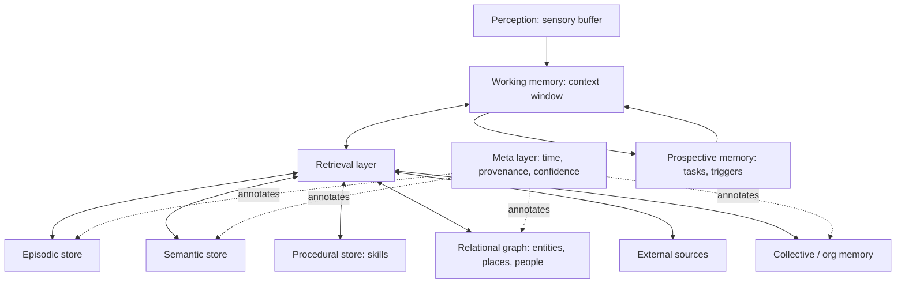

# Memory in AI Agents: A Fourteen-Part Architecture

*Why "just add a vector database" isn't a memory system, and what a real one needs.*

---

## Introduction

A language model, on its own, is stateless. Every call begins from nothing but the weights it was trained with and the text placed in front of it. For a chatbot answering one-off questions, that is fine. For an **agent**, a system that pursues goals over hours, days, or months, uses tools, collaborates with people, and must be trusted with consequential work, statelessness is the central engineering problem.

Teams usually respond by bolting on a single mechanism: a longer context window, a vector store, or a "memory" feature that saves a few notes. These help, but they conflate very different functions. Remembering *what you are doing right now* is not the same as remembering *what happened last Tuesday*, which is not the same as knowing *how to deploy the service*, which is not the same as knowing *that you are unsure about the deployment target*.

Cognitive science separated these functions long ago. Borrowing its vocabulary, and extending it where agents have needs humans don't, gives us a more useful design framework. This article lays out fourteen types of memory for agent architectures, then focuses on the five that matter most for agentic systems and are most often neglected: **temporal, spatial, associative/relational, meta-memory, and collective/organizational memory**.

---

## The Map: Fourteen Kinds of Memory

| # | Memory type | Core question it answers | Typical home in an agent |
|---|---|---|---|
| 1 | Working / context | What is active right now? | Context window, scratchpad |
| 2 | Semantic | What do I know to be true? | Knowledge base, profile store |
| 3 | Episodic | What happened before? | Event logs, trajectory store |
| 4 | Procedural | How do I do this? | Skills, playbooks, tool recipes |
| 5 | External / retrieval | What can I look up? | Vector DBs, search, APIs, files |
| 6 | Parametric | What did training teach me? | Model weights |
| 7 | Prospective | What must I do later? | Task queues, schedulers, triggers |
| 8 | Spatial | Where are things, and how are they arranged? | Maps, file trees, UI/scene graphs |
| 9 | Temporal | When, in what order, how long, how recent? | Timestamps, timelines, decay models |
| 10 | Associative / relational | How are entities connected? | Knowledge graphs, link indices |
| 11 | Social | Who are the people and what are our relationships? | Contact/role/interaction stores |
| 12 | Meta-memory | What do I know, not know, and how sure am I? | Confidence, provenance, coverage metadata |
| 13 | Collective / organizational | What does the group or institution know? | Shared wikis, team knowledge graphs |
| 14 | Sensory / perceptual | What did I just observe? | Short-lived multimodal buffers |

The first six are the familiar core. Items 7 and 11 to 14 extend that core toward how agents actually operate in the world. Items 8 to 10, together with 12 and 13, are the foundation of what makes an agent reliable over long horizons, and we'll return to them in depth.

---

## Part I: The Core Six

### 1. Working (context) memory: what is active now

Working memory is the agent's "desk": the instructions, the current conversation, tool outputs, and intermediate reasoning that sit inside the context window. It is fast, directly usable by the model, and small relative to everything the agent might need.

**Design concerns:** budgeting tokens, deciding what to evict or summarize, keeping the most task-relevant material near the end of the prompt, and avoiding "context rot," where long, cluttered contexts degrade reasoning even before the window is full.

**Failure mode:** treating the context window as the *only* memory. When the window overflows, important constraints silently drop out.

### 2. Semantic memory: facts and concepts

Semantic memory holds stable, decontextualized knowledge: the user prefers metric units; the company's fiscal year starts in April; the API returns paginated results. It is "what is true," stripped of the episode in which it was learned.

**Design concerns:** how facts are extracted from interactions, how they are deduplicated and updated, and how conflicts are resolved when a new fact contradicts an old one.

**Failure mode:** stale facts persisting as truth because nothing marks them as superseded.

### 3. Episodic memory: past events

Episodic memory records *what happened*: "Last week I ran the migration, it failed at step 4 due to a permissions error, and the user fixed it by granting the role." It preserves sequence, context, and outcome, which makes it the basis for learning from experience.

**Design concerns:** what granularity to store (raw trajectories vs. summaries), how to index episodes for retrieval by situation similarity, and when to consolidate episodes into semantic or procedural knowledge.

**Failure mode:** hoarding raw transcripts that are expensive to search and rarely distilled into lessons.

### 4. Procedural memory: skills and procedures

Procedural memory is "how to do things": reusable workflows, tool-use patterns, code snippets, checklists, and learned policies. In agents it often takes the form of skill libraries, runbooks, or refined system prompts.

**Design concerns:** capturing successful procedures automatically, versioning them, and testing that a stored procedure still works after the environment changes.

**Failure mode:** procedures that were correct once but are replayed blindly after the tool, API, or policy has changed.

### 5. External (retrieval) memory: information in outside stores

External memory is everything the agent can *fetch* but doesn't carry: documents, databases, search indices, the web, a codebase. Retrieval-augmented generation (RAG) is the best-known pattern, but external memory also includes structured queries and tool calls.

**Design concerns:** chunking, hybrid keyword-plus-semantic search, reranking, permission checks, and deciding *when* retrieval is worth the latency.

**Failure mode:** retrieving plausible but irrelevant passages and letting them override better knowledge.

### 6. Parametric memory: knowledge in the weights

Parametric memory is what the model absorbed during training and fine-tuning: language, world knowledge, reasoning patterns, coding habits. It is vast, fast, and implicit, but it is also frozen at the training cutoff, hard to inspect, and hard to edit.

**Design concerns:** knowing its limits, using retrieval to cover recent or private knowledge, and choosing fine-tuning only for stable, high-value behaviors rather than facts that change.

**Failure mode:** confident answers from weights about things that have changed since training.

---

## Part II: Memory for Acting in the World

### 7. Prospective memory: future tasks and intentions

Humans remember to *do* things later: send the report Friday, check the build when it finishes. Agents need the same. Prospective memory stores commitments, reminders, and conditional triggers ("when the customer replies, update the ticket").

This is what turns an agent from reactive to genuinely proactive. It requires durable storage, a scheduler or event system to wake the agent, and a way to reconcile pending intentions with changed circumstances.

**Failure mode:** intentions that are written down but never triggered, or triggered long after they stopped being relevant.

### 11. Social memory: people, roles, and interactions

Agents increasingly work with and on behalf of people. Social memory tracks who someone is, their role and authority, their preferences, communication style, and the history of interactions, plus the relationships among people.

It is also where **privacy and consent** become acute: what may be remembered about whom, who may see it, and when it must be forgotten.

**Failure mode:** treating all people as interchangeable, or leaking one person's information to another.

### 14. Sensory (perceptual) memory: recent multimodal observations

For agents that see screens, hear audio, read sensor streams, or operate through a GUI, there is a short-lived buffer of raw or lightly processed observations: the last few screenshots, a snippet of audio, a recent sensor trace. Most of it is discarded quickly; only salient items are promoted into working or episodic memory.

**Failure mode:** either keeping everything (cost explosion) or discarding the one frame that explained a failure.

---

## Part III: The Five That Matter Most for Agentic AI

The classical cognitive taxonomy gives us working, semantic, episodic, and procedural memory. Those are necessary, but they are not sufficient for agents that must act reliably across long horizons, across environments, and across teams. The following five are the additions that most determine whether an agent is *dependable* or merely *impressive in a demo*.

### 9. Temporal memory: time, sequence, duration, and recency

Most memory stores treat entries as a bag of items ranked by similarity. But the real world is temporal, and much of what an agent needs to know depends on **when**.

Temporal memory covers several distinct capabilities:

- **Timestamps and validity windows.** A fact isn't just true; it was true *from* some time *until* some time. "Alice is the project lead" needs an interval, not just a value.
- **Sequence and causality.** Knowing that the config change happened *before* the outage, not after, changes the diagnosis entirely.
- **Duration.** How long did the deploy take? How long since the user last responded?
- **Recency and decay.** Recent information often deserves more weight, and some memories should fade or expire automatically.
- **Versioning and supersession.** When a fact changes, the old version should be kept as history but marked as no longer current.

**Why it matters for agents:** without time, an agent cannot tell a current instruction from an obsolete one, cannot reconstruct what led to a failure, and cannot reason about deadlines or schedules. Many "hallucinated" memory errors are really temporal errors: the agent retrieved something that *was* true.

**Implementation patterns:** bi-temporal records (when something was true in the world vs. when the agent learned it), event timelines, recency-weighted retrieval scoring, TTLs for ephemeral facts, and explicit "as of" dates attached to retrieved content.

### 8. Spatial memory: locations and spatial relationships

"Spatial" is not only about physical space. For agents, it is *any* structured space they must navigate and keep a model of:

- **Physical environments** for robots and embodied agents: maps, room layouts, object positions.
- **Digital environments:** file-system trees, repository structures, database schemas, network topologies.
- **Interface space:** where buttons, fields, and menus sit on a screen; page structure in a web app.
- **Conceptual and organizational space:** where a document lives in a knowledge base, where a team sits in an org chart.

**Why it matters for agents:** an agent that must re-discover the layout of a codebase or a website on every task wastes enormous effort and makes avoidable mistakes. A persistent spatial model lets it say "the config lives in `/infra/env/`, the tests mirror the source tree, and the checkout button is below the cart summary" without exploring again.

**Implementation patterns:** scene graphs, maps with coordinates and landmarks, cached directory and dependency maps, UI element trees, and "locations" as first-class entities that other memories point to.

### 10. Associative / relational memory: relationships between entities

Similarity search finds things that *look alike*. Associative and relational memory captures how things are *connected*: Alice *manages* Bob; this service *depends on* that database; this invoice *belongs to* that contract; this bug *was caused by* that commit.

This is where **graph structures** shine. A knowledge graph lets an agent traverse relationships, answering multi-hop questions that no single document contains: "Which customers are affected by the outage in the service that the payments team owns?" Associative links also let one memory *activate* another, the way a name brings a face to mind, enabling richer recall than a nearest-neighbor lookup.

**Why it matters for agents:** real tasks span entities. Planning, impact analysis, debugging, and compliance checking all depend on following links across people, systems, documents, and events. Flat retrieval handles "find me a passage"; relational memory handles "reason across the structure."

**Implementation patterns:** knowledge graphs with typed edges, entity resolution (recognizing that "J. Smith," "John," and "the CFO" may be one node), graph-augmented retrieval, and link strength that updates with use.

### 12. Meta-memory: what the agent knows, doesn't know, and how sure it is

Meta-memory is memory *about memory*. It records what the agent knows and doesn't know, how confident it is, and where each piece of knowledge came from.

Its main components:

- **Confidence.** How reliable is this item? Was it stated directly by a user, inferred by the model, or scraped from an unverified page?
- **Provenance.** Source, author, time of acquisition, and the chain of reasoning behind a derived fact.
- **Coverage and gaps.** "I have thorough notes on the billing system but nothing on authentication."
- **Retrievability judgment.** Knowing *whether* to look something up, versus answering from weights, versus asking the user.
- **Conflict flags.** Marking entries that disagree with each other rather than silently picking one.

**Why it matters for agents:** this is the foundation of **trustworthiness**. An agent with meta-memory can say "I don't know," cite its sources, escalate when confidence is low, and be audited after the fact. Without it, every remembered item is presented with the same unearned certainty, and errors propagate: a wrong inference gets stored as fact, retrieved later as fact, and used to justify further wrong inferences.

**Implementation patterns:** metadata on every memory record (source, timestamp, confidence, verification status), calibrated uncertainty estimates, citation requirements for high-stakes claims, and a "known unknowns" register that triggers retrieval or clarifying questions.

### 13. Collective / organizational memory: shared institutional knowledge

Individual memory serves one agent and one user. But agents are increasingly deployed as **teams of agents**, as assistants embedded in organizations, or as shared services. Collective memory is the knowledge that belongs to the group: policies, project histories, architectural decisions, customer context, "how we do things here."

**Why it matters for agents:**

- **Continuity across agents and people.** When one agent (or employee) leaves a task, the next should inherit context rather than start cold.
- **Consistency.** Agents should follow the same policies and use the same terminology.
- **Compounding learning.** One agent's hard-won lesson becomes every agent's capability.
- **Institutional memory survives turnover.** Knowledge isn't lost when a person, a session, or an instance goes away.

**The hard parts:** *governance*. Who may write to shared memory, and who may read from it? How are contradictions between contributors resolved? How is private information kept out of shared stores? How is stale organizational knowledge retired? A shared memory with no ownership, review, or access control becomes a shared source of confident misinformation.

**Implementation patterns:** shared knowledge bases with role-based access, scoped memory (personal, team, organization), contribution review or approval flows, source attribution on every entry, and periodic curation.

---

## How the Pieces Fit Together

These fourteen memories are not fourteen separate databases. In practice they are a smaller number of stores viewed through different lenses, and many of them are *properties* of memory records rather than distinct systems. Time, provenance, and confidence, for instance, are best treated as metadata attached to every item. Relationships and locations are best treated as edges and nodes in a shared graph.

### The memory lifecycle

Whatever the structure, every memory system has to handle the same lifecycle:

1. **Write.** Decide what is worth keeping. Not everything should be remembered.
2. **Consolidate.** Turn raw episodes into distilled facts, relationships, and procedures; merge duplicates.
3. **Retrieve.** Pull the right memories at the right moment, using similarity, graph traversal, time filters, and confidence thresholds together.
4. **Update.** Revise or supersede memories when the world changes, keeping history rather than overwriting it.
5. **Forget.** Expire, archive, or delete: for cost, for relevance, and for privacy. Forgetting is a feature, not a bug.

---

## Design Principles

1. **Separate the types, share the substrate.** Distinguish what kind of memory each item is, but store them with common metadata (time, source, confidence, scope).
2. **Never store a fact without its provenance.** If you can't say where it came from, you can't judge whether to trust it.
3. **Prefer supersession over overwriting.** Keep the history; mark what's current.
4. **Retrieve with more than similarity.** Combine semantic closeness with recency, relational proximity, spatial or situational context, and confidence.
5. **Scope everything.** Decide whether each memory is private to a user, shared by a team, or organization-wide, and enforce it.
6. **Make forgetting explicit.** Define retention, decay, and deletion rules up front, especially for personal data.
7. **Let the agent reason about its own memory.** Give it the ability to ask "do I know this, how well, and from where?" before it answers.
8. **Evaluate memory directly.** Test recall, staleness handling, conflict resolution, and cross-session continuity, not just final task success.

---

## Common Failure Modes

| Failure | Typical root cause |
|---|---|
| Agent follows an outdated instruction | No temporal validity or supersession (temporal) |
| Agent re-explores the same environment every run | No persistent layout model (spatial) |
| Agent misses the downstream impact of a change | Flat retrieval, no links between entities (relational) |
| Agent states guesses as facts | No confidence or provenance tracking (meta-memory) |
| Agents give inconsistent answers to the same question | No shared, governed knowledge base (collective) |
| Agent leaks one user's information to another | Missing scope and access control (social / collective) |
| Memory grows without bound and retrieval degrades | No consolidation or forgetting policy (lifecycle) |

---

## Open Problems

- **What to remember.** Deciding, in the moment, which observations will matter later remains largely heuristic.
- **Consolidation quality.** Summaries lose detail, and abstractions can encode errors. Distillation needs verification.
- **Cross-agent consistency.** When many agents write to shared memory concurrently, merging and conflict resolution are unsolved at scale.
- **Memory security.** Stored memory is an attack surface: poisoned entries, injected instructions, and retrieved content that tries to manipulate the agent.
- **Evaluation.** Benchmarks for long-horizon, multi-type memory are still immature.
- **User control.** People need to be able to see, correct, and delete what agents remember about them.

---

## Conclusion

The question "does the agent have memory?" is too coarse to be useful. A better question is: **which kinds of memory does it have, how are they connected, and how well does it know the limits of each?**

The core types (working, semantic, episodic, procedural, retrieval, and parametric) give an agent something to think with and something to draw on. Prospective, social, and sensory memory let it act in a world of commitments, people, and perception. But the leap from a capable assistant to a *dependable agent* depends most on five capabilities that simple vector-store designs tend to skip:

- **Temporal memory** to know *when*, and what is still current;
- **Spatial memory** to know *where*, across physical and digital environments;
- **Associative/relational memory** to know *how things connect*;
- **Meta-memory** to know *what it knows, how well, and from where*;
- **Collective/organizational memory** to know *what the group knows*, and to share it safely.

Build those in, and memory stops being a bolt-on feature and becomes what it should be: the foundation that lets an agent learn, stay consistent, earn trust, and improve over time.
