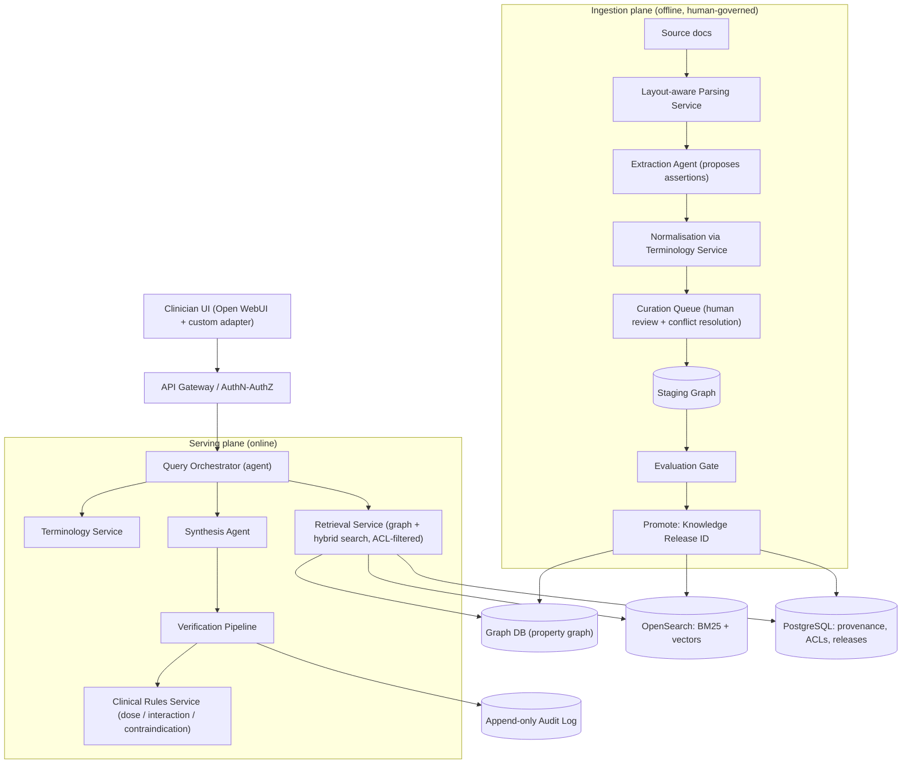

# Healthcare Multi-Agent Knowledge Base Architecture (GraphRAG & Ontology-Driven)

- **Intended use:** Clinician-facing retrieval and synthesis of guideline/SOP knowledge. Not patient-facing. Not a diagnostic or treatment-directing tool.
- **Disclaimer:** Clinical content here is illustrative. Clinical governance owns real content. Not legal advice.

---

## 1. Design Principles

1. **Evidence is the source of truth; the graph is a derived index.** Every assertion links to exact source spans in a specific document version.
2. **Recommendations are first-class, qualified nodes** (population, line of therapy, strength, evidence level, status, validity), not bare `Drug → Disease` triples.
3. **Agents only where judgement is needed.** Parsing, terminology lookup, ACL checks, dose/interaction checks and index writes are deterministic services.
4. **Humans gate the knowledge base.** Staging graph → evaluated release → promote.
5. **Verify against source, not against the graph's own LLM output.** Block unverified clinical text; never stream it.
6. **One PHI-covered inference path, one agent runtime, one graph model.**

---

## 2. System Architecture



### Agents vs. services

| Component | Type | Why |
| :--- | :--- | :--- |
| Parsing (PDF, tables, OCR) | Service | Deterministic, testable |
| Terminology lookup / mapping | Service | Shared by both planes; no cross-swarm coupling |
| Extraction of candidate assertions | **Agent** (schema-constrained) | Needs language judgement; output is a *proposal* |
| Curation / conflict resolution | Human + tooling | Clinical accountability |
| Index writes | Service (outbox, idempotent) | No dual-write drift |
| ACL enforcement | Service | Must not be model-dependent |
| Query orchestration | **Agent** | Decomposes multi-part questions |
| Synthesis | **Agent** | Language judgement |
| Entailment check | **Agent** (separate model call) | Judgement against source spans |
| Dose / interaction / contraindication check | Service (licensed drug KB) | Must be deterministic |

**A2A:** an open protocol (Linux Foundation) that Strands and ADK both implement. Use it only at service boundaries; confirm current maturity before relying on it.

---

## 3. Knowledge Model

### 3.1 Core nodes

| Node | Key attributes |
| :--- | :--- |
| `DocumentVersion` | doc_id, version, publisher, effective/retired dates, ACL, checksum |
| `Chunk` | text, span offsets, section path, page, embedding ref |
| `Assertion` | type, status (`proposed`/`approved`/`retired`), confidence, extractor version, reviewer |
| `Recommendation` | population, line_of_therapy, strength, evidence_level, status, `valid_from`/`valid_to`, `recorded_at` |
| `Concept` | code system, code, label, level (e.g. RxNorm IN/SCD/SBD) |
| `Qualifier` | e.g. severity, laterality, stage, lab threshold + UCUM unit |

Rules:
- `Recommendation` links to `Concept` nodes (condition, drug, population) and to `Chunk` spans as evidence.
- Bitemporal fields: *valid time* (when guidance applies) and *recorded time* (when we learned it). Supersession is an explicit edge.
- `Chunk` is a **graph node**; OpenSearch metadata (node IDs, ACL, release ID) is **derived and rebuildable**. No unbounded ID arrays on nodes.
- Every `Assertion` carries assertion-status attributes: negated, uncertain, experiencer, temporality.

### 3.2 Illustrative pattern (not clinical guidance)

```
(DocumentVersion)-[:HAS_CHUNK]->(Chunk)
(Recommendation)-[:EVIDENCED_BY]->(Chunk)
(Recommendation)-[:FOR_CONDITION]->(Concept: Hypertensive disorder)
(Recommendation)-[:FOR_POPULATION]->(Qualifier: CKD, stage / albuminuria category)
(Recommendation)-[:RECOMMENDS]->(Concept: drug or class)
(Concept: drug)-[:CAUTION_IN {qualifiers}]->(Concept: condition)
(Recommendation)-[:SUPERSEDES]->(Recommendation)
```

Modelling note: a **disease is not contraindicated in another disease**. The relation is `Drug → CAUTION_IN / CONTRAINDICATED_IN → Condition`, with qualifiers. Unqualified "renal artery stenosis" over-generalises; ACE-inhibitor caution is typically tied to bilateral stenosis or stenosis in a solitary kidney.

### 3.3 Trust tiers

| Tier | Content | Used for |
| :--- | :--- | :--- |
| 1 | Human-approved assertions | Answers, verification |
| 2 | Auto-extracted, high confidence, low risk | Retrieval hints only |
| 3 | Unreviewed proposals | Never served |

High-risk assertion types (dosing, contraindications, thresholds) always require human approval.

---

## 4. Ontology Strategy

| System | Role |
| :--- | :--- |
| **SNOMED CT** | Semantic backbone for conditions and findings |
| **RxNorm** | Drugs; each node states its level (ingredient / clinical drug / branded) |
| **ICD-10 / ICD-10-CM** | Mapped, reporting-oriented view; not the backbone |
| **LOINC** | Lab tests (eGFR, creatinine, albuminuria) |
| **UCUM** | Units |
| **ATC** | Drug classes |
| **UMLS** | Cross-walk and synonym support |

- All lookups go through one **Terminology Service**; the agents never invent codes.
- Do not use different code systems for different entities in the same assertion (e.g. SNOMED for one, ICD-10 for another); map everything to the SNOMED CT backbone.
- ICD-10-CM codes hypertension with CKD under the combination category **I12.-** plus an **N18.-** stage code. Naive "hypertension" + `N18.9` pairs misrepresent that.
- Review licensing (SNOMED CT, UMLS, drug KB) before build.

**Verified reference codes (re-validate against your terminology server in CI):**

| Concept | Code | Note |
| :--- | :--- | :--- |
| Hypertensive disorder, systemic arterial | SNOMED `38341003` | Maps to ICD-10 **I10** |
| Lisinopril | RxNorm `29046` | Ingredient-level |
| CKD, unspecified | ICD-10 `N18.9` | Prefer a stage-specific code where documented |

---

## 5. Ingestion Plane (offline)

1. **Trigger:** Airflow detects a new or updated document; creates a `DocumentVersion` with ACL and effective dates.
2. **Parsing:** layout-aware (multi-column, tables, footnotes, recommendation boxes, scanned pages with OCR). Table QA and confidence routing; low-confidence tables go to human review.
3. **Extraction:** schema-constrained agent proposes assertions with exact source spans, plus negation/uncertainty/experiencer/temporality flags. Validators reject unsupported spans.
4. **Normalisation:** codes assigned by the Terminology Service; unmapped terms go to a queue.
5. **Curation:** humans approve high-risk assertions and resolve cross-document conflicts and supersession.
6. **Staging → evaluation → promote:** run the gold-set gate (§8); on pass, publish a **Knowledge Release ID**.
7. **Publish:** outbox pattern writes graph, index and provenance idempotently. Indexes can be rebuilt from the evidence store.

**Untrusted input:** treat documents as data, not instructions. Isolate extraction agents, constrain outputs to schemas, give tools least privilege.

---

## 6. Serving Plane (online)

1. **AuthN/AuthZ:** user identity and document ACLs resolved before retrieval.
2. **Orchestration:** decompose the query; identify population, condition, drug, and which guideline/date "current" refers to. Ask for missing population details rather than guessing.
3. **Entity expansion:** Terminology Service returns codes and synonyms.
4. **Retrieval:** parameterised, read-only graph query templates for known patterns; exploratory LLM-generated queries run only in a sandboxed read-only role with limits. Combine with OpenSearch hybrid search (BM25 + dense). **ACL filters apply inside every query.**
5. **Synthesis:** drafts an answer where each claim cites chunk/span IDs.
6. **Verification pipeline (all layers must pass):**
   1. Citation integrity: cited spans exist and are in the stated document version
   2. Entailment: each claim is supported by its span
   3. Applicability: population/qualifiers match the question
   4. Currency: documents and recommendations are valid and not superseded
   5. Clinical rules: dose, interaction, contraindication via the Clinical Rules Service (licensed drug KB)
   6. Guardrails: PII filter, contextual grounding, policy checks
7. **Release after verify:** stream only progress and evidence; release answer text once verification passes. On failure, return the sources with a clear "could not verify" message.
8. **Response contract:** answer, claims, citations (span-level), Knowledge Release ID, warnings. The UI adapter renders this; Open WebUI does not do it natively.

**Verification note:** Bedrock Guardrails provides sensitive-information filters (probabilistic PII detection, custom regex), contextual grounding checks (against a provided source) and Automated Reasoning checks (against rules you author). It does **not** by itself validate dosage bounds or check answers against your graph. Dose/interaction checks need a licensed drug knowledge base; the NLM RxNav interaction API was retired in 2024.

---

## 7. Security, Privacy & Regulatory

### 7.1 PHI
- One BAA-covered inference path; map every processor that can see prompts (model host, gateway, tracing, logs).
- PHI-safe telemetry: redact or hash prompts in traces; retention limits; custom entities for MRNs and free-text identifiers.

### 7.2 Authorisation
- ACLs on `DocumentVersion`, propagated to chunks and assertions; enforced in graph queries, search filters and citation rendering. UI-level RBAC is insufficient.

### 7.3 Audit
- Append-only, immutable audit log: user, query, Knowledge Release ID, retrieved spans, verification results, output hash. Tracing tools (e.g. Langfuse) are for debugging, not the audit trail.

### 7.4 Regulatory positioning
- Write an intended-use statement. Assess against the FDA non-device CDS criteria (Section 520(o)(1)(E) FDCA); FDA issued updated CDS guidance in **January 2026**, replacing the 2022 guidance. Design choices that matter: HCP-only audience, transparency of sources and basis, no directive single-answer outputs without review.
- Take regional equivalents (EU MDR, etc.) to counsel and a regulatory specialist.

---

## 8. Evaluation & Quality Gates

| Gate | Check | Blocks release if |
| :--- | :--- | :--- |
| Extraction | Gold set: entities, negation, tables, qualifiers | Below agreed precision/recall on high-risk types |
| Retrieval | Gold queries with known correct spans | Recall regression |
| Verification | Seeded false claims, wrong-population and superseded-guideline cases | Any unblocked unsafe claim |
| Safety | Red-team: prompt injection, ACL bypass, PHI leakage | Any critical failure |
| Regression | Model, prompt or ontology change | Any metric drop vs. last release |

Thresholds are starting hypotheses; calibrate in a pilot. Model upgrades are promoted through the same gates.

---

## 9. Operations

- **Release management:** every answer is stamped with a Knowledge Release ID; releases are reproducible and roll-back-able.
- **SLOs / cost:** define latency and cost budgets per stage; tier models (small for routing/entailment, larger for synthesis); cache retrieval.
- **DR:** graph and indexes rebuild from the evidence store and release manifests; backups and tested restore for PostgreSQL and audit log.
- **Monitoring:** verification block rate, unmapped-term rate, conflict queue age, retrieval recall on canary queries.

---

## 10. Technology Stack

| Layer | Choice | Note |
| :--- | :--- | :--- |
| Agent runtime | **One of** AWS Strands SDK or Google ADK | Pin an exact version; ADK ships frequently (2.x GA'd in 2026) |
| Inference | Single BAA-covered gateway; **model aliases in config** | No hard-coded model names; upgrades gated by §8 |
| Graph DB | **Property graph + openCypher/Cypher** | Neptune (openCypher) *or* Neo4j (Cypher). Do not plan SPARQL/Gremlin on the same data |
| Search | OpenSearch (BM25 + dense vectors) | Derived from graph/evidence |
| Relational | PostgreSQL | Provenance, ACLs, releases, sessions |
| Parsing | Textract / Unstructured.io + table QA | Airflow orchestration |
| Terminology | Terminology server over licensed SNOMED CT, RxNorm, LOINC, UCUM, ATC, ICD-10 | |
| Clinical rules | Licensed drug knowledge base behind a service | |
| Guardrails | Bedrock Guardrails (if on AWS) as one layer | Not the verifier |
| Observability | Langfuse or similar, PHI-redacted | Separate from audit log |
| UI | Open WebUI + custom adapter | Review current licence terms before productising |

**Graph-model notes:** Neptune supports Gremlin and openCypher on property graphs and SPARQL on RDF graphs; the two models are not cross-queryable. Neptune's openCypher is a subset of Neo4j Cypher. Neo4j uses Cypher, not Gremlin.

---

## 11. Phased Roadmap

| Phase | Scope |
| :--- | :--- |
| 0. Foundations | Intended-use statement, PHI data-flow map, licensing, terminology service, gold-set seed |
| 1. Single-domain pilot | One specialty; ingestion with human curation; qualified recommendation model; verification pipeline |
| 2. Hardening | Rules service, ACL enforcement, red-team, audit log, release management |
| 3. Scale-out | More domains, conflict workflows, cost tiering, DR drills |

---

## 12. Open Decisions & Risks

| Item | Decision needed |
| :--- | :--- |
| Graph engine | Neptune vs. Neo4j |
| Agent runtime | Strands vs. ADK |
| Drug KB vendor | Licence, coverage, API |
| Regulatory path | Non-device CDS vs. device; regions |
| Curation capacity | Reviewer staffing and turnaround |
| Residual risk | Extraction errors reaching Tier 1 despite review; mitigated by span-level verification and evaluation gates |
