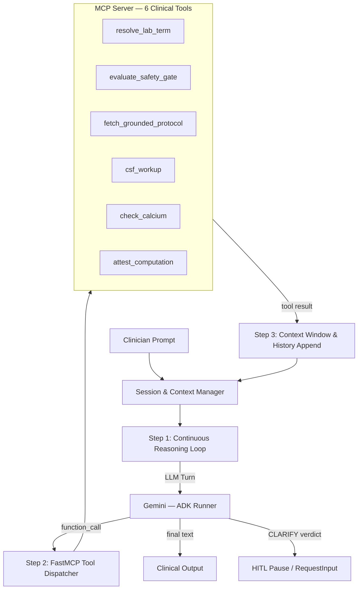

# Google ADK 2.0 Multi-Agent Decision Support System

*Clinical Laboratory Decision Support with Deterministic Safety Gating, Agent-to-Agent (A2A) Contracts, and Open Knowledge Format (OKF v0.2) Grounding.*

Part of the **Multi-Agent Retrieval-Gap Framework** ([Root Project README](../README.md)).

---

## Overview

In clinical laboratory medicine, ambiguous acronyms, colliding reference ranges, specimen tube collection sequences, and unverified calculations can lead to catastrophic medical misinterpretations.

This package implements an extensible multi-agent clinical decision support system built on the **Google Agent Development Kit (ADK 2.0)** and **Gemini 3.8 Flash**. The architecture solves classical retrieval gaps (Gaps 1–7) and agent-specific failure modes (Gaps 8–11) by pairing LLM capabilities with:
1. **Deterministic Safety Gating (`SafetyGateEngine`)**: Pure-code, prompt-free detectors that fail closed on clinical ambiguities or safety violations.
2. **Structured A2A Contracts (`A2AMessage`)**: Schema-validated task payloads passed between specialized agent roles.
3. **Open Knowledge Format (OKF v0.2)**: An ontology and knowledge graph grounding layer providing provenance, trust tiers, freshness boundaries, typed relationships, progressive disclosure indexing, and attested computations.

---

## Agent Roles & Workflow Topology

The system coordinates six specialized agent roles across a directed workflow graph:

```mermaid
flowchart TD
    START([START: Clinician Input]) --> TRIAGE[Triage / Intake Node\nparse_clinician_input\n+ OKF Pre-Scoping]
    TRIAGE -->|A2AMessage: PARSE_REQUEST| RESOLVER[Ontology Resolver Agent\nLOINC Grounding &\nOKF Trust/Staleness Filter]
    RESOLVER -->|A2AMessage: EVALUATE_SAFETY| GUARD[Safety Guard Node\nDeterministic SafetyGateEngine\n6 Pluggable Detectors]
    
    GUARD -->|VERDICT: CLARIFY| CLARIFY[Clarification Agent\nHITL Clinical Pause\nOptions & Disambiguation]
    GUARD -->|VERDICT: PROCEED| PROTOCOL[Protocol Retriever Agent\nReference Ranges & Panic Limits]
    
    PROTOCOL -->|A2AMessage: SYNTHESIZE| ATTEST_GATE[Attestation Gate Node\nDeterministic Plausibility &\nRange Check]
    
    ATTEST_GATE -->|Failed Check| CLARIFY
    ATTEST_GATE -->|Attested Check| SYNTHESIZER[Clinical Synthesis Agent\nTrust-Calibrated Prompting\nEmits [Attested ✓]]
    
    SYNTHESIZER --> END([Clinician Output])
    CLARIFY --> END
```

### Specialized Agents

| Role | Implementation | Description |
| :--- | :--- | :--- |
| **Triage / Intake** | `src/orchestration/a2a_orchestrator.py` | Parses clinician input strings (test term, value, units, qualifiers) and leverages the OKF index for cheap department pre-scoping. |
| **Ontology Resolver** | `src/agents/ontology_agent.py` | Maps unstructured terms and synonyms to canonical LOINC identifiers. Filters deprecated and stale concepts, sorting candidates by OKF trust tier. |
| **Safety Guard** | `src/agents/safety_guard_agent.py` | Executes the deterministic `SafetyGateEngine` over candidates and patient values. If any gap detector triggers, intercepts the flow to `CLARIFY`. |
| **Clarification (HITL)** | `src/agents/clarification_agent.py` | Pauses execution for human-in-the-loop input, structuring clear disambiguation questions without guessing or hallucinating. |
| **Protocol Retriever** | `src/agents/protocol_agent.py` | Retrieves grounded reference intervals, panic limits, guidelines, and attestation metadata from `protocols.yaml`. |
| **Clinical Synthesizer** | `src/agents/synthesis_agent.py` | Calibrates its clinical interpretation based on the OKF trust tier (`human-reviewed`, `machine-confirmed`, `unverified`) and verifies sanctioned computations. |

---

## Open Knowledge Format (OKF v0.2) Implementation

The domain knowledge is structured according to the Open Knowledge Format v0.2 specification across eight functional pillars:

```text
src/
├── core/
│   ├── models.py          # TrustTier, RelationshipKind, ConceptLink, AttestedComputation
│   ├── config.py          # OntologyRegistry & YAML domain/scenario loader
│   ├── okf_index.py       # Progressive disclosure catalog index (OKF §7.1)
│   ├── concept_graph.py   # Multi-hop graph traversal and look-alike detection (OKF §4, §8.2)
│   ├── okf_writer.py      # Chronological audit log writeback to knowledge/log.md (OKF §5.2, §7.5)
│   ├── attestation.py     # Deterministic numeric range attestation (OKF §5.4, §9)
│   └── detectors/         # Pluggable deterministic safety gap detectors
```

### 1. Provenance & Trust Tiers (`models.py`)
Concepts and protocols declare provenance (`generated_by`, `generated_at`, `sources`, `verified_by`). Trust tiers are dynamically derived:
- **`human-reviewed`**: Verified by a human clinical specialist (e.g. `human:dr_puri`).
- **`machine-confirmed`**: Verified by an automated validation pipeline or secondary agent.
- **`unverified`**: Draft or unverified concept requiring clinical caution.

### 2. Freshness & Lifecycle (`config.py` & `ontology_agent.py`)
Concepts and protocols declare lifecycle statuses (`draft`, `stable`, `deprecated`) and a `stale_after` timestamp.
- Deprecated concepts are dropped from active index and resolver candidates.
- Stale concepts are filtered out when fresh candidates exist, and heavily hedged when used as fallbacks.

### 3. Progressive Disclosure Index (`okf_index.py`)
Provides an in-memory index (`build_index`, `search_index`, `inspect_index_scope`) allowing the triage node to pre-scope departments (e.g. "Clinical Biochemistry" vs. "Hematology") before performing full ontology resolution.

### 4. Typed Concept Graph (`concept_graph.py`)
Enables multi-hop retrieval and look-alike hazard detection (`neighbors`, `find_lookalikes`, `find_governing_protocols`, `concept_subgraph`) via typed relationships (`see_also`, `governed_by`, `part_of`, `computed_from`).

### 5. Knowledge Writeback & Audit Log (`okf_writer.py`)
Maintains an ISO-timestamped audit trail in `knowledge/log.md` whenever agents discover new concept variants or update reference ranges, enabling git-diff human verification.

### 6. Attested Computation Gate (`attestation.py` & `synthesis_agent.py`)
Deterministic range checker that attests numerical laboratory claims before generative synthesis. Out-of-bounds or physiologically implausible values route to `CLARIFY`; verified values receive the `[Attested ✓]` citation badge.

---

## Agent Harness

The `src/harness/` package wraps the ADK multi-agent fleet in a **4-step production harness** that manages inputs, MCP tool execution, context window state, and continuous deployment:



| Step | What it does | File |
| :--- | :--- | :--- |
| **1 — Core Loop** | `ClinicalADKHarness.run()` loops until model answers or safety gate pauses for HITL | `src/harness/agent.py` |
| **2 — MCP Integration** | `FastMCP` server registers 6 clinical tools; `MCPToolBridge` intercepts `function_call` events | `src/harness/mcp_server.py` · `src/harness/mcp_client.py` |
| **3 — Context Window** | Tool outputs caught → `types.Part.from_function_response` → appended to session; sliding-window pruning; OKF progressive disclosure | `src/harness/context.py` · `src/harness/session.py` |
| **4 — Deploy** | FastAPI ASGI server (`/api/v1/query`, `/healthz`, `/readyz`, `/api/v1/mcp/tools`); interactive CLI console; `Dockerfile` | `src/harness/server.py` · `src/harness/console.py` · `Dockerfile` |

### Harness Quick Start

```bash
# Offline harness demo — all 3 scenarios (no API key needed)
python src/runner.py --harness --offline

# Live Gemini harness demo
python src/runner.py --harness

# Interactive CLI console
python -m src.harness.console --offline

# Production ASGI server
uvicorn src.harness.server:app --host 0.0.0.0 --port 8000

# Docker production container (built from repository root)
docker build -f google-adk-agents/Dockerfile -t adk-harness . && docker run -p 8000:8000 -e GEMINI_API_KEY=... adk-harness
```

### REST API Endpoints

| Method | Endpoint | Description |
| :--- | :--- | :--- |
| `POST` | `/api/v1/sessions` | Create isolated clinician session (server-generated ID) |
| `POST` | `/api/v1/query` | Execute harness turn; returns route, status, attestation (max 2,000 chars) |
| `GET` | `/api/v1/sessions/{id}` | Retrieve turn history for a session (requires Bearer auth) |
| `GET` | `/api/v1/mcp/tools` | List all registered MCP tool schemas |
| `GET` | `/healthz` | Liveness probe |
| `GET` | `/readyz` | Readiness probe (`status: ready`, or `status: degraded, offline_mode: true`) |

---

## Directory Structure

```text
google-adk-agents/
├── Dockerfile                     # Cloud Run / GKE production container
├── pytest.ini                     # Pytest configuration
├── requirements.txt               # Dependencies (google-adk, google-genai, mcp, fastapi, uvicorn)
├── load_env.sh                    # Helper script for loading environment variables
├── src/
│   ├── a2a/
│   │   └── contracts.py           # A2AMessage, AgentRole, A2AAction, ResolutionStatus
│   ├── core/
│   │   ├── models.py              # Pydantic schemas (ConceptDefinition, ProtocolDefinition...)
│   │   ├── config.py              # YAML domain loader & OntologyRegistry
│   │   ├── okf_index.py           # OKF catalog index & progressive disclosure
│   │   ├── concept_graph.py       # OKF typed link graph walk & look-alikes
│   │   ├── okf_writer.py          # OKF log.md audit writer
│   │   ├── attestation.py         # Deterministic numeric range attester
│   │   └── detectors/
│   │       ├── base.py            # SafetyGateEngine & BaseDetector
│   │       ├── ambiguity.py       # Ambiguity detector
│   │       ├── missing_unit.py    # Missing unit detector
│   │       ├── missing_qualifier.py # Total vs. ionized qualifier detector
│   │       ├── range_collision.py # Look-alike range collision detector
│   │       ├── specimen_sequence.py # Specimen aliquot/tube order detector
│   │       └── unit_mismatch.py   # Unit compatibility detector
│   ├── agents/
│   │   ├── triage_agent.py        # Intake agent envelope creator
│   │   ├── ontology_agent.py      # LOINC resolver with OKF trust filtering
│   │   ├── safety_guard_agent.py  # Safety gate orchestration node
│   │   ├── protocol_agent.py      # Reference protocol retriever
│   │   ├── clarification_agent.py # HITL clinical clarification pause node
│   │   └── synthesis_agent.py     # Trust-calibrated synthesis & attestation gate
│   ├── harness/                   # ── Agent Harness (4-step MCP loop) ──────────────────
│   │   ├── agent.py               # Step 1: ClinicalADKHarness continuous reasoning loop
│   │   ├── mcp_server.py          # Step 2: FastMCP server (6 clinical tools)
│   │   ├── mcp_client.py          # Step 2: Gemini function_call ↔ MCP bridge
│   │   ├── context.py             # Step 3: Token budgeting & OKF progressive disclosure
│   │   ├── session.py             # Step 3: Turn-by-turn conversation session state
│   │   ├── server.py              # Step 4: FastAPI ASGI production server
│   │   └── console.py             # Step 4: Interactive CLI debugging console
│   ├── orchestration/
│   │   └── a2a_orchestrator.py    # ADK Workflow definition & input parsing
│   ├── tools.py                   # Pure code tools wrapped for standalone use
│   ├── workflow.py                # Standalone deterministic workflow functions
│   ├── runner.py                  # Multi-scenario runner (supports --harness flag)
│   └── main.py                    # Interactive CLI runner
└── tests/
    ├── test_gate.py               # Deterministic safety gate tests (Gap 10, 27 tests)
    ├── test_gate_hardening.py     # Safety gate hardening & bypass regression tests (14 tests)
    ├── test_harness.py            # Harness tests: session, MCP dispatch, context window, scenario parity (49 tests)
    ├── test_multiagent_extensible.py # Registry, dynamic scenario extensions, detector tests (16 tests)
    ├── test_okf_index_graph_attestation.py # Progressive disclosure index, graph traversal, attestation (25 tests)
    ├── test_okf_trust_and_lifecycle.py # Trust tiers, staleness filtering, lifecycle status, synthesis (46 tests)
    └── test_workflow_and_attestation.py # Workflow execution and attestation integration (16 tests)
```

---

## Getting Started

### 1. Installation

Python 3.10+ is recommended. In a virtual environment:

```bash
cd google-adk-agents
pip install -r requirements.txt
```

### 2. Environment Configuration

Create a `.env` file in `google-adk-agents/src/` (or set the environment variable directly):

```bash
cp src/env.example src/.env
```

Add your Google Gemini API key:
```env
GEMINI_API_KEY=your_gemini_api_key_here
```

*(Note: All deterministic unit tests run completely in pure code without requiring an API key).*

---

## Running the System

### Running Scenarios via CLI

Execute the multi-scenario runner (ADK workflow graph, A2A multi-agent fleet):

```bash
# Live Gemini (gemini-3.8-flash, all 4 scenarios)
python -m src.runner

# Offline / stub mode (no API key needed)
python -m src.runner --offline

# Run through the Agent Harness (FastMCP + continuous loop)
python src/runner.py --harness
python src/runner.py --harness --offline
```

Run the interactive clinician entrypoint:

```bash
python -m src.main
```

Run the interactive Agent Harness console:

```bash
python -m src.harness.console
python -m src.harness.console --offline
```

Start the production REST server:

```bash
uvicorn src.harness.server:app --host 0.0.0.0 --port 8000
```

---

## Test Suite & Verification

The suite includes **193 comprehensive unit and trajectory tests** running deterministically in pure code:

```bash
# Full test suite
python -m pytest tests/ -v

# Harness tests only
python -m pytest tests/test_harness.py -v

# Or run from workspace root:
sh run-all-tests.sh
```

### Test Coverage Summary

| Test File | Test Count | Focus Area |
| :--- | :--- | :--- |
| `tests/test_gate.py` | **27 tests** | Classical retrieval gaps & deterministic gate verification without LLMs. |
| `tests/test_gate_hardening.py` | **14 tests** | Safety gate hardening, bypass prevention, and strict fail-closed boundary enforcement. |
| `tests/test_harness.py` | **49 tests** | Session state, MCP tool registry & dispatch, context window token budgeting, and scenario parity. |
| `tests/test_multiagent_extensible.py` | **16 tests** | Baseline registry, dynamic scenario extensions (Troponin), and 6 safety detectors. |
| `tests/test_okf_index_graph_attestation.py` | **25 tests** | Progressive disclosure index, typed graph traversal, audit writeback log, and numeric attestation gate. |
| `tests/test_okf_trust_and_lifecycle.py` | **46 tests** | OKF trust tier derivation, staleness filtering, lifecycle status, and calibrated synthesis instructions. |
| `tests/test_workflow_and_attestation.py` | **16 tests** | End-to-end workflow execution, state graph traversal, and attested computation verification. |
| **Total** | **193 tests** | **100% Passing** |
