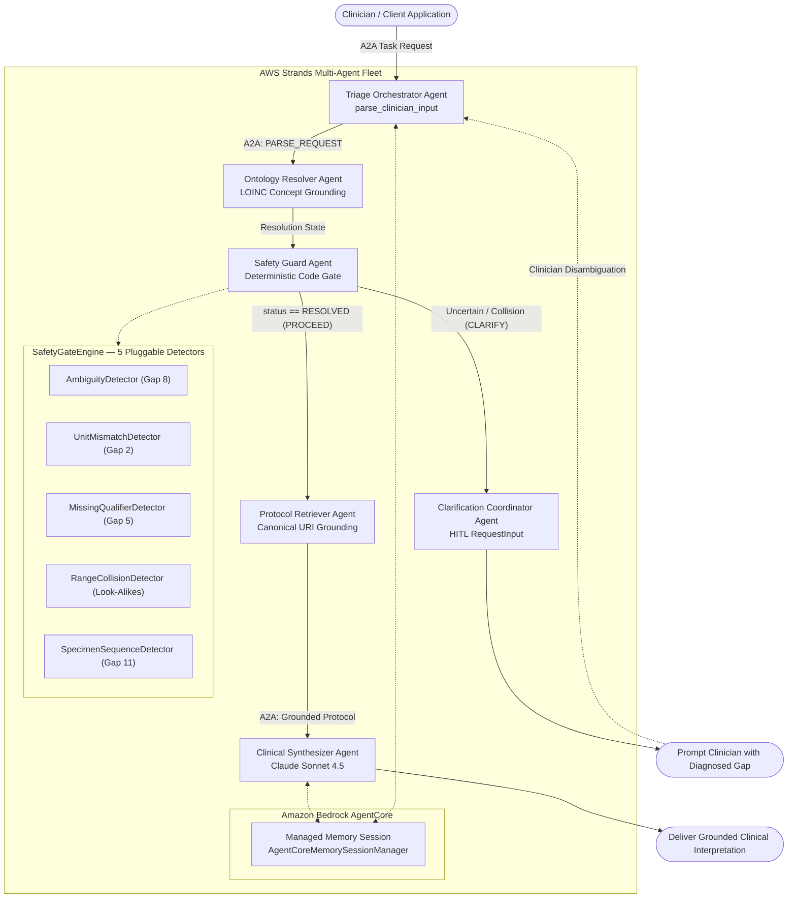

# AWS Strands Agents SDK + Amazon Bedrock AgentCore

*Clinical Laboratory Decision Support with Deterministic Safety Gating, Managed Session Memory, and Claude Sonnet 4.5.*

Part of the **Multi-Agent Retrieval-Gap Framework** ([Root Project README](../README.md)).

---

## Overview

In acute and ambulatory clinical care, misinterpreting look-alike lab orders, ambiguous units, or tube collection sequences can result in severe clinical harm.

This package implements the multi-agent clinical decision support architecture using the **AWS Strands Agents SDK** and **Amazon Bedrock AgentCore**, with **Anthropic Claude Sonnet 4.5** on Amazon Bedrock.

The system addresses classical RAG retrieval gaps (Gaps 1–7) and multi-agent failure modes (Gaps 8–11) through:
1. **Deterministic Safety Gating (`SafetyGateEngine`)**: Code-enforced rules that intercept ambiguous orders and unit mismatches without relying on generative prompt compliance.
2. **Structured A2A Contracts (`A2AMessage`)**: Explicit Agent-to-Agent communication schemas with typed payloads and lifecycle statuses.
3. **Bedrock AgentCore Managed Memory**: Managed multi-turn conversation sessions (`AgentCoreMemorySessionManager`) with seamless offline fallback (`LocalMemorySessionManager`).
4. **Shared Declarative Clinical Ontology**: Consumes the shared YAML domain vocabulary, protocols, collision families, and tube sequencing rules in `config/`.

---

## Architecture & Workflow Topology

The system coordinates six specialized agent roles under a supervisor orchestration pattern:



### Specialized Agent Roles

| Role | Implementation | Description |
| :--- | :--- | :--- |
| **Triage Orchestrator** | `src/agents/triage_agent.py` | Primary supervisor agent; ingests clinician input, manages multi-turn sessions via Bedrock AgentCore, and coordinates subagent handoffs. |
| **Ontology Resolver** | `src/agents/ontology_agent.py` | Maps lab terms and colloquial synonyms to canonical LOINC identifiers; flags unresolved terms as `NOT_FOUND` or `AMBIGUOUS`. |
| **Safety Guard** | `src/agents/safety_guard_agent.py` | Executes the deterministic `SafetyGateEngine` across the 5 pluggable detectors. Fails closed to `CLARIFY` if any clinical safety rule fails. |
| **Clarification Coordinator** | `src/agents/clarification_agent.py` | Generates structured clarification requests for human-in-the-loop (HITL) input without hallucinating or guessing. |
| **Protocol Retriever** | `src/agents/protocol_agent.py` | Fetches grounded reference intervals, critical panic limits, and clinical guidelines from `config/domains/laboratory_medicine/protocols.yaml`. |
| **Clinical Synthesizer** | `src/agents/synthesis_agent.py` | Single-turn grounded synthesis agent powered by Claude Sonnet 4.5; interprets patient values strictly within protocol bounds. |

---

## Model Selection & Runtime Providers

The runtime dynamically selects the appropriate model provider based on your environment:

| Mode | Model Identifier | Trigger Condition |
| :--- | :--- | :--- |
| **AWS Bedrock** *(Production)* | `us.anthropic.claude-sonnet-4-5:0` | `AWS_REGION` + AWS credentials configured, `ANTHROPIC_API_KEY` unset |
| **Direct Anthropic** | `claude-sonnet-4-5` | `ANTHROPIC_API_KEY` configured in `.env` |
| **Offline / Mock** *(Testing)* | `MockBedrockModel` | `STRANDS_OFFLINE_MODE=true` or missing cloud credentials |

---

## Directory Structure

```text
strands-agents/
├── pytest.ini                     # Pytest configuration
├── requirements.txt               # Dependencies (strands-agents, bedrock-agentcore, boto3)
├── load_env.sh                    # Environment setup helper
├── .env.example                   # Configuration template
├── src/
│   ├── a2a/
│   │   └── contracts.py           # A2AMessage, AgentRole, A2AAction, ResolutionStatus
│   ├── core/
│   │   ├── models.py              # Pydantic schemas (ConceptDefinition, NumericAssay...)
│   │   ├── config.py              # YAML domain loader & OntologyRegistry
│   │   └── detectors/             # SafetyGateEngine + 5 gap detectors
│   │       ├── base.py            # Base detector contract & gate engine
│   │       ├── ambiguity.py       # Ambiguity & silent guessing (Gap 8)
│   │       ├── unit_mismatch.py   # Unit compatibility checks (Gap 2)
│   │       ├── missing_qualifier.py # Assay qualifier detector (Gap 5)
│   │       ├── range_collision.py # Look-alike range collisions
│   │       └── specimen_seq.py    # Specimen tube order & aliquot routing (Gap 11)
│   ├── agents/
│   │   ├── triage_agent.py        # Supervisor triage orchestrator
│   │   ├── ontology_agent.py      # LOINC ontology resolver
│   │   ├── safety_guard_agent.py  # Deterministic safety gate node
│   │   ├── protocol_agent.py      # Reference protocol retriever
│   │   ├── clarification_agent.py # HITL clinical clarification coordinator
│   │   └── synthesis_agent.py     # Grounded Claude Sonnet 4.5 synthesizer
│   ├── memory/
│   │   └── session.py             # Bedrock AgentCore & Local memory managers
│   ├── models/
│   │   └── provider.py            # Model factory (Bedrock, Anthropic, Mock)
│   ├── tools/                     # Strands tool definitions
│   │   ├── parse_tool.py          # Input parser tool
│   │   ├── ontology_tool.py       # LOINC resolution tool
│   │   ├── safety_gate_tool.py    # Deterministic code gate tool
│   │   ├── protocol_tool.py       # Protocol retrieval tool
│   │   └── clarification_tool.py   # Clarification prompt generator
│   ├── orchestration/
│   │   ├── a2a_orchestrator.py    # High-level A2A coordinator
│   │   └── strands_orchestrator.py# Supervisor orchestrator implementation
│   ├── runner.py                  # Scenarios A–D evaluation runner
│   └── main.py                    # Interactive CLI runner
└── tests/
    ├── test_gate.py               # Deterministic safety gate tests (Gap 10)
    ├── test_multiagent_extensible.py # Registry & dynamic scenario extension tests
    └── test_strands_agents.py     # Strands agents, tools, memory, and orchestration tests
```

---

## Getting Started

### 1. Installation

In a virtual environment (Python 3.10+):

```bash
cd strands-agents
pip install -r requirements.txt
```

### 2. Environment Configuration

Copy the example environment file:

```bash
cp .env.example src/.env
```

Configure credentials according to your chosen mode:

**Option A — AWS Bedrock (Recommended for Production)**:
```env
AWS_REGION=us-east-1
BEDROCK_MODEL_ID=us.anthropic.claude-sonnet-4-5:0
AGENTCORE_MEMORY_ID=mem-clinical-decision-support
STRANDS_OFFLINE_MODE=false
```
*(Ensure valid AWS credentials are configured via `~/.aws/credentials` or standard environment variables `AWS_ACCESS_KEY_ID` / `AWS_SECRET_ACCESS_KEY`).*

**Option B — Direct Anthropic API**:
```env
ANTHROPIC_API_KEY=your_anthropic_api_key_here
STRANDS_OFFLINE_MODE=false
```

**Option C — Pure Offline Mode (No Credentials Required)**:
```env
STRANDS_OFFLINE_MODE=true
```

---

## Running the System

### Run Scenarios Evaluation

Executes Scenarios A through D (Hemoglobin ambiguity, CSF tube sequencing, Calcium range collision, and dynamic Troponin extension):

```bash
python -m src.runner
```

### Interactive CLI

Launch the clinician terminal interface:

```bash
python -m src.main
```

To run offline without AWS or Anthropic API calls:

```bash
python -m src.main --offline
```

---

## Test Suite & Verification

The test suite contains **50 tests** running deterministically in pure code without live external API calls:

```bash
python -m pytest tests/ -v
```

### Test Coverage Summary

| Test File | Test Count | Focus Area |
| :--- | :--- | :--- |
| `tests/test_gate.py` | 12 tests | Deterministic safety invariants for Gaps 2, 5, 8, and 11 without LLM dependencies. |
| `tests/test_multiagent_extensible.py` | 16 tests | Shared ontology registry loading, dynamic YAML scenario extensions (Troponin), and detector unit tests. |
| `tests/test_strands_agents.py` | 22 tests | Strands tools, agent factories, offline model selection, AgentCore memory fallbacks, and end-to-end multi-agent orchestration. |
| **Total** | **50 tests** | **100% Passing** |
